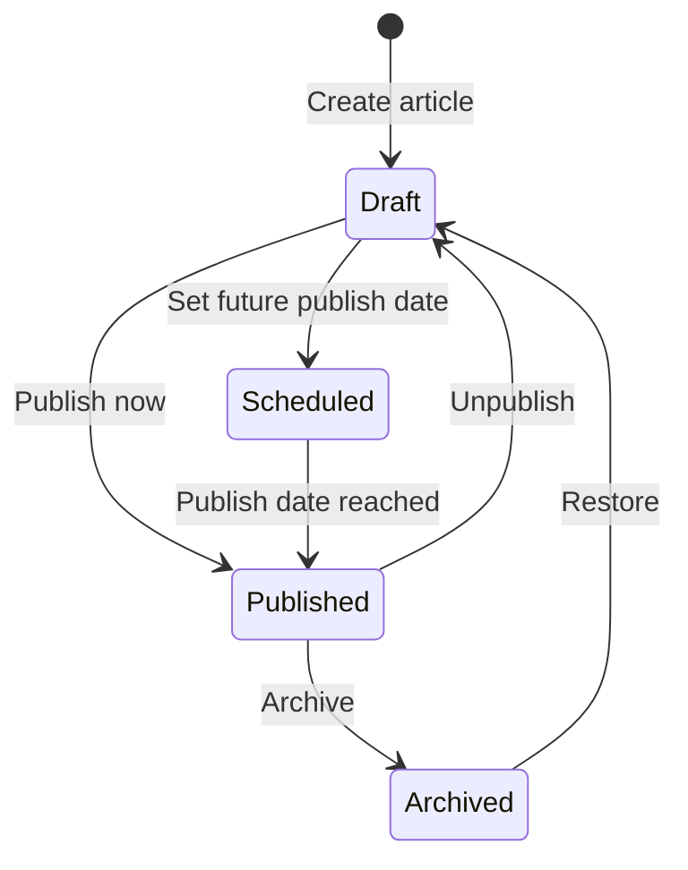

# Admin Panel — Current State & Roadmap

Internal documentation for the `/admin` section of Scorr Studio. This panel is used by employees (customer service reps, engineers, and operations) to manage the platform, assist tenants, and troubleshoot issues.

---

## 1. File Map

| Area | Route | File |
|---|---|---|
| Dashboard Hub | `/admin/dashboard` | [dashboard/page.tsx](file:///home/jack/clawd/scorr-studio/app/admin/dashboard/page.tsx) |
| Database Explorer | `/admin/database` | [database/page.tsx](file:///home/jack/clawd/scorr-studio/app/admin/database/page.tsx) |
| WorkOS Manager | `/admin/dashboard/workos` | [workos/page.tsx](file:///home/jack/clawd/scorr-studio/app/admin/dashboard/workos/page.tsx) |
| Feature Flags | `/admin/feature-flags` | [feature-flags/page.tsx](file:///home/jack/clawd/scorr-studio/app/admin/feature-flags/page.tsx) |
| Platform Metrics | `/admin/metrics` | [metrics/page.tsx](file:///home/jack/clawd/scorr-studio/app/admin/metrics/page.tsx) |
| Template Store | `/admin/templates` | [templates/page.tsx](file:///home/jack/clawd/scorr-studio/app/admin/templates/page.tsx) |
| Template Analytics | `/admin/templates/analytics` | [analytics/page.tsx](file:///home/jack/clawd/scorr-studio/app/admin/templates/analytics/page.tsx) |
| Create Template | `/admin/templates/new` | [new/page.tsx](file:///home/jack/clawd/scorr-studio/app/admin/templates/new/page.tsx) |
| Articles CMS | `/admin/articles` | [articles/page.tsx](file:///home/jack/clawd/scorr-studio/app/admin/articles/page.tsx) |
| Notification Center | `/admin/notifications` | [PROPOSED] |
| User Devices | `/admin/devices` | [PROPOSED] |
| Server Actions | — | [actions.ts](file:///home/jack/clawd/scorr-studio/app/admin/actions.ts) |
| Article Actions | — | [articles/actions.ts](file:///home/jack/clawd/scorr-studio/app/admin/articles/actions.ts) |
| Notification Dispatch | — | [dispatch.ts](file:///home/jack/clawd/scorr-studio/lib/notifications/dispatch.ts) |
| Web Push | — | [web-push.ts](file:///home/jack/clawd/scorr-studio/lib/notifications/web-push.ts) |

---

## 2. What Exists Today

### 2.1 Dashboard Hub (`/admin/dashboard`)

The main landing page with card-based navigation to all admin sections. Displays platform infrastructure info:

| Stat | Value |
|---|---|
| Database Type | Convex Cloud |
| Identity Provider | WorkOS AuthKit |
| Environment | `NODE_ENV` value |

**Cards link to:** Database Explorer, WorkOS Manager, Feature Flags, Platform Metrics, Template Store.

### 2.2 Database Explorer (`/admin/database`)

A recursive tree-based viewer for browsing the Convex database. Allows employees to:

- **Read** any document by navigating the path hierarchy
- **Edit** individual field values inline (with save confirmation)
- **Delete** specific paths from the database

> [!CAUTION]
> This is a raw database tool with no guardrails — any field can be modified or deleted. Production use should be restricted to engineers.

**Server actions:** `getDatabasePath`, `updateDatabasePath`, `deleteDatabasePath`

### 2.3 WorkOS Manager (`/admin/dashboard/workos`)

Two-tab interface for viewing WorkOS entities:

| Tab | What It Shows |
|---|---|
| **Organizations** | Card grid of all WorkOS orgs with name, ID, creation date, and profile policy |
| **User Directory** | Table of all WorkOS users with name, email, user ID, creation date, and avatar |

Both tabs support **search** by name, email, or ID. A "Sync Remote Data" button re-fetches from the WorkOS API.

**Server actions:** `getWorkOSOrganizations`, `getWorkOSUsers`

**Limitations:**
- View-only — cannot edit, suspend, or delete users/orgs from this panel
- No link between WorkOS org and Convex tenant record
- "Audit Infrastructure" button exists but is non-functional

### 2.4 Feature Flags (`/admin/feature-flags`)

Displays a table of all tenants with toggle switches for 5 feature flags:

| Current Flags |
|---|
| `live-streaming` |
| `advanced-brackets` |
| `social-automation` |
| `api-access` |
| `white-label` |

Employees can enable/disable any flag for any tenant. Changes are immediate.

**Server actions:** `listAllTenants`, `toggleTenantFeature`

### 2.5 Platform Metrics (`/admin/metrics`)

Server-rendered page (uses `withAuth` guard) displaying:

| Category | Metrics |
|---|---|
| **Performance** | SSE Match Poll Avg (ms), SSE Comp Poll Avg (ms), SSE Stage Poll Avg (ms) |
| **Engagement** | Total Matches, Active Tournaments, Designs Created, Matches Completed |
| **Business** | User Retention (%), Paid Conversion (%) |

Also shows the last 20 SSE polling latency data points for matches, competitions, and stages.

### 2.6 Template Store (`/admin/templates`)

Full template lifecycle management:

| Action | Description |
|---|---|
| **List** | View all templates with status badges (draft, published, archived) |
| **Create** | Form at `/admin/templates/new` |
| **Publish** | Make a template available in the marketplace |
| **Unpublish** | Remove from marketplace but keep data |
| **Archive** | Soft-delete (mark as archived) |
| **Delete** | Hard-delete permanently |
| **Review Queue** | Pending community-submitted templates awaiting approval |
| **Analytics** | Template download/usage stats at `/admin/templates/analytics` |

### 2.7 Articles CMS (`/admin/articles`)

CRUD interface for managing help articles and announcements:

| Action | Description |
|---|---|
| **Create** | Title, slug (auto-generated), content (textarea), published toggle |
| **Edit** | Inline editing dialog |
| **Delete** | Hard-delete |
| **Push** | Send a push notification for the article |

#### Current Article Schema

```typescript
// Convex table: articles
{
    slug: string,           // URL-friendly identifier (auto-generated from title)
    title: string,
    content: string,        // MDX or HTML content
    excerpt?: string,       // Short summary for previews and notifications
    coverImage?: string,    // Hero image URL
    author: string,         // Author display name
    authorAvatar?: string,  // Author avatar URL
    publishedAt: string,    // ISO timestamp
    isPublished: boolean,   // Public visibility toggle
    category?: string,      // Article category
    tags?: string[],        // Tags for filtering
}
```

#### Current Notification Infrastructure

The push system already supports 3 channels:

| Channel | Table | How It Works |
|---|---|---|
| **Web Push** | `pushSubscriptions` | VAPID-based browser push via `web-push` library |
| **Expo Push** | `expoPushTokens` | Expo SDK for iOS/Android native app |
| **SMS** | Via profile `phoneNumber` | Twilio-based SMS (premium feature) |

Dispatch functions: `notifyUser(userId, title, body, data)`, `notifyAll(title, body, data)`, `notifyMatchUpdate(match, trigger)`

---

### 2.8 Content Management — Proposed Enhancements

The existing Articles CMS needs to be expanded into a full content management system.

#### Enhanced Article Editor

| Feature | Current | Proposed |
|---|---|---|
| Content format | Plain textarea | Rich markdown editor with live preview |
| Cover image | URL text field | Image upload with drag-and-drop |
| Categories | Optional text field | Predefined category selector |
| Tags | Optional text array | Tag autocomplete with creation |
| Scheduling | Immediate only | Schedule publish date/time |
| SEO | None | Meta description, OG image |
| Versioning | None | Draft history with restore |
| Featured | None | Pin article to top of feed |

#### Article Statuses



#### Proposed Article Schema Additions

```typescript
// Enhanced fields for articles table
{
    // ... existing fields ...
    status: string,             // 'draft' | 'scheduled' | 'published' | 'archived'
    scheduledAt?: string,       // Future publish date
    featuredUntil?: string,     // Pin to top until this date
    metaDescription?: string,   // SEO meta description
    ogImage?: string,           // Open Graph image
    readTimeMinutes?: number,   // Estimated read time (auto-calculated)
    viewCount: number,          // Total views
    pushSentAt?: string,        // When notification was sent
    pushSentCount?: number,     // How many devices received the push
    updatedAt: string,          // Last edit timestamp
    updatedBy?: string,         // Last editor user ID
}
```

#### Article Push Notifications

When pushing an article notification:

1. Admin clicks **"Push Notification"** on the article
2. Choose target audience:
   - **All users** — every registered device
   - **By platform** — Web only, Mobile only, or Both
   - **By category** — users who follow this category (future)
3. Customise notification text (defaults to article title + excerpt)
4. Confirm and send
5. System records: `pushSentAt`, `pushSentCount`, delivery stats
6. Article card shows a **"Pushed"** badge with timestamp

---

### 2.9 Notification Center (`/admin/notifications`) — Proposed

A dedicated admin page for managing all push notifications across the platform.

#### Notification Center Tabs

| Tab | Description |
|---|---|
| **Compose** | Create and send a new notification |
| **History** | Log of all sent notifications with delivery/view stats |
| **Targeted** | Send notifications to specific users |
| **Scheduled** | View/manage scheduled notifications |

#### Compose Notification

| Field | Type | Required | Description |
|---|---|---|---|
| Title | text | ✅ | Notification headline (max 100 chars) |
| Body | textarea | ✅ | Notification message (max 500 chars) |
| Target | select | ✅ | `all_users`, `specific_users`, `by_platform`, `by_tenant` |
| Platform | multi-select | ❌ | `web`, `ios`, `android`, `sms` |
| Link URL | text | ❌ | Deep link / URL to open when tapped |
| Schedule | datetime | ❌ | Send at a future date/time (or "Now") |
| Image | upload | ❌ | Rich notification image |

#### Targeted User Notifications

Admins can send notifications to **specific users** manually:

1. Search for a user by name, email, or user ID
2. View the user's registered devices (see §2.10)
3. Compose a message for that user
4. Choose which channels to use (push, SMS, or both)
5. Send immediately or schedule

Use cases:
- Support follow-ups ("Your issue has been resolved")
- Account-specific alerts ("Your payment failed")
- Beta invitations or feature announcements
- Event reminders for specific participants

#### Notification Log

Every notification sent is recorded in a `notificationLog` table:

```typescript
// Proposed Convex table: notificationLog
{
    notificationId: string,     // Unique ID
    type: string,               // 'broadcast' | 'targeted' | 'article_push' | 'system'
    title: string,
    body: string,
    data?: any,                 // Payload data (deep link, article ID, etc.)

    // Targeting
    targetType: string,         // 'all' | 'user' | 'platform' | 'tenant'
    targetIds?: string[],       // User IDs if targeted
    targetPlatforms?: string[], // ['web', 'ios', 'android']

    // Delivery stats
    sentCount: number,          // Total devices sent to
    deliveredCount: number,     // Confirmed delivered (where trackable)
    failedCount: number,        // Failed sends
    viewedCount: number,        // Opened/viewed in mobile app

    // Metadata
    sentBy: string,             // Admin user ID who sent it
    sentAt: string,             // When it was dispatched
    scheduledFor?: string,      // If it was scheduled
    articleId?: string,         // If linked to an article

    // Per-device results (for targeted notifications)
    deliveryResults?: Array<{
        userId: string,
        channel: string,        // 'web_push' | 'expo' | 'sms'
        status: string,         // 'sent' | 'delivered' | 'failed' | 'viewed'
        viewedAt?: string,      // When the user opened it in the mobile app
        error?: string,         // Error message if failed
    }>,
}
```

#### Notification History Table

The History tab shows a table of all sent notifications:

| Column | Description |
|---|---|
| Title | Notification title |
| Type | `broadcast` / `targeted` / `article_push` / `system` |
| Sent By | Admin name |
| Sent At | Timestamp |
| Sent | Total devices sent to |
| Delivered | Confirmed deliveries |
| Viewed | Opened in mobile app |
| Failed | Failed sends |
| Actions | View details, re-send |

> [!NOTE]
> **Mobile app view tracking**: When a user opens a notification in the Expo mobile app, the app sends a `notification_viewed` event back to the server. This updates the `viewedCount` and per-device `viewedAt` in the notification log.

---

### 2.10 User Device Management (`/admin/devices`) — Proposed

Admins need to see what devices a user has registered and whether they are active.

#### Device View

When looking up a user (by name, email, or ID), the panel shows:

```
┌─ User: John Smith (john@example.com) ──────────────────────────┐
│                                                                 │
│  Devices (3 registered)                                         │
│                                                                 │
│  ┌─ Web Push ──────────────────────────────────────────────┐    │
│  │  🟢 Active   Chrome on macOS                            │    │
│  │  Registered: Jan 15, 2025                                │    │
│  │  Last active: 2 hours ago                                │    │
│  │  Endpoint: https://fcm.googleapis.com/fcm/send/...       │    │
│  └──────────────────────────────────────────────────────────┘    │
│                                                                 │
│  ┌─ Expo Push (iOS) ───────────────────────────────────────┐    │
│  │  🟢 Active   iPhone 15 Pro / iOS 18.2                    │    │
│  │  Registered: Feb 1, 2025                                 │    │
│  │  Last active: 30 minutes ago                             │    │
│  │  Token: ExponentPushToken[xxxxxxxxxxxx]                   │    │
│  └──────────────────────────────────────────────────────────┘    │
│                                                                 │
│  ┌─ Expo Push (Android) ───────────────────────────────────┐    │
│  │  🔴 Inactive  Pixel 8 / Android 14 (expired)             │    │
│  │  Registered: Dec 5, 2024                                 │    │
│  │  Last active: 45 days ago                                │    │
│  │  Token: ExponentPushToken[yyyyyyyyyyyy]                   │    │
│  └──────────────────────────────────────────────────────────┘    │
│                                                                 │
│  SMS: +1 (555) 123-4567  🟢 Verified                           │
│                                                                 │
│  [Send Test Notification]  [Send Custom Message]                │
└─────────────────────────────────────────────────────────────────┘
```

#### Device Status

| Status | Indicator | Meaning |
|---|---|---|
| **Active** | 🟢 | Device registered, push token valid, recent activity |
| **Idle** | 🟡 | Registered but no activity in 14+ days |
| **Inactive** | 🔴 | Push token expired or invalid (last push failed with 404/410) |
| **Unregistered** | ⚪ | Device was removed by the user |

#### Proposed Schema Enhancements

```typescript
// Enhanced pushSubscriptions table
{
    // ... existing fields ...
    lastActiveAt?: string,      // Last successful push delivery or user activity
    userAgent?: string,         // Browser/OS info for web push
    isActive: boolean,          // Whether the subscription is still valid
    deactivatedAt?: string,     // When it became inactive (push failure)
}

// Enhanced expoPushTokens table
{
    // ... existing fields ...
    deviceName?: string,        // "iPhone 15 Pro", "Pixel 8"
    osVersion?: string,         // "iOS 18.2", "Android 14"
    appVersion?: string,        // Scorr Studio app version
    lastActiveAt?: string,      // Last push delivery or app session
    isActive: boolean,          // Whether the token is still valid
    deactivatedAt?: string,     // When it became inactive
}
```

#### Admin Actions on Devices

| Action | Description |
|---|---|
| **Send Test** | Send a test notification to a specific device |
| **Remove** | Delete a stale/invalid device registration |
| **View History** | See all notifications sent to this device |
| **Refresh Status** | Attempt to send a silent push to verify the device is reachable |

---

## 3. What's Missing — Roadmap

The following features are needed to make the admin panel a complete customer service and operations tool. Items are grouped by priority.

### 🔴 Priority 1 — Security & Authentication

| Feature | Why It's Needed | Details |
|---|---|---|
| **Admin auth guard** | No shared layout with auth check exists — any route could be accessed without verification | Add an `/admin/layout.tsx` that validates the user is an employee via WorkOS role/metadata before rendering any admin page |
| **Admin RBAC** | Not all employees need the same access level (CS reps vs engineers) | Define admin-level roles: `super_admin`, `support_agent`, `content_manager`. Gate destructive actions (database writes, user suspension) behind `super_admin` |
| **Audit log** | No record of what admin actions were taken, by whom, or when | Log every admin action (database edits, feature flag changes, template approvals, user actions) with timestamp, admin user ID, action type, and target entity |

> [!WARNING]
> The Database Explorer currently has **no write protection**. Until an auth guard and audit log exist, any production database modification is untracked and irreversible.

---

### 🟡 Priority 2 — Tenant Support Tools

These are the tools CS reps need most to help tenants with day-to-day issues.

| Feature | Why It's Needed | Details |
|---|---|---|
| **Tenant lookup & detail view** | CS reps need to quickly find and view a tenant's full account info | Search by name, email, or ID → show subscription tier, member list, feature flags, creation date, last active, usage stats, billing status |
| **Tenant activity timeline** | Understand what a tenant has been doing before a support ticket | Chronological log of matches created, competitions run, displays modified, members added/removed, settings changes |
| **Impersonation mode** | See exactly what a tenant user sees without accessing their credentials | "View as tenant" mode that applies the tenant's feature flags, plan tier, and role restrictions to the admin's session. Read-only, with a clear visual banner indicating impersonation |
| **Subscription management** | CS reps need to upgrade/downgrade plans, extend trials, apply credits | Interface to change a tenant's plan tier, add billing credits, extend free trials, and view Stripe payment history without going to the Stripe dashboard |
| **Member management** | Help tenants with stuck invitations, role changes, or locked-out owners | View/edit/remove members for any tenant, resend/revoke invitations, transfer ownership |
| **Feature flag overrides** | Grant temporary access to paid features (e.g., for demos, support escalations) | Already partially built — enhance with expiry dates, reason/notes field, and link to support ticket |

---

### 🟡 Priority 3 — Troubleshooting & Diagnostics

| Feature | Why It's Needed | Details |
|---|---|---|
| **SSE connection debugger** | Live score displays failing is the #1 support issue | Per-tenant SSE connection status: active connections, last heartbeat, recent errors, latency per display |
| **Score display preview** | Verify what a tenant's live display looks like without their OBS setup | Load any tenant's score display in an iframe with their current data, styles, and feature flags applied |
| **Match data inspector** | Investigate scoring issues or data corruption | View full match state: current scores, history of score changes (who changed what, when), linked competition, event, and display data |
| **Competition/bracket debugger** | Help tenants with broken brackets or seeding issues | View bracket structure, match assignments, progression logic, and identify where data is inconsistent |
| **Error log viewer** | Surface errors affecting a specific tenant, not just global metrics | Filter application errors by tenant ID — show JS errors, failed mutations, API errors, and webhook delivery failures |
| **Webhook delivery log** | Enterprise tenants need help debugging webhook integrations | Show delivery attempts, response codes, payload snapshots, retry history, and allow manual re-delivery |

---

### 🟢 Priority 4 — Operations & Content

| Feature | Why It's Needed | Details |
|---|---|---|
| **Global announcements** | Notify all tenants about maintenance, new features, or incidents | Banner system with scheduling, targeting (all tenants, free only, pro only), and dismissal tracking |
| **Enhanced article editor** | Current textarea is too basic for rich content | Rich markdown editor with image uploads, categories, scheduling, and SEO fields |
| **Notification center** | No central place to manage and track notifications | Dedicated `/admin/notifications` page with compose, history, targeting, and delivery tracking |
| **Device management** | Can't see what devices a user has or if notifications were delivered | `/admin/devices` page showing per-user device list, active status, and notification history |
| **Notification log** | No record of what notifications were sent or viewed | Full log with delivery stats, mobile app view tracking, and per-device results |
| **Targeted notifications** | Current push only supports broadcast to all | Send to specific users, platforms, or tenants |
| **Template review workflow** | The current review queue has no reviewer assignment or feedback mechanism | Add reviewer assignment, status transitions (submitted → in review → approved/rejected), and rejection reason feedback to the template author |
| **Bulk operations** | Operations team needs to act on many tenants at once | Bulk enable/disable feature flags, bulk plan changes, bulk email notifications |
| **Platform health dashboard** | Real-time operational awareness beyond SSE latency | Convex function execution stats, error rates, active WebSocket connections, Stripe webhook processing status, WorkOS auth success/failure rates |
| **Knowledge base editor** | CS reps need internal runbooks alongside the public help articles | Internal-only articles with troubleshooting steps, common issues, escalation procedures. Separate from the public articles CMS |

---

### 🔵 Priority 5 — Analytics & Reporting

| Feature | Why It's Needed | Details |
|---|---|---|
| **Tenant health score** | Proactively identify tenants at risk of churn or needing help | Composite score based on: days since last active, feature adoption, match frequency, support ticket count |
| **Revenue dashboard** | Business metrics beyond what Stripe provides | MRR, churn rate, plan distribution, upgrade/downgrade trends, revenue per sport, LTV estimates |
| **Feature adoption heatmap** | Understand which features are used and which aren't | Per-feature usage rates across all tenants, broken down by plan tier and sport |
| **Support ticket integration** | Link admin actions to support context | Integrate with Intercom/Zendesk to show open tickets alongside tenant details, and log admin actions back to the ticket |

---

## 4. Architecture Recommendations

### 4.1 Shared Admin Layout

```
app/admin/layout.tsx  ← Auth guard + sidebar navigation + audit logger
├── dashboard/
├── tenants/          ← NEW: tenant lookup + detail pages
│   ├── [tenantId]/   ← Tenant detail view with tabs
│   └── page.tsx      ← Search/list interface
├── database/
├── feature-flags/
├── metrics/
├── templates/
├── articles/         ← Enhanced with rich editor, scheduling, categories
│   ├── page.tsx      ← Article list with filters
│   ├── new/          ← NEW: dedicated create page with rich editor
│   └── [id]/         ← NEW: edit page with preview
├── notifications/    ← NEW: notification center
│   ├── page.tsx      ← Compose + history + targeted
│   └── [id]/         ← Notification detail with delivery results
├── devices/          ← NEW: user device management
│   └── page.tsx      ← Search by user, view devices, send test push
└── support/          ← NEW: support-specific tools
    ├── impersonate/
    ├── sse-debugger/
    └── error-logs/
```

### 4.2 Admin Roles

| Role | Database Explorer | Feature Flags | Tenant Management | Templates | Articles | Notifications | Devices | Impersonation |
|---|---|---|---|---|---|---|---|---|
| **Super Admin** | Full CRUD | ✅ | ✅ | ✅ | ✅ | ✅ Send + history | ✅ | ✅ |
| **Support Agent** | Read-only | Read + override with expiry | View + member management | — | — | ✅ Targeted only | ✅ View only | ✅ (read-only) |
| **Content Manager** | — | — | — | ✅ | ✅ | ✅ Article push only | — | — |

### 4.3 Audit Log Schema

```typescript
// Proposed Convex table: adminAuditLog
{
    adminUserId: string,       // WorkOS user ID of the employee
    action: string,            // "tenant.feature_flag.toggled", "database.path.updated", etc.
    targetType: string,        // "tenant", "user", "template", "database_path"
    targetId: string,          // ID of the affected entity
    before: any,               // Previous state (for reversibility)
    after: any,                // New state
    reason: string,            // Optional: why this action was taken
    supportTicketId: string,   // Optional: linked support ticket
    timestamp: string,         // ISO 8601
    ip: string,                // Request IP for security
}
```

---

## 5. Current vs Proposed Comparison

| Capability | Today | Proposed |
|---|---|---|
| **Auth guard** | ❌ None | ✅ Layout-level WorkOS check with admin role |
| **Audit trail** | ❌ None | ✅ Full action logging with before/after state |
| **Tenant lookup** | ❌ Must use database explorer | ✅ Dedicated search + detail view |
| **View tenant data** | 🟡 Raw database only | ✅ Structured tenant detail page |
| **Impersonation** | ❌ None | ✅ Read-only "view as tenant" mode |
| **Subscription changes** | ❌ Must use Stripe dashboard | ✅ In-panel plan management |
| **Member management** | ❌ None | ✅ View/edit/remove/transfer |
| **SSE debugging** | 🟡 Global latency metrics only | ✅ Per-tenant connection status |
| **Error investigation** | ❌ None | ✅ Per-tenant error log viewer |
| **Feature flags** | ✅ Per-tenant toggles | ✅ Enhanced with expiry + notes |
| **Templates** | ✅ Full lifecycle | ✅ Enhanced review workflow |
| **Articles** | ✅ Basic CRUD + push | ✅ Rich editor, scheduling, categories, versioning |
| **Notification center** | ❌ Only article push exists | ✅ Compose, target, schedule, history, delivery tracking |
| **User devices** | ❌ No visibility | ✅ Per-user device list, status, test push |
| **Notification log** | ❌ None | ✅ Full log with sent/delivered/viewed/failed counts |
| **Targeted notifications** | ❌ Broadcast only | ✅ Send to specific users, platforms, or tenants |
| **Mobile view tracking** | ❌ None | ✅ Track when notifications are opened in the mobile app |
| **Global announcements** | ❌ None | ✅ Banner system with targeting |
