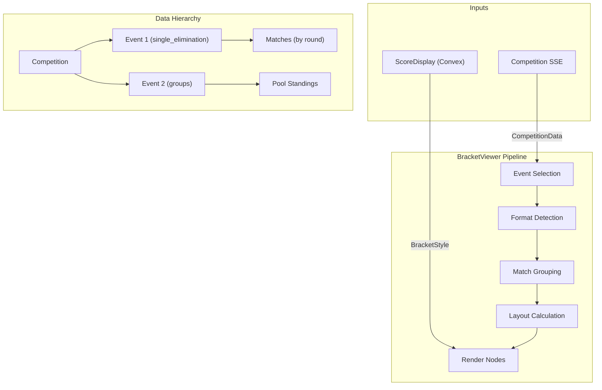

# Bracket Editor — Complete Reference

Comprehensive documentation of **every** editable setting, import/export feature, and animation/formatting logic in the Scorr Studio bracket editor.

---

## File Map

| Area | File |
|---|---|
| Main Editor | [BracketEditor.tsx](file:///home/jack/clawd/scorr-studio/components/bracket-editor/BracketEditor.tsx) |
| Style Panel | [StylePanel.tsx](file:///home/jack/clawd/scorr-studio/components/bracket-editor/StylePanel.tsx) |
| Canvas / Stage | [BracketStage.tsx](file:///home/jack/clawd/scorr-studio/components/bracket-editor/BracketStage.tsx) |
| Match Boxes | [MatchNode.tsx](file:///home/jack/clawd/scorr-studio/components/bracket-editor/MatchNode.tsx) |
| Connector Lines | [ConnectorLine.tsx](file:///home/jack/clawd/scorr-studio/components/bracket-editor/ConnectorLine.tsx) |
| Round Headers | [RoundHeader.tsx](file:///home/jack/clawd/scorr-studio/components/bracket-editor/RoundHeader.tsx) |
| Group / Pool Tables | [GroupTable.tsx](file:///home/jack/clawd/scorr-studio/components/bracket-editor/GroupTable.tsx) |
| Live Viewer | [BracketViewer.tsx](file:///home/jack/clawd/scorr-studio/components/bracket-editor/BracketViewer.tsx) |
| Type Definitions | [bracket-style.ts](file:///home/jack/clawd/scorr-studio/lib/types/bracket-style.ts) |
| Presets | [presets.ts](file:///home/jack/clawd/scorr-studio/lib/bracket-editor/presets.ts) |
| Layout Calculator | [layout-calculator.ts](file:///home/jack/clawd/scorr-studio/lib/bracket-editor/layout-calculator.ts) |
| Camera Controller | [camera-controller.ts](file:///home/jack/clawd/scorr-studio/lib/bracket-editor/camera-controller.ts) |
| Konva Export | [export-konva.ts](file:///home/jack/clawd/scorr-studio/lib/bracket-editor/export-konva.ts) |

---

## 1. Bracket Format Selection

The user can choose one of three tournament formats from the toolbar dropdown (only shown when `format` is not locked by a parent prop):

| Value | Label | Description |
|---|---|---|
| `single_elimination` | Single Elimination | Standard knockout bracket |
| `double_elimination` | Double Elimination | Winners + losers brackets with grand final |
| `groups` | Groups / Pools | Round-robin pool tables with standings |

Changing format regenerates sample data, recalculates layout, and conditionally shows/hides certain style panel sections (e.g. connectors, animations, and match box are hidden for groups; group table is hidden for brackets).

---

## 2. Editable Settings (Style Panel)

All settings are exposed via collapsible sections in `StylePanel.tsx`. Each setting maps to a field on the `BracketStyle` interface.

### 2.1 Presets

One-click style themes that overwrite the entire `BracketStyle`. Five built-in presets:

| Preset | Canvas BG | Vibe |
|---|---|---|
| `default` | `#1a1a2e` (dark navy) | Dark mode, green accents |
| `classic` | `#ffffff` (white) | Light/clean, green winner highlights |
| `esports` | `#0a0a0f` (near-black) | Purple/pink neon glow, curved connectors |
| `sport` | `#1e3a5f` (deep blue) | Impact font, bold borders, gold winners, straight connectors |
| `minimal` | `#fafafa` (off-white) | Flat, no shadows, no animations, no seeds |

### 2.2 Canvas Settings

| Setting | Type | Range | Description |
|---|---|---|---|
| Background Color | Color | — | Canvas background color (color picker + hex input) |

> [!NOTE]
> `width`, `height`, and `autoSize` exist on the `CanvasStyle` type but are **not** exposed in the style panel — they are calculated automatically.

### 2.3 Match Box Settings *(bracket formats only)*

| Setting | Type | Range | Description |
|---|---|---|---|
| Width | Number (slider) | 100–400 | Width of each match box in px |
| Height | Number (slider) | 40–120 | Height of each match box in px |
| Background | Color | — | Primary match box fill color |
| Border Color | Color | — | Stroke color around match boxes |
| Border Width | Number (slider) | 0–8 | Border thickness in px |
| Border Radius | Number (slider) | 0–24 | Corner rounding in px |
| Winner Highlight | Color | — | Accent color for the winner side-bar and selected-match border |
| Live Highlight | Color | — | Border color for in-progress matches |

> [!NOTE]
> Additional `MatchBoxStyle` properties exist on the type but are **not** directly editable in the panel: `backgroundColorAlt`, `shadow` (BoxShadow object), and `hoverScale`. These can still be set via JSON import or preset.

### 2.4 Group Table Settings *(groups format only)*

| Setting | Type | Range | Description |
|---|---|---|---|
| Header Background | Color | — | Table header row fill |
| Header Text | Color | — | Header text color |
| Row Background | Color | — | Even row fill |
| Alt Row Background | Color | — | Odd row fill |
| Border Color | Color | — | Table grid border color |
| Advancing Color | Color | — | Left-side bar + row tint for advancing teams |
| Cell Padding | Number (slider) | 0–32 | Horizontal padding inside team name cells |

### 2.5 Typography Settings

| Setting | Type | Range | Description |
|---|---|---|---|
| Participant Font | Select dropdown | 6 options* | Font family for participant names |
| Participant Size | Number (slider) | 10–24 | Font size for participant names |
| Participant Color | Color | — | Default text color for participants |
| Winner Color | Color | — | Text color for the winning participant |
| Score Size | Number (slider) | 10–28 | Font size for score values |
| Score Color | Color | — | Default score text color |

*Available fonts:*
- Inter, system-ui, sans-serif
- system-ui, sans-serif
- Arial, sans-serif
- Impact, Haettenschweiler, sans-serif
- Georgia, serif
- Courier New, monospace

> [!NOTE]
> Additional typography fields exist on the type but are not directly in the panel: `participantWinnerColor` is exposed as "Winner Color", but `scoreFont`, `scoreWinnerColor`, `roundLabelFont`, `roundLabelSize`, `roundLabelColor`, `seedFont`, `seedSize`, and `seedColor` are only changeable via JSON import or presets.

### 2.6 Connector Settings *(bracket formats only)*

| Setting | Type | Options/Range | Description |
|---|---|---|---|
| Style | Select dropdown | `elbow`, `curved`, `straight` | Line path algorithm between matches |
| Line Color | Color | — | Default connector line color |
| Line Width | Number (slider) | 1–8 | Default connector line thickness |
| Winner Line Color | Color | — | Highlighted connector color for winner paths |

> [!NOTE]
> `winnerLineWidth` exists on the type but is not directly in the panel.

### 2.7 Spacing Settings

| Setting | Type | Range | Shown For | Description |
|---|---|---|---|---|
| Horizontal Gap | Number (slider) | 20–200 | Brackets only | Px gap between rounds |
| Vertical Gap | Number (slider) | 8–100 | Brackets only | Px gap between matches in same round |
| Match/Table Padding | Number (slider) | 4–24 | All formats | Internal padding inside match boxes / table cells |

> [!NOTE]
> `roundHeaderHeight` exists on the type but is not in the panel.

### 2.8 Animation Settings *(bracket formats only)*

| Setting | Type | Options/Range | Description |
|---|---|---|---|
| Enable Animations | Toggle | on/off | Master switch for all animations |
| Duration (ms) | Number (slider) | 100–2000 (step 100) | Base animation duration in milliseconds |
| Easing | Select dropdown | `linear`, `easeIn`, `easeOut`, `easeInOut`, `bounce` | Easing curve function |
| Winner Highlight | Toggle | on/off | Animate winner highlight effect |
| Line Progression | Toggle | on/off | Progressively draw connector lines |
| Match Pulse (Live) | Toggle | on/off | Subtle pulsing scale animation on live matches |
| Hover Effects | Toggle | on/off | Scale-up on hover for match boxes |

> [!NOTE]
> `fadeIn` exists on the type/presets (controls opacity fade-in on match mount) but is **not** in the style panel. It is enabled by default in all presets except `minimal`.

---

## 3. Import, Export, Download & Save Features

### 3.1 Import JSON

- **Button:** "Import" (toolbar, right side, with `IconFileUpload` icon)
- **Mechanism:** Hidden `<input type="file" accept=".json">` triggered on click
- **Behavior:** Reads the selected `.json` file, parses it, and replaces the entire current `BracketStyle` with the imported object
- **Validation:** Checks that parsed content is a non-null object; shows `alert('Invalid JSON file.')` on parse failure
- **Telemetry event:** `bracket_editor_import_json`

### 3.2 Export JSON

- **Button:** "Export" (toolbar, with `IconFileCode` icon)
- **Output file:** `bracket-style-{format}.json` (e.g. `bracket-style-single_elimination.json`)
- **Content:** Pretty-printed JSON (`JSON.stringify(style, null, 2)`) of the full `BracketStyle` object
- **Delivery:** Browser download via Blob + `URL.createObjectURL`
- **Telemetry event:** `bracket_editor_export_json`

### 3.3 Download PNG

- **Button:** "PNG" (toolbar, with `IconDownload` icon)
- **Output file:** `bracket.png`
- **Mechanism:** Calls `stageRef.current.exportToPNG()` which uses Konva's `stage.toDataURL({ pixelRatio: 2 })` for 2× resolution
- **Delivery:** Browser download via data URL `<a>` click
- **Telemetry event:** `bracket_editor_export_png`

### 3.4 Export HTML (Konva Script)

- **Button:** "HTML" (toolbar, primary styled button)
- **Output file:** `bracket.html`
- **Content:** Self-contained HTML page with:
  - Embedded Konva.js 9.x from CDN
  - Full style config as JSON literal
  - Rendering functions for match boxes, connectors, round headers
  - Zoom/pan controls (buttons + mouse wheel)
  - Responsive resize handler
  - Public API: `window.setBracketData(data)` to render bracket data
- **Delivery:** Browser download via Blob
- **Callback:** Also calls `onExport?.(script)` prop if provided
- **Telemetry event:** `bracket_editor_export_konva`

### 3.5 Style Change Callback (Live Save)

- Whenever any style property changes, the component calls `onStyleChange?.(style)` — the parent can use this to persist to a database in real-time
- The `BracketViewer` component loads styles from a `ScoreDisplay` record and renders them live

---

## 4. Camera Controls

### 4.1 Canvas Interaction

| Action | Method |
|---|---|
| Pan | Click and drag the canvas (Konva `draggable` stage) |
| Zoom | Mouse wheel scroll (zoom toward pointer position) |
| Zoom In | `+` button (bottom-right overlay) |
| Zoom Out | `−` button (bottom-right overlay) |
| Fit to Screen | "Fit" button (bottom-right overlay) |
| Zoom Level | Displayed as percentage (bottom-left overlay) |

**Zoom limits:** min scale `0.1` (10%), max scale `3.0` (300%), zoom factor `1.2` per step.

### 4.2 Toolbar Camera Controls

| Button | Symbol | Description |
|---|---|---|
| Fit All | `⊡` | Fits entire bracket into viewport with padding |
| Auto-Play | `▶` / `⏹` | Cycles through all matches at 4-second intervals, focusing camera on each |

### 4.3 Match List Panel

Located in the top-left overlay of the canvas:
- **Single click** on a match → Focus camera on that match (zoomed to ~60% of stage width)
- **Double click** on a match → Show match with context (zoomed to ~25% of stage width, showing surrounding matches)

### 4.4 External Camera Control (postMessage API)

The camera controller supports remote commands from a parent window via `postMessage`:

| Command Type | Description |
|---|---|
| `focus_match` | Zoom into a specific match by ID |
| `show_match_with_context` | Show match with surrounding context |
| `zoom_in` | Zoom in at current position |
| `zoom_out` | Zoom out from current position |
| `fit_all` | Fit entire bracket in view |
| `get_bracket_state` | Request current camera state and match identifiers |

**Message format:**
```json
{
  "type": "bracket_command",
  "command": {
    "type": "focus_match",
    "matchId": "match-0-1",
    "duration": 800
  }
}
```

---

## 5. Animation & Formatting Logic

### 5.1 Match Box Animations (MatchNode.tsx)

| Animation | Trigger | Effect | Controlled By |
|---|---|---|---|
| **Fade In** | Component mount | Opacity 0 → 1 over `duration` ms | `animations.enabled` + `animations.fadeIn` |
| **Live Pulse** | `status === 'in_progress'` | Continuous subtle scale oscillation (`1 ± 0.005`) using `sin(time/500)` | `animations.enabled` + `animations.matchPulse` |
| **Hover Scale** | Mouse enter/leave | Scale to `matchBox.hoverScale` (default 1.02) over 150ms | `animations.enabled` + `animations.hoverEffects` |

**Easing mapping** (Konva built-ins used for fade-in):

| Config Value | Konva Easing |
|---|---|
| `easeOut` | `Konva.Easings.EaseOut` |
| `easeIn` | `Konva.Easings.EaseIn` |
| `easeInOut` | `Konva.Easings.EaseInOut` |
| `linear` / default | `Konva.Easings.Linear` |
| `bounce` | Available in config but maps to Linear in current code |

### 5.2 Connector Line Animations (ConnectorLine.tsx)

| Animation | Trigger | Effect | Controlled By |
|---|---|---|---|
| **Line Progression** | `animate` prop = true | Points drawn incrementally via `setInterval`, each segment added at `duration / (totalPoints/2)` intervals | `animations.enabled` + `animations.lineProgression` |

### 5.3 Camera Transition Animation (camera-controller.ts)

All camera movements use `requestAnimationFrame` with **cubic ease-out**: `1 - (1 - progress)³`

| Transition | Default Duration |
|---|---|
| Focus on match | 400ms (or `style.animations.duration`) |
| Show with context | 400ms |
| Zoom in/out | 300ms |
| Fit all | 500ms |
| Auto-play focus | 800ms |

### 5.4 Match Box Formatting Logic

**Border color priority:**
1. Selected → `matchBox.winnerHighlight`
2. Live (in_progress) → `matchBox.liveHighlight`
3. Default → `matchBox.borderColor`

**Border width:** Selected or live matches get `borderWidth + 1`.

**Winner indicator:** 4px colored bar on the right side of the winning participant's half, using `matchBox.winnerHighlight` color.

**Participant name rendering:**
- Winner → bold text in `participantWinnerColor`
- Normal participant → `participantColor`
- TBD/BYE → `seedColor` (dimmed)

**Score rendering:**
- Winner → bold in `scoreWinnerColor`
- Normal → `scoreColor`

### 5.5 Connector Line Styles

| Style | Path Algorithm |
|---|---|
| `elbow` | Horizontal → vertical → horizontal (classic bracket look): `[fromX, fromY, midX, fromY, midX, toY, toX, toY]` |
| `curved` | Cubic Bézier approximated with 20 line segments. Control points at 40% and 60% of horizontal distance |
| `straight` | Direct line: `[fromX, fromY, toX, toY]` |

**Winner vs default lines:**
- Default: `connectors.lineColor` at `connectors.lineWidth`
- Winner path: `connectors.winnerLineColor` at `connectors.winnerLineWidth`

### 5.6 Layout Calculations

Three layout calculators, each returning a `BracketLayout`:

| Format | Calculator | Key Behavior |
|---|---|---|
| Single Elimination | `calculateSingleEliminationLayout()` | Matches halve each round; vertical positions center between feeder matches |
| Double Elimination | `calculateDoubleEliminationLayout()` | Winners bracket on top, losers bracket below with offset; grand final to the right of the last winners round |
| Groups | `calculateGroupsLayout()` | Pool tables arranged in a 2-column grid with spacing |

**Round naming:** Final → "Finals", second-to-last → "Semifinals", third-to-last → "Quarterfinals", otherwise "Round N".

### 5.7 Group Table Formatting (GroupTable.tsx)

Fixed column layout:

| Column | Key | Width | Align |
|---|---|---|---|
| # | rank | 30px | center |
| Team | name | 140px | left |
| P | played | 30px | center |
| W | wins | 30px | center |
| D | draws | 30px | center |
| L | losses | 30px | center |
| Pts | points | 40px | center |

- **Row height:** 32px fixed
- **Header height:** 36px fixed
- **Advancing teams:** Left 3px accent bar + row background tinted with `advancingHighlight` at 20% opacity
- **Alternating rows:** Even rows use `rowBackgroundColor`, odd rows use `rowAltBackgroundColor`

### 5.8 Round Headers (RoundHeader.tsx)

- Conditionally rendered based on `roundHeaders.show`
- Background rectangle only drawn if `backgroundColor !== 'transparent'`
- Uses `typography.roundLabelFont`, `typography.roundLabelSize`, and `roundHeaders.textColor` for the label

---

## 6. Exported HTML (Konva) Capabilities

The standalone HTML export replicates the editor's rendering logic with:

- ✅ Match box rendering with all style properties
- ✅ Connector line rendering (all three styles)
- ✅ Round headers with show/hide logic
- ✅ Winner highlight bars
- ✅ Hover animations (when enabled)
- ✅ Fade-in animations (when enabled)
- ✅ Zoom in/out/fit controls
- ✅ Mouse wheel zoom
- ✅ Click-drag pan
- ✅ Responsive window resize
- ✅ Public `window.setBracketData(data)` API
- ❌ Does **not** include: live pulse animation, auto-play, match selection, or the style panel

---

## 7. Settings Persistence

> [!IMPORTANT]
> **Every** setting configured in the editor must be saved so the production viewer renders an identical result.

### 7.1 What Gets Saved

The entire `BracketStyle` object — every property from sections 2.1 through 2.8 above — is persisted as a single JSON blob. This includes:

| Category | Saved Fields |
|---|---|
| Canvas | `backgroundColor`, `width`, `height`, `autoSize` |
| Match Box | `width`, `height`, `backgroundColor`, `borderColor`, `borderWidth`, `borderRadius`, `winnerHighlight`, `liveHighlight`, `backgroundColorAlt`, `shadow`, `hoverScale` |
| Typography | All font families, sizes, colors for participants, scores, seeds, round labels |
| Connectors | `style` (elbow/curved/straight), `lineColor`, `lineWidth`, `winnerLineColor`, `winnerLineWidth` |
| Spacing | `horizontalGap`, `verticalGap`, `matchPadding`, `roundHeaderHeight` |
| Animations | `enabled`, `duration`, `easing`, `fadeIn`, `winnerHighlight`, `lineProgression`, `matchPulse`, `hoverEffects` |
| Round Headers | `show`, `backgroundColor`, `textColor` |
| Seeds | `show`, `backgroundColor`, `textColor` |
| Group Table | `headerBackground`, `headerTextColor`, `rowBackgroundColor`, `rowAltBackgroundColor`, `borderColor`, `advancingHighlight`, `cellPadding` |

### 7.2 Save Mechanism

```
Editor (StylePanel) → onStyleChange(style) → Parent component → Convex scoreDisplays.update()
```

1. **Live save:** Every `StylePanel` change immediately calls `onStyleChange?.(newStyle)` on the parent
2. **Parent persists:** The parent page (e.g. `/app/manage/[sport]/scoredisplays/[id]`) calls the Convex `scoreDisplays.update` mutation, storing the `BracketStyle` JSON in the `theme` field
3. **Viewer loads:** The production `BracketViewer` reads the same record and initialises with `style: initialStyle`

### 7.3 Round-Trip Guarantee

| Step | Data |
|---|---|
| Editor saves | `BracketStyle` JSON → Convex `theme` field |
| Viewer loads | Convex `theme` field → `BracketStyle` object |
| Viewer renders | Same `MatchNode`, `ConnectorLine`, `RoundHeader`, `GroupTable` components with identical style props |

Because both editor and viewer use the **same** rendering components and the **same** layout calculators, any configuration that looks correct in the editor will look identical in production.

> [!CAUTION]
> Properties that exist on the type but are **not** in the StylePanel (see notes in section 2) can still be set via JSON import. These are saved and loaded like all other properties — they just lack a GUI editor.

---

## 8. Production Bracket / Group Viewer

[BracketViewer.tsx](file:///home/jack/clawd/scorr-studio/components/bracket-editor/BracketViewer.tsx) is the **production-side** component that renders a live, read-only bracket or group stage display using real event data and the saved editor styling.

> [!IMPORTANT]
> **Data hierarchy:** A **Competition** contains one or more **Events**. Each **Event** defines its own format (single elimination, double elimination, or groups) and owns all of its matches and pool standings. The competition itself does not have brackets, groups, or matches — those belong to individual events.

### 8.1 Architecture



### 8.2 Props

| Prop | Type | Required | Description |
|---|---|---|---|
| `style` | `BracketStyle` | Yes | The saved editor style (loaded from `ScoreDisplay.theme`) |
| `tenantId` | string | Yes | Organisation ID |
| `sportId` | string | Yes | Sport ID |
| `stageId` | string | Yes | Stage ID (links SSE endpoint) |
| `competitionId` | string | No | Competition to display (the container for events) |
| `eventId` | string | No | Specific event within the competition to render; if omitted, auto-selects the first event with an elimination format |

### 8.3 Live Data Connection (SSE)

- **Endpoint:** `/api/sse/competition?tenantId=X&sportId=Y&competitionId=Z`
- **Data format:** `{ competition: CompetitionData }` or direct `CompetitionData` object
- **Payload structure:** The `CompetitionData` contains an `events` map (`Record<string, EventData>`). Each `EventData` has a `format`, `matches`, and optionally `poolStandings`.
- **Auto-reconnect:** 3-second backoff on connection error
- **Streaming:** Every SSE message triggers a full pipeline re-evaluation (event selection → format detection → layout → render)

### 8.4 Step 1: Event Selection & Format Detection

Since a competition can contain multiple events (e.g. "Men's Singles", "Women's Doubles"), the viewer first selects which event to display, then reads that event's format.

**Event selection priority:**
1. If `eventId` prop is provided → use that specific event from `competition.events[eventId]`
2. Otherwise → find the first event whose `format` contains `elimination`
3. Fallback → use the first event in the map

Once an event is selected, its `format` field determines the bracket type:

| Event `format` Value | Detected `BracketFormat` |
|---|---|
| Contains `round_robin` | `groups` |
| Exactly `double_elimination` | `double_elimination` |
| Everything else (including `single_elimination`) | `single_elimination` |

### 8.5 Step 2: Match Grouping & Structure Building

The viewer reads the selected event's match data and **re-evaluates how many matches exist per round**, dynamically building the bracket structure.

> [!NOTE]
> Matches and pool standings live on the **event** object (`EventData.matches`, `EventData.poolStandings`), not on the competition directly.

#### For Elimination Brackets (from `event.matches`)

1. **Filter** the event's matches that have `isPlayoff === true` or `roundIndex !== undefined`
2. **Group by `roundIndex`** into a `Map<number, MatchData[]>`
3. **Sort rounds** by index (ascending)
4. **Sort matches** within each round by `matchIndex`
5. **Build rounds array** with round name derived from `matchRound` or `round` field, falling back to `"Round N+1"`

This means the bracket **dynamically sizes itself** based on the actual number of matches present in each round. If a 16-team single elimination event has 8 → 4 → 2 → 1 matches, the viewer discovers this from the event data — it doesn't assume a fixed count.

#### For Groups / Pools (from `event.poolStandings`)

1. Read `poolStandings` from the selected event
2. Map each pool's standings into the rendering format with `rank`, `teamName`, stats, and `advancementCount`

### 8.6 Step 3: Layout Calculation

The same layout calculators from the editor are reused:

| Format | Calculator | What It Computes |
|---|---|---|
| `single_elimination` | `calculateSingleEliminationLayout()` | Match positions centered between feeder matches, round spacing |
| `double_elimination` | `calculateDoubleEliminationLayout()` | Winners on top, losers below with offset, grand final right of last winners round |
| `groups` | `calculateGroupsLayout()` | Pool tables in 2-column grid |

All layout calculations consume the **saved `BracketStyle`** — so match box width/height, spacing, padding, and round header height from the editor are applied identically.

### 8.7 Step 4: Connector Calculation

For elimination brackets, connectors are calculated between rounds:
- Each match in round `R` connects to match `⌊matchIndex / 2⌋` in round `R+1`
- Connector line starts at the right edge center of the source match
- Connector line ends at the left edge center of the target match
- Connector style (elbow / curved / straight) comes from `style.connectors.style`

### 8.8 Step 5: Rendering

The viewer renders the **exact same components** as the editor:

| Component | Data Source | Style Source |
|---|---|---|
| `MatchNode` | Live match data from the event (team names, scores, status) | `style.matchBox`, `style.typography`, `style.animations` |
| `ConnectorLine` | Calculated connector coordinates | `style.connectors` |
| `RoundHeader` | Round names from grouped event match data | `style.roundHeaders`, `style.typography` |
| `GroupTable` | Pool standings from event's `poolStandings` | `style.groupTable`, `style.typography` |

### 8.9 Camera & External Control

The production viewer includes the same camera system as the editor:
- Zoom / pan / fit-all
- `BracketCameraController` with `fitAll()` called on initial load
- Full `postMessage` external control API (same commands as section 4.4)
- Optional PNG export button (`showExport` prop)

### 8.10 State Displays

| State | Display |
|---|---|
| No `competitionId` prop | 🏆 "No competition linked to this stage" + instructions |
| `competitionId` set but data loading | "Loading bracket…" overlay |
| Competition loaded but selected event has no matches | 📊 "No bracket matches found" + instructions |
| Event with matches/standings available | Full bracket/group rendering |

### 8.11 Editor ↔ Production Parity Summary

| Aspect | Editor | Production Viewer |
|---|---|---|
| **Data source** | Sample/mock data | Live SSE → Competition → Event → Matches |
| **Format** | User-selected dropdown | Auto-detected from the selected event's `format` field |
| **Match count** | Fixed sample (8-team etc.) | Dynamic — re-evaluated from real event matches |
| **Event selection** | N/A | Auto-selects event by `eventId` prop or first elimination event |
| **Styling** | Interactive `StylePanel` | Loaded from saved `BracketStyle` |
| **Layout calculators** | Same functions | Same functions |
| **Rendering components** | Same `MatchNode`, `ConnectorLine`, etc. | Same components |
| **Animations** | Same settings | Same settings |
| **Camera system** | Same `BracketCameraController` | Same controller + external API |
| **Editing** | Full style editing | Read-only display |

---

## 9. Telemetry Events

All telemetry is gated behind `NEXT_PUBLIC_POSTHOG_KEY` and `NEXT_PUBLIC_POSTHOG_HOST` env vars.

| Event Name | Trigger |
|---|---|
| `bracket_editor_mounted` | Editor component mounts |
| `bracket_editor_format_changed` | Format dropdown changed |
| `bracket_editor_section_opened` | Style panel section expanded |
| `bracket_editor_preset_applied` | Preset button clicked |
| `bracket_editor_import_json` | JSON file successfully imported |
| `bracket_editor_export_json` | JSON style exported |
| `bracket_editor_export_png` | PNG downloaded |
| `bracket_editor_export_konva` | HTML export downloaded |
| `bracket_camera_command` | External camera command received |
| `bracket_autoplay_started` | Auto-play mode activated |
| `bracket_preset_requested` | Preset accessed via `getPreset()` utility |
| `konva_script_generated` | Konva HTML script generated |
| `bracket_viewer_loaded` | Production viewer component mounts |
| `bracket_exported_png` | PNG exported from production viewer |
