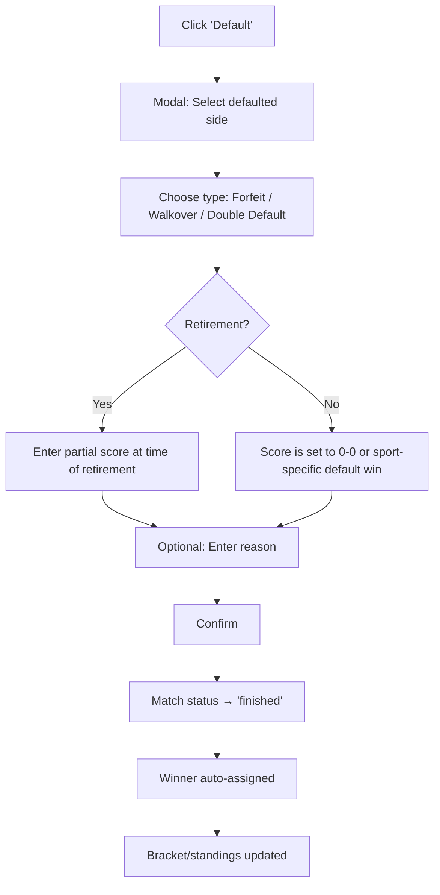

# Bulk Score Entry & Match Defaults

This document outlines the design for a **bulk match score entry interface** and a **match default (forfeit/walkover)** mechanism. These features apply to both competitions and leagues, enabling rapid score entry for tournament directors who need to record many results at once.

---

## 1. Problem

Currently, scores can only be entered one match at a time via the individual score keeper interface. For a tournament with 50+ matches in a round, or a league with 20 fixtures on a matchday, this is impractical. Directors need a spreadsheet-like interface where they can tab through matches and enter scores in bulk.

Additionally, there is no way to **default a match** (forfeit/walkover/no-show). This is a common occurrence in competitions and leagues where a participant fails to appear or withdraws.

---

## 2. Bulk Score Entry Interface

### 2.1 Access Points

| Context | Navigation Path | Scope |
| :--- | :--- | :--- |
| **Competition** | Competition → Event → "Bulk Score Entry" | All matches within a single event |
| **League** | League → Season → Division → "Bulk Score Entry" | All fixtures within a single round/matchday |
| **Standalone** | Matches page → "Bulk Entry" | All ad-hoc matches (filtered by date) |

### 2.2 Layout

The bulk score entry page is a **table-based interface**:

| Column | Description |
| :--- | :--- |
| **Match #** | Match number or bracket position |
| **Player/Team 1** | Name (from profile or team name) |
| **Score 1** | Editable input — inline number fields per set/game |
| **Score 2** | Editable input — inline number fields per set/game |
| **Player/Team 2** | Name (from profile or team name) |
| **Status** | `Scheduled` / `Live` / `Finished` / `Defaulted` |
| **Actions** | "Default" button, "Save" indicator |

#### Score Input Format

The score input adapts to the sport's scoring structure:

| Sport Type | Input Format | Example |
| :--- | :--- | :--- |
| **Set-based** (Tennis, Table Tennis, Badminton) | Score per set, displayed as inline cells | `11-9, 7-11, 11-5, 11-8` |
| **Period-based** (Basketball, Soccer, Hockey) | Total score with optional period breakdown | `78 - 65` |
| **Single-score** (Darts, Snooker) | Frames/legs won | `6 - 4` |

### 2.3 Filtering & Search

Bulk entry only shows **relevant matches** to avoid clutter:

**Competition Mode (by Event):**
- Matches are scoped to the selected event.
- **Search:** Filter by player/team name (real-time text filter).
- **Filter by round:** Show only a specific round (e.g., "Round of 16", "Quarterfinals", "Group A").
- **Filter by status:** Show only `Scheduled`, only `Finished`, or all.
- Default view: **Scheduled matches only** (unscored).

**League Mode (by Round/Matchday):**
- Matches are scoped to the selected division and round.
- **Search:** Filter by player name or team name.
- **Filter by group:** If the division has multiple groups, filter by group.
- **Filter by status:** Same as competition mode.
- Default view: **Current round's scheduled matches**.

### 2.4 Auto-Advance Flow

The core UX principle is **type and go** — the user should never need to click between fields. After entering a valid score in one cell, the cursor automatically advances to the next logical cell.

#### Single-Score Sports (Soccer, Basketball, etc.)

```
Match 1:  [Team 1 Score] → [Team 2 Score] → auto-save ✓ → jump to Match 2
Match 2:  [Team 1 Score] → [Team 2 Score] → auto-save ✓ → jump to Match 3
...continues until the last unscored match
```

1. Focus starts in **Match 1, Team 1 Score**.
2. User types the score (e.g., `3`) and presses **Enter** or **Tab**.
3. Focus auto-advances to **Match 1, Team 2 Score**.
4. User types the score (e.g., `1`) and presses **Enter**.
5. The row **auto-saves** (green checkmark appears), and focus jumps to **Match 2, Team 1 Score**.
6. Repeat until done.

#### Set-Based Sports (Table Tennis, Tennis, Badminton, etc.)

For sports with multiple sets/games per match, the flow moves through each set cell:

```
Match 1:  [G1-T1] → [G1-T2] → [G2-T1] → [G2-T2] → ... → auto-save ✓ → Match 2
```

1. Focus starts in **Match 1, Game 1, Team 1**.
2. User types `11`, presses **Enter** → focus moves to **Game 1, Team 2**.
3. User types `9`, presses **Enter** → focus moves to **Game 2, Team 1**.
4. Continue through all games. When the match-winning condition is met (e.g., 3 games won in best-of-5), the remaining game cells are **skipped** and the row auto-saves.
5. Focus jumps to the next match.

> [!TIP]
> **Early completion:** If a table tennis match ends 3-0 (best of 5), the user enters 6 cells (3 games × 2 sides). Games 4 and 5 are automatically skipped because the match winner is already determined. The cursor jumps straight to the next match.

#### Smart Auto-Advance Rules

| Rule | Behaviour |
| :--- | :--- |
| **Enter / Tab** | Accept current value, advance to next cell |
| **Shift+Tab** | Go back to the previous cell |
| **Escape** | Discard unsaved changes in the current row, deselect |
| **Skip finished rows** | Auto-advance skips rows already marked `Finished` or `Defaulted` |
| **End of list** | When the last unscored match is saved, show a "All scores entered" confirmation |
| **Click to override** | User can click any cell to jump directly to it, breaking the auto-advance sequence |

### 2.5 Save Behaviour

- **Auto-save per row:** A row saves automatically when **both sides have valid scores** and the user advances out of that row (via Enter/Tab). A green checkmark (✓) appears.
- **"Save All" button:** Also available as a fallback to batch-save all modified rows.
- **Unsaved indicator:** Rows with partial data (only one side entered) show a yellow dot and are **not** auto-saved — the cursor stays in that row until both sides are complete.
- **Validation:** Sport-specific validation ensures scores are valid (e.g., a table tennis game can't be `11-10` without deuce rules). Invalid cells are highlighted red with an inline tooltip.

---

## 3. Match Default (Forfeit / Walkover)

A **default** is when a match result is recorded without actual play, typically because one participant did not appear or withdrew.

### 3.1 Default Types

| Type | Code | Description |
| :--- | :--- | :--- |
| **Forfeit** | `forfeit` | One participant fails to show up. The opponent wins by default. |
| **Walkover** | `walkover` | One participant withdraws before the match. The opponent advances. |
| **Double Default** | `double_default` | Both participants fail to appear. Neither advances (or both receive a loss). |
| **Retirement** | `retirement` | A match starts but one participant withdraws mid-match. The score at the time of retirement is recorded. |

### 3.2 Data Model

```typescript
// Addition to match state
interface MatchDefault {
    type: 'forfeit' | 'walkover' | 'double_default' | 'retirement';
    defaultedSide: 'team1' | 'team2' | 'both';
    reason?: string;            // Optional reason text
    recordedBy: string;         // userId of the admin who recorded it
    recordedAt: string;         // ISO 8601
}

// On the match object:
{
    status: 'finished',
    winner: 'team1',            // Auto-set based on defaultedSide
    defaultInfo?: MatchDefault, // Present only for defaulted matches
}
```

### 3.3 Access Points for Defaulting a Match

The "Default Match" action must be available in **two places**:

| Location | UI Element | Flow |
| :--- | :--- | :--- |
| **Score Keeper Interface** | "Default" button in the match controls | Opens a modal: select which side defaulted, choose type, optional reason → confirm |
| **Bulk Score Entry** | "Default" button per row in the Actions column | Same modal, scoped to that row |

### 3.4 Default Flow



### 3.5 Impact on Standings & Brackets

| System | Effect of a Default |
| :--- | :--- |
| **Brackets** | The non-defaulting player advances to the next round. If double default, the bracket position is vacated (BYE in next round). |
| **Round Robin Standings** | The non-defaulting player receives points for a win. The defaulting player receives a loss. If double default, both receive a loss. |
| **League Standings** | Same as round robin. Points awarded per the league's points configuration. |
| **Swiss Pairings** | The non-defaulting player receives a win for pairing purposes in the next round. |

### 3.6 Display

Defaulted matches should be visually distinct:

- **Bracket Viewer:** Show "W/O" or "DEF" next to the winner's name instead of a score.
- **Standings Table:** Defaults count as wins/losses but can be filtered separately in stats.
- **Match History:** Show a badge ("Forfeit", "Walkover") on the match card.

---

## 4. Sport-Specific Score Templates

The bulk entry table adapts its score input columns based on the sport's match structure. The sport class (`lib/sports/[sport]/index.tsx`) defines the scoring template.

| Sport | Score Format | Columns per Side |
| :--- | :--- | :--- |
| **Table Tennis** | Best of 5/7 games | 5 or 7 game score inputs |
| **Tennis** | Best of 3/5 sets | 3 or 5 set score inputs + tiebreak |
| **Badminton** | Best of 3 games | 3 game score inputs |
| **Squash** | Best of 3/5 games | 3 or 5 game score inputs |
| **Basketball** | 4 quarters or total | 1 total or 4 quarter inputs |
| **Soccer** | Full time + extra time | 1 FT score + optional ET + PKs |
| **Cricket** | Innings | Runs/wickets per innings |
| **Others** | Single total score | 1 input per side |

> [!NOTE]
> The sport class's `getDefaultState()` method determines the initial score structure. The bulk entry table renders inputs matching this structure. Sport classes with set-based scoring (table tennis, tennis) render inline set cells; sports with a single total score render a single input.

---

## 5. Roadmap

### Phase 1: Bulk Score Entry
- [ ] Build the table-based bulk score entry component.
- [ ] Implement sport-specific score input rendering based on sport class.
- [ ] Integrate with competition event pages (filter by event + round).
- [ ] Add search/filter bar (by name, by round, by status).
- [ ] Implement auto-save per row and "Save All" button.
- [ ] Add keyboard navigation (Tab, Enter, Escape).

### Phase 2: Match Defaults
- [ ] Add `defaultInfo` field to match schema.
- [ ] Build "Default Match" modal (side selection, type, reason).
- [ ] Add "Default" button to the individual score keeper interface.
- [ ] Add "Default" button per row in the bulk score entry table.
- [ ] Implement automatic winner assignment and bracket/standings progression.
- [ ] Add visual indicators ("W/O", "DEF" badges) to brackets and standings.

### Phase 3: League Integration
- [ ] Integrate bulk score entry into league season → division → round pages.
- [ ] Add team name search in addition to player name search.
- [ ] Support league-specific standings impact for defaults.

### Phase 4: Polish
- [ ] Undo/revert for accidentally saved scores.
- [ ] Audit log for score changes (who changed what, when).
- [ ] Print-friendly score sheet export for manual entry at venues without connectivity.
