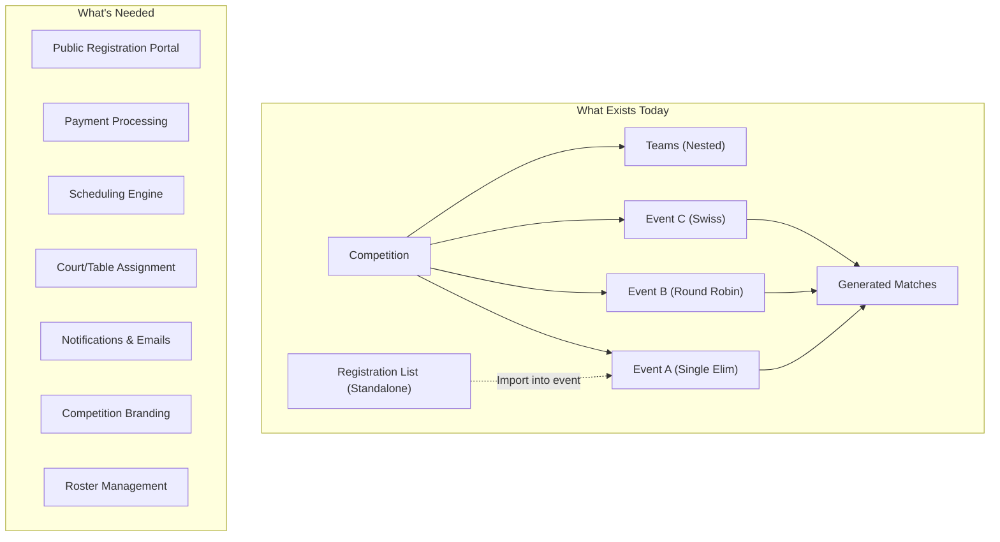
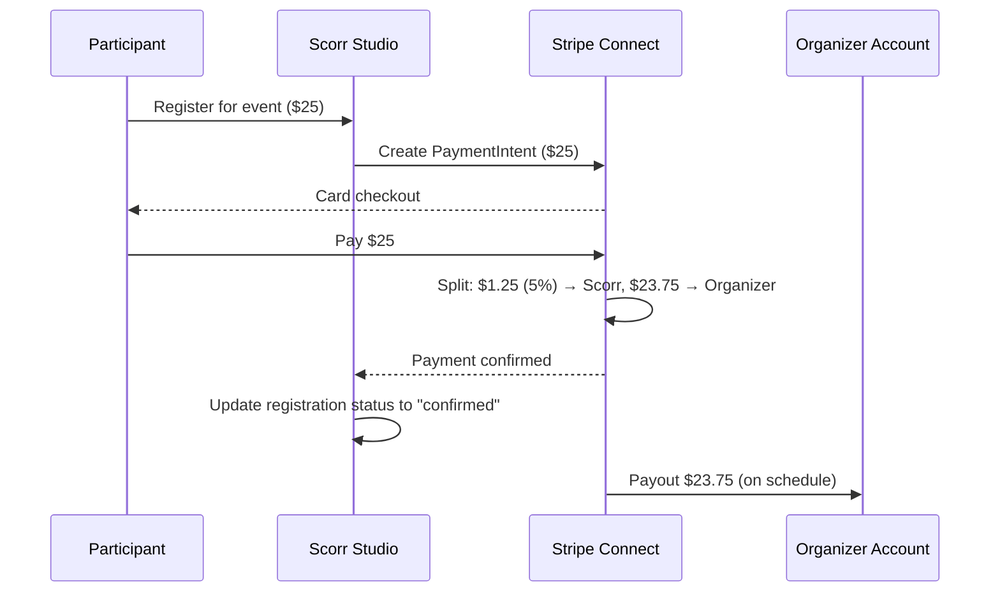
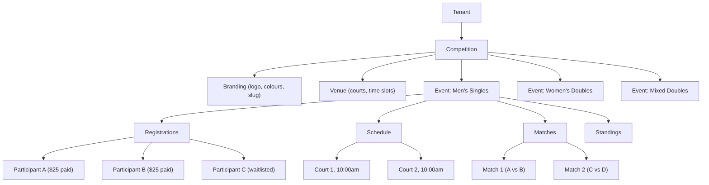

# Competition System — Current State & Roadmap

Comprehensive documentation of the competition/tournament feature in Scorr Studio, covering what exists today and the full roadmap to make it a complete tournament registration, scheduling, and management platform.

---

## 1. Architecture Overview



---

## 2. File Map

| Area | File |
|---|---|
| **Convex** | |
| Competition CRUD | [competitions.ts](file:///home/jack/clawd/scorr-studio/convex/competitions.ts) |
| Registration Lists | [registrations.ts](file:///home/jack/clawd/scorr-studio/convex/registrations.ts) |
| Schema | [schema.ts](file:///home/jack/clawd/scorr-studio/convex/schema.ts) (L37-47) |
| **UI Pages** | |
| Competition List | [competitions/page.tsx](file:///home/jack/clawd/scorr-studio/app/app/manage/[sportname]/competitions/page.tsx) |
| Competition Detail | [competitions/[id]/page.tsx](file:///home/jack/clawd/scorr-studio/app/app/manage/[sportname]/competitions/[id]/page.tsx) (1589 lines) |
| **Server Actions** | |
| Create Competition | [createCompetition.ts](file:///home/jack/clawd/scorr-studio/app/app/manage/[sportname]/competitions/actions/createCompetition.ts) |
| Create Event | [createEvent.ts](file:///home/jack/clawd/scorr-studio/app/app/manage/[sportname]/competitions/actions/createEvent.ts) |
| Generate Matches | [generateEventMatches.ts](file:///home/jack/clawd/scorr-studio/app/app/manage/[sportname]/competitions/actions/generateEventMatches.ts) |
| Generate Playoffs | [generatePlayoffMatches.ts](file:///home/jack/clawd/scorr-studio/app/app/manage/[sportname]/competitions/actions/generatePlayoffMatches.ts) |
| Generate Swiss Round | [generateSwissRound.ts](file:///home/jack/clawd/scorr-studio/app/app/manage/[sportname]/competitions/actions/generateSwissRound.ts) |
| Pool Standings | [updatePoolStandings.ts](file:///home/jack/clawd/scorr-studio/app/app/manage/[sportname]/competitions/actions/updatePoolStandings.ts) |
| Seeding | [saveEventSeeding.ts](file:///home/jack/clawd/scorr-studio/app/app/manage/[sportname]/competitions/actions/saveEventSeeding.ts) |
| Manual Match Edit | [manualMatchAdjustment.ts](file:///home/jack/clawd/scorr-studio/app/app/manage/[sportname]/competitions/actions/manualMatchAdjustment.ts) |
| Team Management | [addTeamToEvent.ts](file:///home/jack/clawd/scorr-studio/app/app/manage/[sportname]/competitions/actions/addTeamToEvent.ts), [addTeamsToEvent.ts](file:///home/jack/clawd/scorr-studio/app/app/manage/[sportname]/competitions/actions/addTeamsToEvent.ts), [removeTeamFromEvent.ts](file:///home/jack/clawd/scorr-studio/app/app/manage/[sportname]/competitions/actions/removeTeamFromEvent.ts) |
| Type Definitions | [actions.ts](file:///home/jack/clawd/scorr-studio/app/app/manage/[sportname]/competitions/actions.ts) |

---

## 3. Current Data Model

### 3.1 Competition (Schema)

```typescript
competitions: {
    competitionId: string,       // External UUID
    tenantId: string,
    sportId: string,
    name: string,
    status: string,              // "draft" | "active" | "completed"
    createdAt: string,
    events: any,                 // Record<eventId, Event> — NESTED in competition
    teams: any,                  // Record<teamId, Team> — NESTED in competition
}
// Index: by_tenant_sport [tenantId, sportId]
```

### 3.2 Event (Nested Inside Competition)

```typescript
interface Event {
    id: string;
    name: string;
    format: CompetitionFormat;   // 6 supported formats
    type: CompetitionType;       // "team" | "individual"
    status: "draft" | "active" | "completed";
    teams?: any;
    seeding?: string[];          // Ordered team IDs
    matches?: any;               // Record<matchId, Match> — generated matches
    matchesGenerated?: boolean;
    matchesGeneratedAt?: string;
    // Round Robin specific
    groupSize?: number;
    groupFormat?: "linear" | "snake";
    advancingPerGroup?: number;
    playoffsGenerated?: boolean;
    // Swiss specific
    swissRounds?: SwissRound[];
    totalSwissRounds?: number;
    currentSwissRound?: number;
    // General
    allowByes?: boolean;
    byeSeeding?: string;
    description?: string;
    matchSettings?: Record<string, any>;  // Sport-specific settings
    poolStandings?: Record<string, PoolStanding[]>;
}
```

### 3.3 Registration List (Separate Table)

```typescript
registrations: {
    listId: string,
    tenantId: string,
    sportId: string,
    name: string,
    publicUrl?: string,          // Shareable link for self-registration
    entries: any,                // Record<entryId, EntryData>
}
// Indexes: by_tenant_sport, by_publicUrl
```

> [!NOTE]
> Registration lists are **standalone entities** — they can optionally be linked to a competition via `linkedCompetitionId`, but are not tightly coupled. Entries are imported into events manually.

---

## 4. What Exists Today

### 4.1 Competition List Page

| Feature | Status | Details |
|---|---|---|
| Create competition | ✅ | Name + optional auto-create registration list |
| Delete competition | ✅ | With confirmation dialog |
| View competition cards | ✅ | Shows name, creation date, team count, status |
| Navigate to management | ✅ | Links to `[id]` detail page |
| Embed code generation | ✅ | iframe embed for external websites |
| Usage limit enforcement | ✅ | `checkLimit()` before creation |
| RBAC gating | ✅ | `competition:create` / `competition:delete` permissions |
| Telemetry | ✅ | PostHog events for create, delete, page view |

### 4.2 Competition Management Page (1589 lines)

The single largest page in the application. Capabilities:

| Feature | Status | Details |
|---|---|---|
| **Event Creation** | ✅ | Name, format selection, type (team/individual), match settings |
| **Event Deletion** | ✅ | With confirmation |
| **Team Assignment** | ✅ | Add individual teams to events, manual name entry |
| **Batch Import** | ✅ | Import from registration lists with select-all and filtering |
| **Drag-and-Drop Seeding** | ✅ | dnd-kit powered sortable participant list |
| **Match Generation** | ✅ | All 6 formats — see §4.3 |
| **Pool Standings** | ✅ | W/L/D/Points tracking for round robin groups |
| **Swiss Rounds** | ✅ | Round-by-round generation with bye handling |
| **Bracket Viewer** | ✅ | Inline BracketViewer (Konva) for generated brackets |
| **Manual Match Adjustment** | ✅ | Reassign teams to specific match slots |
| **Playoff Generation** | ✅ | Generate single-elimination playoffs from group stage |
| **Competition Settings** | ✅ | Update name, description |

### 4.3 Supported Event Formats

| Format | Key | Match Generation | Progression |
|---|---|---|---|
| **Single Match** | `single_match` | 1 match with 2 participants | — |
| **Single Elimination** | `single_elimination` | Full bracket with proper seeding + bye handling | Winner advances via `nextMatchId` |
| **Double Elimination** | `double_elimination` | Winners bracket + losers bracket + grand finals | Losers drop down, winners advance, grand final decides |
| **Round Robin** | `round_robin` | All-play-all within groups (snake/linear seeding) | Pool standings track W/L/D/Points |
| **Round Robin → Playoffs** | `round_robin_to_single` | Groups first, then single elimination for top N per group | `advancingPerGroup` controls cutoff |
| **Swiss** | `swiss` | Round-by-round pairing, similar records face each other | Configurable `totalSwissRounds` |

### 4.4 Registration Lists

| Feature | Status | Details |
|---|---|---|
| CRUD for lists | ✅ | Create, update, delete |
| Add/remove/update entries | ✅ | Entries stored as nested map |
| Public URL sharing | ✅ | Shareable link for self-registration |
| Auto-create with competition | ✅ | Toggle during competition creation |
| Import into events | ✅ | Select entries → batch add to event |

---

## 5. What's Missing — Full Roadmap

### 🔴 Phase 1 — Public Registration Portal

The single most important missing feature. Users need a public-facing page where participants can discover events, register, and pay.

| Feature | Priority | Details |
|---|---|---|
| **Competition public page** | Critical | Public URL at `/c/[slug]` showing competition name, dates, venue, events list, schedule, and registration status |
| **Event registration form** | Critical | Per-event sign-up for individuals, doubles pairs, or teams with configurable fields (name, email, phone, club/affiliation, rating/skill level) |
| **Registration status tracking** | Critical | States: `pending` → `confirmed` → `checked_in` / `waitlisted` / `cancelled` |
| **Capacity limits** | High | Max participants per event, auto-waitlist when full |
| **Registration deadlines** | High | Open/close dates, early-bird windows |
| **Division/category selection** | High | Age groups, skill levels, weight classes (sport-dependent) |
| **Doubles/team composition** | High | Allow registrants to specify partners or create teams during registration |
| **Waiver/agreement acceptance** | Medium | Terms of service, liability waiver checkbox during registration |
| **QR code check-in** | Medium | Generate QR codes for registered participants, scan at venue |

**Proposed schema addition:**

```typescript
competitionRegistrations: {
    competitionId: string,
    eventId: string,
    participantId: string,     // Can be anonymous (no account) or linked user
    name: string,
    email: string,
    phone?: string,
    club?: string,
    rating?: number,
    status: "pending" | "confirmed" | "waitlisted" | "checked_in" | "cancelled",
    paymentStatus: "unpaid" | "paid" | "refunded",
    paymentId?: string,        // Stripe/platform payment reference
    registeredAt: string,
    metadata: any,             // Sport-specific fields
}
```

---

### 🔴 Phase 2 — Payment Processing

Enable tournament organizers to charge entry fees and receive payouts.

| Feature | Priority | Details |
|---|---|---|
| **Entry fee per event** | Critical | Configurable price per event (e.g., $25 for Singles, $30 for Doubles) |
| **Multi-event bundles** | High | Discounted pricing when registering for multiple events (e.g., 3 events for $60) |
| **Payment collection** | Critical | Participants pay during registration via Stripe Connect |
| **Platform fee** | Critical | Scorr Studio takes a small percentage (e.g., 3-5%) of each transaction |
| **Organizer payouts** | Critical | Deposit collected funds into organizer's account via Stripe Connect standard/express, Venmo, or bank transfer |
| **Refund handling** | High | Full/partial refunds for cancellations, with configurable refund policy |
| **Invoice/receipt generation** | Medium | Email receipts to participants, downloadable invoices for organizers |
| **Prize pool tracking** | Medium | Track entry fees allocated to prize pool vs. operational costs |
| **Early-bird pricing** | Medium | Time-based pricing tiers |

**Recommended approach:**

> [!IMPORTANT]
> **Stripe Connect** is the recommended payment processor. It handles:
> - Collecting payments from participants
> - Splitting funds (platform fee → Scorr, remainder → organizer)
> - Payouts to organizer's bank account
> - Refund processing
> - Tax form generation (1099-K for organizers)
>
> Venmo/Plaid can be offered as **payout alternatives** via Stripe Connect's external account feature.



---

### 🟡 Phase 3 — Scheduling Engine

| Feature | Priority | Details |
|---|---|---|
| **Competition date range** | Critical | Start date, end date, day-of-week/time slots |
| **Court/table assignment** | Critical | Define available courts/tables (e.g., "Court 1-8"), assign matches to specific courts |
| **Time slot scheduling** | Critical | Assign estimated start times to matches based on court availability and match duration |
| **Match duration estimates** | High | Per-sport default match duration, adjustable per event |
| **Schedule conflicts detection** | High | Prevent double-booking participants across concurrent events |
| **Schedule visualization** | High | Timeline/grid view showing courts × time slots with assigned matches |
| **Live schedule updates** | High | Automatically push schedule changes when matches run long or short |
| **Bottleneck detection** | High | Identify which unfinished matches are blocking bracket progression |
| **Rest period enforcement** | Medium | Minimum rest time between matches for the same participant |
| **Schedule export** | Medium | PDF/printable schedule for venue posting |

**Proposed schema addition:**

```typescript
competitionVenue: {
    competitionId: string,
    courts: Array<{
        id: string,
        name: string,           // "Court 1", "Table A"
        location?: string,      // "Building B, Floor 2"
        type?: string,          // "standard" | "featured" | "streaming"
    }>,
    timeSlots: {
        startTime: string,      // "09:00"
        endTime: string,        // "18:00"
        slotDuration: number,   // minutes (e.g., 30)
    },
    schedule: Record<string, {  // matchId → assignment
        courtId: string,
        startTime: string,
        endTime: string,
        status: "scheduled" | "in_progress" | "completed" | "delayed",
    }>,
}
```

---

### 🟡 Phase 4 — Notifications & Communication

| Feature | Priority | Details |
|---|---|---|
| **Competition-wide announcements** | Critical | Send to all registered participants via email + in-app |
| **Event-specific notifications** | High | Notify only participants in a specific event |
| **Schedule notifications** | High | "Your next match is in 15 minutes on Court 3" |
| **Registration confirmations** | High | Auto-send confirmation email with QR code on registration |
| **Results notifications** | Medium | "Match results posted" or "You advanced to the next round" |
| **Custom email templates** | Medium | Organizer-customizable email templates with branding |
| **SMS notifications** | Low | Text message alerts for schedule changes (via Twilio) |
| **Push notifications** | Low | In-app push for mobile users (future PWA) |

---

### 🟡 Phase 5 — Competition Branding & Customization

| Feature | Priority | Details |
|---|---|---|
| **Competition logo upload** | Critical | Custom logo displayed on public page, brackets, and emails |
| **Banner/hero image** | High | Large banner image for the competition's public landing page |
| **Custom colour scheme** | High | Primary/secondary colours applied to the public portal |
| **Sponsor logos** | Medium | Display sponsor logos on public page and bracket displays |
| **Custom URL slug** | Medium | `/c/my-tournament-2025` instead of UUID |
| **Social media sharing cards** | Medium | Open Graph meta tags with competition logo, name, dates for link previews |
| **Printable assets** | Low | Generate printable brackets, schedules, and results sheets with branding |

**Proposed schema addition:**

```typescript
competitionBranding: {
    competitionId: string,
    logo?: string,              // Convex file storage ID
    banner?: string,            // Convex file storage ID
    primaryColor?: string,      // Hex colour
    secondaryColor?: string,
    slug?: string,              // Custom URL slug
    sponsorLogos?: Array<{
        name: string,
        imageUrl: string,
        url?: string,
    }>,
    socialDescription?: string, // OG meta description
}
```

---

### 🟢 Phase 6 — Roster & Participant Management

> [!NOTE]
> Roster import uses the **flat-file import tool** documented in [user-profiles.md](file:///home/jack/clawd/scorr-studio/docs/user-profiles.md) §4. This allows organisations to export rosters from their existing registration system and import them into Scorr Studio with column-to-field mapping.

| Feature | Priority | Details |
|---|---|---|
| **Team roster management** | High | Add/remove players from team rosters, set captain/contact |
| **Player profiles** | High | Name, email, photo, rating, past results (linked to a user profile — see [user-profiles.md](file:///home/jack/clawd/scorr-studio/docs/user-profiles.md)) |
| **Doubles partner assignment** | High | Pair two players as a doubles team for specific events |
| **Seeding by rating** | Medium | Auto-seed participants based on user-input rating/ranking |
| **Attendance tracking** | Medium | Mark participants as present/absent for check-in |
| **Player stats/history** | Low | Track historical results across competitions for a player |
| **Flat-file roster import** | High | CSV/TSV/XLSX import with column mapping — see [user-profiles.md §4](file:///home/jack/clawd/scorr-studio/docs/user-profiles.md) |

---

### 🟢 Phase 7 — Results & Analytics

| Feature | Priority | Details |
|---|---|---|
| **Live results page** | High | Public real-time results feed (matches completing, brackets updating) |
| **Final standings** | High | Auto-calculated final placements for all events |
| **Results export** | Medium | CSV/PDF export of all results for governing body submission |
| **Head-to-head records** | Medium | Track historical matchups between players/teams |
| **Post-competition report** | Medium | Summary: attendance, registration fill rate, revenue, match count, average match duration |
| **Rating adjustments** | Low | Calculate and publish rating changes post-competition |
| **Photo gallery** | Low | Upload and display competition photos |

---

### 🔵 Phase 8 — Advanced Features

| Feature | Priority | Details |
|---|---|---|
| **Multi-day competition support** | Medium | Schedule spanning multiple days with per-day session management |
| **Consolation brackets** | Medium | Automatic consolation/plate events for early losers |
| **Compass draws** | Low | 8-player compass format (N/S/E/W brackets) used in racket sports |
| **Live streaming integration** | Low | Link courts to camera feeds, embed in public page |
| **Spectator mode** | Medium | Non-participant view of live brackets with auto-refresh |
| **Volunteer management** | Low | Assign volunteers to tasks (umpiring, desk duty, etc.) |
| **Tournament series** | Low | Group multiple competitions into a season/tour with cumulative standings |
| **Custom scoring rules** | Medium | Override default sport scoring per event (e.g., best-of-5 instead of best-of-3) |
| **Referee assignment** | Low | Assign referees/umpires to matches, manage availability |
| **Seeding committee tools** | Low | Collaborative seeding review with multiple admins |

---

## 6. Proposed Competition Data Hierarchy

The current flat `events` nested object should evolve into a richer hierarchy:



---

## 7. Implementation Priority Summary

| Phase | Theme | Key Deliverable | Effort |
|---|---|---|---|
| **Phase 1** | Public Registration | `/c/[slug]` portal with event sign-up | Large |
| **Phase 2** | Payments | Stripe Connect for entry fees + organizer payouts | Large |
| **Phase 3** | Scheduling | Court/table assignment + time slot management | Medium |
| **Phase 4** | Communication | Email notifications + announcements | Medium |
| **Phase 5** | Branding | Logo/banner upload + custom colours + social cards | Small |
| **Phase 6** | Rosters | Player profiles + doubles pairing + attendance | Medium |
| **Phase 7** | Results | Live results page + standings + export | Medium |
| **Phase 8** | Advanced | Multi-day, consolation, streaming, series | Large (incremental) |

---

## 8. Current State vs Competitive Landscape

For reference, here's how the current state compares to what leading tournament platforms offer:

| Feature | Scorr Studio (Now) | Challonge | Start.gg | Tournamentsoftware |
|---|---|---|---|---|
| Bracket generation | ✅ 6 formats | ✅ 5 formats | ✅ Many | ✅ Many |
| Online registration | 🟡 Basic lists | ✅ | ✅ | ✅ |
| Payment processing | ❌ | ❌ | ✅ | ✅ |
| Court/table scheduling | ❌ | ❌ | ❌ | ✅ |
| Live score displays | ✅ Custom Konva | ❌ | 🟡 Basic | ❌ |
| Custom branding | ❌ | ❌ | 🟡 Premium | ✅ |
| Embeddable widgets | ✅ | ✅ | ✅ | ❌ |
| Notifications/email | ❌ | 🟡 Basic | ✅ | ✅ |
| Multi-sport support | ✅ | ✅ | 🟡 Esports only | 🟡 Racket sports only |
| Score display editor | ✅ Unique | ❌ | ❌ | ❌ |

> [!TIP]
> Scorr Studio's **unique competitive advantage** is the custom Konva score display editor and live broadcasting overlay system. No competitor offers this. The roadmap should build on this strength by ensuring competition data flows seamlessly into the live display pipeline.
