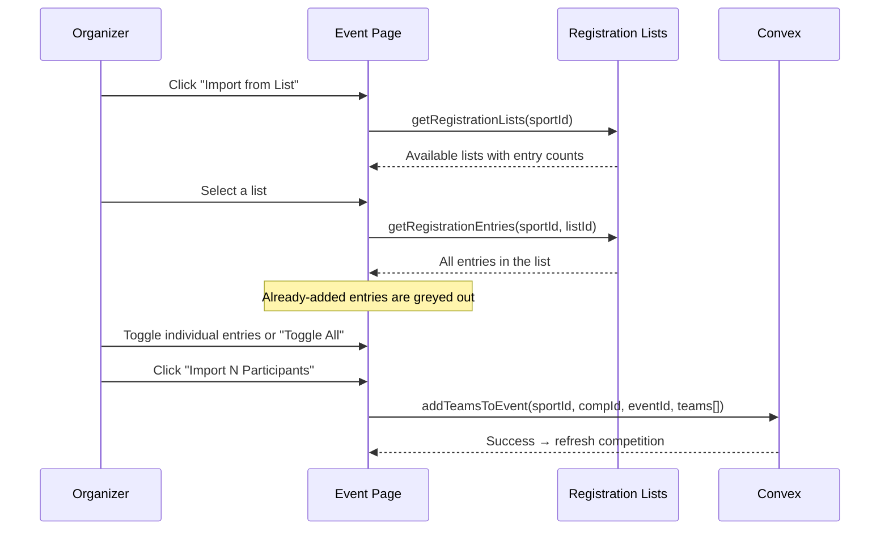

# Event Management — Current State & Roadmap

Detailed documentation of the event management system within Scorr Studio's competition feature. Events are the individual brackets, divisions, or categories inside a competition (e.g., "Men's Singles," "U18 Division," "Mixed Doubles"). This document covers the full lifecycle: creation, participant management, seeding, match generation, live management, standings, public views, and the roadmap for what's needed next.

---

## 1. Data Model

### 1.1 Event (Nested Inside Competition)

Events are stored as a `Record<eventId, Event>` inside the parent competition document — they are **not** a separate Convex table.

```typescript
interface Event {
    id: string;
    name: string;                           // "Men's Singles", "U18 Division"
    format: CompetitionFormat;              // See §2.1
    type: "team" | "individual";
    status: "draft" | "active" | "completed";
    teams?: Record<string, Participant>;    // Participants in the event (individuals or teams)
    seeding?: string[];                     // Ordered participant IDs (drag-and-drop order)
    matches?: Record<string, Match>;        // Generated matches
    matchesGenerated?: boolean;
    matchesGeneratedAt?: string;
    // Round Robin settings
    groupSize?: number;                     // Players/teams per group (default: 4)
    groupFormat?: "linear" | "snake";       // How participants distribute into groups
    advancingPerGroup?: number;             // How many advance from each group to playoffs
    playoffsGenerated?: boolean;
    // Swiss settings
    swissRounds?: SwissRound[];
    totalSwissRounds?: number;
    currentSwissRound?: number;
    // General
    allowByes?: boolean;
    byeSeeding?: string;
    description?: string;
    matchSettings?: Record<string, any>;    // Sport-specific (best-of, game-to, etc.)
    poolStandings?: Record<string, PoolStanding[]>;
}
```

### 1.2 Participant (Nested Inside Event)

```typescript
// Participants live in event.teams[participantId]
{
    id: string;              // UUID or "player-{timestamp}" for manual entries
    name: string;
    logoUrl?: string;        // Avatar/logo
    city?: string;           // Location (displayed on seeding cards)
    imageUrl?: string;       // Alternative to logoUrl (from registration lists)
    joinedAt?: string;       // ISO timestamp
}
```

### 1.3 Match (Nested Inside Event)

Matches are created by the match generation system (§3) and stored in `event.matches[matchId]`. Each match is sport-specific (created via `sportConfig.createMatch()`), but common fields include:

```typescript
{
    id: string;
    sportId: string;
    tenantId: string;
    matchRound: string;           // "Round of 16", "Quarter Finals", "Group A", etc.
    team1Id: string | null;
    team2Id: string | null;
    team1?: { name: string; logoUrl: string | null };
    team2?: { name: string; logoUrl: string | null };
    team1Score?: number;
    team2Score?: number;
    status: string;               // "scheduled" | "in_progress" | "finished"
    // Bracket progression
    nextMatchId?: string;         // Winner advances here
    nextMatchSlot?: "team1Id" | "team2Id";
    // Double elimination
    loserNextMatchId?: string;    // Loser drops to this match
    loserNextMatchSlot?: "team1Id" | "team2Id";
    isLosersBracket?: boolean;
    isPlayoff?: boolean;
    roundIndex?: number;
    matchIndex?: number;
    note?: string;                // "Bye"
    eventName?: string;
    competitionId?: string;
    eventId?: string;
}
```

---

## 2. Event Creation & Configuration

### 2.1 Supported Formats

| Format | Key | Description | When to Use |
|---|---|---|---|
| **Single Elimination** | `single_elimination` | Standard bracket — lose once and you're out | Classic knockout tournaments |
| **Double Elimination** | `double_elimination` | Winners bracket + losers bracket + grand finals | Competitive events where one loss shouldn't eliminate |
| **Round Robin** | `round_robin` | Every participant plays every other participant in their group | League-style play, group stages |
| **Round Robin → Playoffs** | `round_robin_to_single` | Groups first, then top N from each group advance to SE bracket | Most common format for serious tournaments |
| **Swiss** | `swiss` | Round-by-round pairing based on similar records | Large fields where RR is impractical |
| **Single Match** | `single_match` | Exactly 2 participants, 1 match | Exhibition matches, one-off games |

### 2.2 Event Creation Dialog

Created via the "Create Event" dialog on the competition detail page:

| Field | Type | Options |
|---|---|---|
| **Event Name** | Text input | e.g., "Men's Singles", "U18 Category" |
| **Competition Format** | Select dropdown | All 6 formats from §2.1 |
| **Participant Type** | Select dropdown | "Individual Players" or "Teams" |

> [!NOTE]
> **Match settings** (best-of, game points, etc.) are passed to `handleCreateEvent` as an empty object `{}` — sport-specific match settings configuration is **not yet exposed** in the create dialog. They default to the sport config defaults.

### 2.3 Format-Specific Settings (Post-Creation)

Once an event is created, additional settings appear depending on the format:

| Setting | Applies To | UI Control | Action |
|---|---|---|---|
| **Group Size** | Round Robin formats | Number input | `handleUpdateGroupSize()` → `updateEvent()` |
| **Advancing Per Group** | Round Robin → Playoffs | Number input | `handleUpdateAdvancement()` → `updateEvent()` |
| **Total Swiss Rounds** | Swiss | configurable | Set during event or auto-calculated |

---

## 3. Participant Management

### 3.1 Adding Participants

Three methods exist for adding participants to an event:

| Method | For Type | UI | How It Works |
|---|---|---|---|
| **Assign Team** | Teams | Dialog with team list | Fetches global tenant teams → `addTeamToEvent()` |
| **Add Player** | Individuals | Manual name input | Creates `{ id: "player-{timestamp}", name }` → `addTeamToEvent()` |
| **Import from Registration List** | Individuals | Multi-select from registration entries | Select list → pick entries → `addTeamsToEvent()` (batch) |

#### Import Flow



### 3.2 Removing Participants

Participants can be removed individually via the trash icon on their seeding card — **only if matches have not been generated yet**. Once matches are generated, the participants list is **locked** (marked "Locked: Matches Generated").

### 3.3 Searching Participants

A search bar filters the participant list by name (client-side filter).

---

## 4. Seeding

### 4.1 Current Seeding System

Seeding is managed via **drag-and-drop reordering** of participant cards using `@dnd-kit`:

| Feature | Status | Details |
|---|---|---|
| Drag-and-drop reorder | ✅ | `SortableParticipantCard` with `verticalListSortingStrategy` |
| Visual seed number | ✅ | Shows `index + 1` on each card |
| Save seed order | ✅ | `saveEventSeeding()` persists the ordered ID array |
| Lock after generation | ✅ | Seeding disabled once matches are generated |

When matches are generated, the seeding array is passed to `generateEventMatches()`, which uses proper bracket seeding order (1v8, 4v5, etc.) for elimination formats and snake seeding for round robin groups.

### 4.2 What's Missing — Seeding by Profile Fields

> [!WARNING]
> Currently, seeding is **purely manual drag-and-drop**. There is no ability to auto-seed based on player ratings, rankings, or custom profile fields.

**Roadmap — Profile-Based Auto-Seeding:**

| Feature | Priority | Details |
|---|---|---|
| **Custom participant fields** | Critical | Allow organizers to define custom fields on their registration form (e.g., USATT rating, club, age, gender, weight class) |
| **Participant profile data** | Critical | Store rating, ranking, and custom fields on each participant record |
| **Auto-seed by field** | High | "Sort by Rating (desc)" button that reorders the seeding list by a selected field |
| **Seed preview** | Medium | Show the resulting bracket matchups before confirming ("Player 1 vs Player 8 in R1") |
| **Rating-based separation** | Medium | Ensure top-rated players don't face each other until later rounds (proper bracket seeding algorithm based on ratings) |
| **Category auto-assignment** | Medium | Auto-assign players to events based on profile fields (e.g., all U18 players go to the U18 event) |

**Proposed participant schema enhancement:**

```typescript
interface EnhancedParticipant {
    id: string;
    name: string;
    email?: string;
    phone?: string;
    logoUrl?: string;
    // Profile fields for seeding
    rating?: number;            // Sports governing body rating (USATT, BWF, etc.)
    ranking?: number;           // Manual or imported ranking
    club?: string;              // Club/affiliation
    ageGroup?: string;          // "U12", "U18", "Open", "Senior"
    gender?: string;            // For gendered divisions
    weightClass?: string;       // Combat/wrestling sports
    customFields?: Record<string, any>;  // Organizer-defined fields
}
```

---

## 5. Match Generation

### 5.1 Bracket Seeding Algorithm

For elimination formats, the match generator uses a **proper tournament seeding order** (ensures #1 seed plays #16, #8 plays #9, etc.):

```typescript
const getBracketOrder = (n: number): number[] => {
    if (n === 1) return [0];
    const lower = getBracketOrder(n / 2);
    return lower.flatMap(i => [i, n - 1 - i]);
};
```

### 5.2 Generation by Format

| Format | What Gets Generated | Special Handling |
|---|---|---|
| **Single Elimination** | Full bracket with `nextMatchId` linking | Bye handling (auto-advance), round names (Round of 16 → QF → SF → Finals) |
| **Double Elimination** | Winners bracket + losers bracket + grand finals | `loserNextMatchId` for tracking players dropping into losers bracket |
| **Round Robin** | All-vs-all matches within each group | Snake seeding distributes players evenly across groups |
| **Round Robin → Playoffs** | Groups first, then `generatePlayoffMatches()` creates SE bracket | Top N per group advance (configurable `advancingPerGroup`) |
| **Swiss** | One round at a time via `generateSwissRound()` | Pairs players with similar records, handles byes for odd numbers |
| **Single Match** | Exactly 1 match | Direct assignment of 2 participants |

### 5.3 Post-Generation Lock

Once matches are generated:
- ✅ Participant list is **locked** (no add/remove)
- ✅ Seeding drag-and-drop is **disabled**
- ✅ `matchesGenerated: true` and `matchesGeneratedAt` are set on the event

---

## 6. Match Management Interface

### 6.1 Brackets & Matches Tab

After match generation, the "Brackets & Matches" tab displays:

| Element | Details |
|---|---|
| **Match Schedule heading** | Includes a "View All Matches" button linking to the full matches page |
| **Match card grid** | 3-column responsive grid of individual match cards |
| **Match card contents** | Round name label, Team 1 (avatar + name + score), Team 2 (avatar + name + score), "Score →" link |
| **Match search** | Filter matches by team/player name |
| **Per-match dropdown** | "Change Player 1" / "Change Player 2" via `manualMatchAdjustment()` |

Each match card links to `/app/manage/[sport]/matches/[matchId]/score` for live scoring with the sport-specific scorekeeper interface.

### 6.2 Bracket View Tab

For elimination formats, a dedicated "Bracket View" tab renders the bracket using the `BracketViewer` component (Konva-based canvas):
- Only appears when format includes `elimination` **and** matches have been generated
- Displays the full bracket tree with match progression
- Uses the `defaultStyle` preset for visual styling

### 6.3 Manual Match Adjustment

When a match assignment needs correction:
1. Open the match card dropdown → "Change Player 1" or "Change Player 2"
2. A dialog appears listing all event participants
3. Select a new participant or "Clear Slot (TBD)"
4. Calls `manualMatchAdjustment()` to update the match in the database

---

## 7. Standings & Results

### 7.1 Pool Standings (Round Robin)

The `PoolStandingsCard` component renders a table for each group:

| Column | Data |
|---|---|
| **#** | Rank (1-indexed) |
| **Team** | Participant name |
| **P** | Matches played |
| **W** | Wins |
| **D** | Draws |
| **L** | Losses |
| **GD** | Game difference |
| **Pts** | Points (3 for win, 1 for draw) |

- Top 2 teams per group are highlighted in green (`bg-emerald-500/5`)
- Standings are refreshed via `handleRefreshStandings()` → `updatePoolStandings()`

### 7.2 Swiss Standings

The `SwissRoundsCard` component shows:
1. **Running standings table** — Rank, Name, W, L, Points (sorted by points desc, then wins desc)
2. **Round-by-round pairings** — Each round as a card showing matchups with completion status
3. **Bye indicator** — Shows which player got a bye each round
4. **"Generate Round N" button** — Generates the next Swiss round on demand

Swiss points: 3 for a win, 0 for a loss, 3 for a bye (counts as a win).

---

## 8. Quick Stats Sidebar

The left sidebar displays contextual stats depending on view:

| Context | Stats Shown |
|---|---|
| **Competition level** (no event selected) | Total Events, Total Players/Teams across all events |
| **Event level** (event selected) | Teams count, Format badge, Matches count |

---

## 9. Public & Embedded Views

### 9.1 Competition Embed (`/embed/competition/[id]`)

| Feature | Details |
|---|---|
| Polling interval | Every 10 seconds |
| Data shown | Competition name, description, event count, team count |
| Design | Indigo-themed card with "Powered by Scorr Studio" footer |
| Telemetry | `competition_embed_viewed` event |

### 9.2 Event Embed (`/embed/event/[competitionId]/[eventId]`)

| Feature | Details |
|---|---|
| Polling interval | Every 5 seconds |
| Data shown | Event name, format badge, match count, "Connected" live indicator |
| Design | Dark slate card with green pulse dot |
| Telemetry | `event_embed_viewed` event |

### 9.3 Embed Code UI

Both competitions and events have embed code dialogs. The iframe embed is generated in-app and copyable to clipboard:

```html
<iframe
  src="https://app.scorr.studio/embed/competition/{id}"
  width="100%" height="500" frameborder="0"
  style="border: 0; background: transparent;"
></iframe>
```

---

## 10. What's Missing — Full Roadmap

### 🔴 Phase 1 — Enhanced Event Configuration

| Feature | Priority | Details |
|---|---|---|
| **Match settings in create dialog** | Critical | Expose sport-specific settings (best-of, points-per-game, deuce rules) during event creation — currently passed as empty `{}` |
| **Doubles/mixed event type** | Critical | Add `"doubles"` and `"mixed_doubles"` as participant types, allowing pair formation during event setup |
| **Event-level description/rules** | High | Rich text description shown on public page with event-specific rules, format explanation |
| **Entry capacity limits** | High | Max number of participants per event, auto-close registration when full |
| **Event schedule dates** | High | Start date, end date, estimated rounds per day |
| **Age/division validation** | Medium | Auto-validate that participants meet event requirements based on profile fields |

---

### 🔴 Phase 2 — Profile-Based Seeding & Categories

| Feature | Priority | Details |
|---|---|---|
| **Enhanced participant profiles** | Critical | Rating, ranking, club, age group, gender, weight class, custom fields stored on each participant |
| **Auto-seed by rating** | Critical | One-click sort by rating/ranking (descending) with proper bracket seeding placement |
| **Custom field definitions per competition** | High | Organizer defines which fields appear on registration form and are used for seeding |
| **Separation rules** | High | Same-club separation (don't pair teammates in R1), geographic separation |
| **Seeding preview** | Medium | Show the resulting bracket with all matchups before confirming generation |
| **Multi-field sort** | Medium | Sort by primary field (rating), then tiebreak by secondary field (ranking) |
| **Seeding import from CSV** | Medium | Bulk import seedings from a spreadsheet |

---

### 🟡 Phase 3 — Court & Table Assignment

| Feature | Priority | Details |
|---|---|---|
| **Define courts/tables for competition** | Critical | Named resources: "Court 1", "Table A", etc. with optional location info |
| **Assign match to court** | Critical | During or after match generation, assign specific matches to specific courts |
| **Court schedule view** | High | Grid/timeline: courts on Y-axis, time on X-axis, matches as blocks |
| **Court switching** | High | Move an in-progress match to a different court with one click (updates all displays) |
| **Court status dashboard** | Medium | At-a-glance view: which courts are in use, which are available, which matches are due up next |
| **Featured court** | Medium | Mark a court as "streaming" or "featured" — controls which match goes on the live broadcast display |
| **Estimated time tracking** | Medium | Based on average match duration, show estimated start times for upcoming matches |

---

### 🟡 Phase 4 — Live Event Operations

| Feature | Priority | Details |
|---|---|---|
| **Progression bottleneck alerts** | Critical | Identify which unfinished matches are blocking bracket advancement — show them prominently |
| **Match queue management** | High | Ordered queue of matches to be called to courts, drag to reorder priority |
| **Live match status board** | High | Dashboard showing all courts, current match status, scores updating in real-time |
| **Quick score entry** | Medium | Inline score entry directly on the match card (without navigating to full scorekeeper) |
| **Match timer controls** | Medium | Start/stop/reset timers for timed sports (basketball, football) |
| **Score correction** | Medium | Edit finished match scores with audit trail |
| **Auto-advance results** | High | When a match finishes, automatically populate the next match slot and update standings |

> [!NOTE]
> **Auto-advance** partially exists — the `nextMatchId`/`nextMatchSlot` fields are set during generation, but the live scoring flow doesn't automatically write the winner into the next match. This must happen in the match completion handler.

---

### 🟡 Phase 5 — Notifications & Communication

| Feature | Priority | Details |
|---|---|---|
| **Competition-wide announcement** | Critical | Send message to all registered participants via email + in-app |
| **Event-specific notification** | High | "Your event starts in 30 minutes" to all event participants |
| **Match call notification** | High | "Report to Court 3 for your match" when a match is assigned |
| **Results notification** | Medium | "You advanced to the semifinals" after a match completes |
| **Schedule change alert** | Medium | "Your match time has been updated" when schedule shifts |
| **Custom email content** | Medium | Rich text editor for announcement body with competition branding |
| **In-app notification center** | Medium | Bell icon in the participant app showing all event notifications |

---

### 🟢 Phase 6 — Enhanced Public Views

| Feature | Priority | Details |
|---|---|---|
| **Public competition portal** | Critical | Full `/c/[slug]` page showing all events, schedule, results, registration link |
| **Live bracket viewer (public)** | Critical | Interactive bracket that updates in real-time, not just a summary card |
| **Live standings page** | High | Real-time pool/Swiss standings viewable by spectators |
| **Match schedule (public)** | High | Court-by-court schedule with status indicators |
| **Participant list (public)** | Medium | Sorted by seed, showing name, club, rating |
| **Results archive** | Medium | Post-competition results page with final placements |
| **Competition stats rollup** | High | Competition-level counters that update when events change: total matches completed, matches in progress, participants checked in, events started/finished |

---

### 🟢 Phase 7 — Competition-Level Stats & Dashboard

| Feature | Priority | Details |
|---|---|---|
| **Real-time competition dashboard** | High | Total matches (completed / in-progress / scheduled), participants checked in, events in progress |
| **Event completion progress** | High | Per-event progress bar (e.g., "12/31 matches completed") |
| **Match throughput metrics** | Medium | Average match duration, matches per hour, estimated time remaining |
| **Head-to-head record display** | Medium | When two players are assigned a match, show their historical record |
| **Live activity feed** | Medium | Chronological stream of events ("Match 7 completed: A beat B 11-9, 11-7") |

---

## 11. Current vs Target State

| Capability | Today | Target |
|---|---|---|
| **Event creation** | ✅ Name, format, type | + Match settings, doubles type, capacity, dates |
| **Participant management** | ✅ Manual, import, assign | + Profile fields, rating, auto-validation |
| **Seeding** | ✅ Drag-and-drop only | + Auto-seed by rating, separation rules, preview |
| **Match generation** | ✅ All 6 formats | + Consolation brackets, compass draws |
| **Pool standings** | ✅ W/L/D/GD/Pts table | + Live-updating, public view |
| **Swiss standings** | ✅ Running + round pairings | + Public view, tiebreaker display |
| **Bracket view** | ✅ Konva-based BracketViewer | + Public interactive version |
| **Match management** | 🟡 Card grid + manual adjust | + Court assignment, queue, bottleneck alerts |
| **Live scoring** | ✅ Sport-specific scorekeeper | + Auto-advance to next match |
| **Court management** | ❌ None | + Court definition, assignment, switching, dashboard |
| **Notifications** | ❌ None | + Announcements, match calls, results alerts |
| **Public embed** | 🟡 Summary cards only | + Full bracket, standings, schedule |
| **Competition stats** | 🟡 Basic sidebar only | + Real-time dashboard, progress bars, activity feed |
| **Profile-based seeding** | ❌ None | + Rating fields, auto-sort, separation rules |
| **Doubles support** | ❌ None | + Pair formation, partner assignment |

---

## 12. File Reference

### Server Actions (all in `app/app/manage/[sportname]/competitions/actions/`)

| File | Function | What It Does |
|---|---|---|
| [createCompetition.ts](file:///home/jack/clawd/scorr-studio/app/app/manage/[sportname]/competitions/actions/createCompetition.ts) | `createCompetition()` | Creates competition + optional registration list, checks usage limits |
| [createEvent.ts](file:///home/jack/clawd/scorr-studio/app/app/manage/[sportname]/competitions/actions/createEvent.ts) | `createEvent()` | Creates a new event inside a competition |
| [deleteEvent.ts](file:///home/jack/clawd/scorr-studio/app/app/manage/[sportname]/competitions/actions/deleteEvent.ts) | `deleteEvent()` | Removes an event from a competition |
| [updateEvent.ts](file:///home/jack/clawd/scorr-studio/app/app/manage/[sportname]/competitions/actions/updateEvent.ts) | `updateEvent()` | Updates event settings (group size, advancement, etc.) |
| [addTeamToEvent.ts](file:///home/jack/clawd/scorr-studio/app/app/manage/[sportname]/competitions/actions/addTeamToEvent.ts) | `addTeamToEvent()` | Adds a single team/player to an event |
| [addTeamsToEvent.ts](file:///home/jack/clawd/scorr-studio/app/app/manage/[sportname]/competitions/actions/addTeamsToEvent.ts) | `addTeamsToEvent()` | Batch-adds multiple participants |
| [removeTeamFromEvent.ts](file:///home/jack/clawd/scorr-studio/app/app/manage/[sportname]/competitions/actions/removeTeamFromEvent.ts) | `removeTeamFromEvent()` | Removes a participant from an event |
| [saveEventSeeding.ts](file:///home/jack/clawd/scorr-studio/app/app/manage/[sportname]/competitions/actions/saveEventSeeding.ts) | `saveEventSeeding()` | Persists drag-and-drop seed order |
| [generateEventMatches.ts](file:///home/jack/clawd/scorr-studio/app/app/manage/[sportname]/competitions/actions/generateEventMatches.ts) | `generateEventMatches()` | Master match generator for all 6 formats |
| [generatePlayoffMatches.ts](file:///home/jack/clawd/scorr-studio/app/app/manage/[sportname]/competitions/actions/generatePlayoffMatches.ts) | `generatePlayoffMatches()` | Creates SE bracket from group stage results |
| [generateSwissRound.ts](file:///home/jack/clawd/scorr-studio/app/app/manage/[sportname]/competitions/actions/generateSwissRound.ts) | `generateSwissRound()` | Generates the next Swiss round based on current standings |
| [updatePoolStandings.ts](file:///home/jack/clawd/scorr-studio/app/app/manage/[sportname]/competitions/actions/updatePoolStandings.ts) | `updatePoolStandings()` | Recalculates pool standings from match results |
| [manualMatchAdjustment.ts](file:///home/jack/clawd/scorr-studio/app/app/manage/[sportname]/competitions/actions/manualMatchAdjustment.ts) | `manualMatchAdjustment()` | Manually reassign teams to match slots |
| [updateCompetitionSettings.ts](file:///home/jack/clawd/scorr-studio/app/app/manage/[sportname]/competitions/actions/updateCompetitionSettings.ts) | `updateCompetitionSettings()` | Updates competition-level settings |

### UI Components

| Component | Location | Purpose |
|---|---|---|
| `SortableParticipantCard` | [page.tsx#L109-174](file:///home/jack/clawd/scorr-studio/app/app/manage/[sportname]/competitions/[id]/page.tsx#L109-L174) | Draggable participant card with seed number, avatar, name, location, remove button |
| `PoolStandingsCard` | [page.tsx#L176-225](file:///home/jack/clawd/scorr-studio/app/app/manage/[sportname]/competitions/[id]/page.tsx#L176-L225) | Round robin group standings table |
| `SwissRoundsCard` | [page.tsx#L227-374](file:///home/jack/clawd/scorr-studio/app/app/manage/[sportname]/competitions/[id]/page.tsx#L227-L374) | Swiss standings + round pairings + next round generator |
| `CompetitionManagementPage` | [page.tsx#L376-1588](file:///home/jack/clawd/scorr-studio/app/app/manage/[sportname]/competitions/[id]/page.tsx#L376-L1588) | Master page with all event management functionality |
