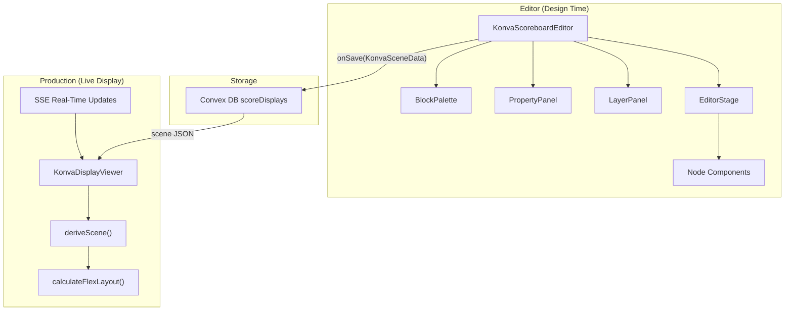
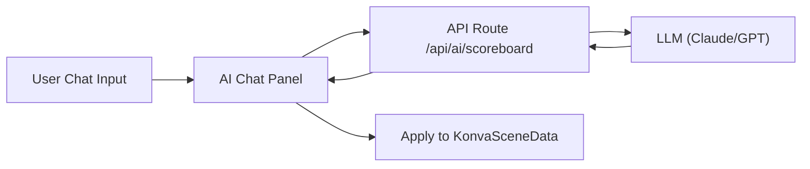

# Konva Scoreboard Editor — Complete Reference & Roadmap

Comprehensive documentation of the Konva-based score display editor: current code, every feature & setting, flexbox layout analysis, versioning roadmap, production rendering, and AI assistant roadmap.

---

## Table of Contents

1. [Architecture Overview](#1-architecture-overview)
2. [File Map](#2-file-map)
3. [Node Types & Editable Settings](#3-node-types--editable-settings)
4. [Data Binding System](#4-data-binding-system)
5. [Animation System](#5-animation-system)
6. [Save / Import / Export](#6-save--import--export)
7. [Editor Features](#7-editor-features)
8. [Production Viewer Pipeline](#8-production-viewer-pipeline)
9. [Flexbox Layout — Current State](#9-flexbox-layout--current-state)
10. [Flexbox Roadmap — Full CSS Flexbox Parity](#10-flexbox-roadmap--full-css-flexbox-parity)
11. [Versioning Roadmap](#11-versioning-roadmap)
12. [AI Chat Assistant Roadmap](#12-ai-chat-assistant-roadmap)

---

## 1. Architecture Overview



**Key insight:** The editor saves a `KonvaSceneData` JSON blob. The production viewer (`KonvaDisplayViewer`) loads that blob, applies live data bindings, measures text, and recalculates flex layouts in a 4-phase pipeline before rendering to a Konva stage.

---

## 2. File Map

### Editor Components

| File | Purpose |
|---|---|
| [KonvaScoreboardEditor.tsx](file:///home/jack/clawd/scorr-studio/components/konva-scoreboard/KonvaScoreboardEditor.tsx) | Main editor: toolbar, undo/redo, import/export, drag-drop, keyboard shortcuts |
| [EditorStage.tsx](file:///home/jack/clawd/scorr-studio/components/konva-scoreboard/EditorStage.tsx) | Konva Stage with zoom, pan, grid, snap lines, drop handling |
| [PropertyPanel.tsx](file:///home/jack/clawd/scorr-studio/components/konva-scoreboard/PropertyPanel.tsx) | Right panel: edits all properties of the selected node |
| [BlockPalette.tsx](file:///home/jack/clawd/scorr-studio/components/konva-scoreboard/BlockPalette.tsx) | Left panel: draggable blocks grouped by category (Basic / Layout / Sport) |
| [LayerPanel.tsx](file:///home/jack/clawd/scorr-studio/components/konva-scoreboard/LayerPanel.tsx) | Layer tree: selection, visibility, lock, drag-reorder/reparent |
| [TransitionController.tsx](file:///home/jack/clawd/scorr-studio/components/konva-scoreboard/TransitionController.tsx) | Controls for animation preview |

### Node Components (`nodes/`)

| File | Node Type |
|---|---|
| [TextNode.tsx](file:///home/jack/clawd/scorr-studio/components/konva-scoreboard/nodes/TextNode.tsx) | `text`, `score` |
| [ImageNode.tsx](file:///home/jack/clawd/scorr-studio/components/konva-scoreboard/nodes/ImageNode.tsx) | `image` |
| [TimerNode.tsx](file:///home/jack/clawd/scorr-studio/components/konva-scoreboard/nodes/TimerNode.tsx) | `timer` |
| [RectNode.tsx](file:///home/jack/clawd/scorr-studio/components/konva-scoreboard/nodes/RectNode.tsx) | `rect`, `container` |
| [FlexContainerNode.tsx](file:///home/jack/clawd/scorr-studio/components/konva-scoreboard/nodes/FlexContainerNode.tsx) | `flex` |
| [VisibilityNode.tsx](file:///home/jack/clawd/scorr-studio/components/konva-scoreboard/nodes/VisibilityNode.tsx) | `visibility` |
| [SeparatorNode.tsx](file:///home/jack/clawd/scorr-studio/components/konva-scoreboard/nodes/SeparatorNode.tsx) | `separator` |

### Utilities (`utils/`)

| File | Purpose |
|---|---|
| [flex-layout.ts](file:///home/jack/clawd/scorr-studio/components/konva-scoreboard/utils/flex-layout.ts) | Flexbox layout engine |
| [data-binder.ts](file:///home/jack/clawd/scorr-studio/components/konva-scoreboard/utils/data-binder.ts) | Value resolution, formatting, animation triggers |
| [serializer.ts](file:///home/jack/clawd/scorr-studio/components/konva-scoreboard/utils/serializer.ts) | Serialize/deserialize, validate, clone, migrate, find/update/remove nodes |
| [snap.ts](file:///home/jack/clawd/scorr-studio/components/konva-scoreboard/utils/snap.ts) | Node-to-node and grid snapping |
| [measurement.ts](file:///home/jack/clawd/scorr-studio/components/konva-scoreboard/utils/measurement.ts) | Canvas 2D text measurement |
| [tree.ts](file:///home/jack/clawd/scorr-studio/components/konva-scoreboard/utils/tree.ts) | Tree manipulation (move/reparent nodes) |
| [animations.ts](file:///home/jack/clawd/scorr-studio/components/konva-scoreboard/utils/animations.ts) | Entrance, loop, and transition animation runners |
| [useNodeAnimation.ts](file:///home/jack/clawd/scorr-studio/components/konva-scoreboard/utils/useNodeAnimation.ts) | React hook for applying animations to Konva nodes |

### Types & Storage

| File | Purpose |
|---|---|
| [types.ts](file:///home/jack/clawd/scorr-studio/components/konva-scoreboard/types.ts) | All TypeScript interfaces, unions, constants, defaults |
| [scoreDisplays.ts](file:///home/jack/clawd/scorr-studio/convex/scoreDisplays.ts) | Convex CRUD mutations/queries |

---

## 3. Node Types & Editable Settings

### 3.1 All Node Types

| Type | Description | Can Have Children |
|---|---|---|
| `text` | Static or data-bound text label | No |
| `score` | Score display (text variant, larger defaults) | No |
| `image` | Image from URL or data binding | No |
| `timer` | Countdown/countup timer display | No |
| `container` | Generic grouping container | Yes |
| `flex` | Flexbox layout container | Yes |
| `rect` | Decorative rectangle/shape | No |
| `visibility` | Conditional visibility wrapper | Yes |
| `separator` | Horizontal or vertical line | No |

### 3.2 Shared Properties (All Nodes)

| Property | Type | UI Control | Description |
|---|---|---|---|
| `name` | string | Text input | Display name in layer panel |
| `x` | number | Number input | X position (px) |
| `y` | number | Number input | Y position (px) |
| `width` | number | Number input | Width value |
| `widthUnit` | `'px'` / `'%'` / `'auto'` | Dropdown | Width unit (px, % of parent, or fit content) |
| `height` | number | Number input | Height value |
| `heightUnit` | `'px'` / `'%'` / `'auto'` | Dropdown | Height unit |
| `rotation` | number | Number input | Rotation in degrees |
| `opacity` | number (0–1) | Number input (step 0.1) | Node opacity |
| `visible` | boolean | Layer panel eye icon | Show/hide node |
| `locked` | boolean | Layer panel lock icon | Prevent dragging/transforming |

### 3.3 Text / Score Node Properties

| Property | Type | UI Control | Options |
|---|---|---|---|
| `text` | string | Text input | Default content |
| `fontFamily` | string | Dropdown | Inter, Roboto, Open Sans, Montserrat, Lato, Oswald, Bebas Neue, Roboto Mono, Orbitron, Teko |
| `fontSize` | number | Dropdown | 12–128px (15 presets) |
| `fontStyle` | string | Dropdown | `normal`, `bold`, `italic` |
| `fill` | string | Color picker | Text color |
| `align` | string | Dropdown | `left`, `center`, `right` |
| `verticalAlign` | string | — | `top`, `middle`, `bottom` (on type, not in panel) |
| `letterSpacing` | number | — | Letter spacing (on type, not in panel) |
| `lineHeight` | number | — | Line height multiplier (on type) |
| `textDecoration` | string | — | `none`, `underline`, `line-through` (on type) |
| `textTransform` | string | — | `none`, `uppercase`, `lowercase`, `capitalize` (on type) |
| `stroke` | string | — | Text outline color (on type) |
| `strokeWidth` | number | — | Text outline width (on type) |
| `shadowColor` | string | — | Drop shadow color (on type) |
| `shadowBlur` | number | — | Shadow blur radius (on type) |
| `shadowOffsetX/Y` | number | — | Shadow offset (on type) |

### 3.4 Image Node Properties

| Property | Type | UI Control | Description |
|---|---|---|---|
| `src` | string | Text input | Image source URL |
| `cornerRadius` | number | Number input | Border radius |
| `cropX/Y/Width/Height` | number | — | Crop region (on type, not in panel) |

### 3.5 Timer Node Properties

| Property | Type | UI Control | Description |
|---|---|---|---|
| `format` | string | — | `MM:SS`, `HH:MM:SS`, `SS`, `M:SS` |
| `direction` | string | — | `up` (countup) or `down` (countdown) |
| `fontSize` | number | — | Font size |
| `fontFamily` | string | — | Default: Roboto Mono |
| `fill` | string | — | Text color |
| `align` | string | — | Text alignment |

### 3.6 Flex Container Properties

| Property | Type | UI Control | Options |
|---|---|---|---|
| `direction` | string | Dropdown | `row` (horizontal), `column` (vertical) |
| `justify` | string | Dropdown | `start`, `center`, `end`, `space-between`, `space-around` |
| `align` | string | Dropdown | `start`, `center`, `end`, `stretch` |
| `gap` | number | Number input | Gap between children (px) |
| `padding` | number | Number input | Internal padding (px) |
| `fill` | string / GradientConfig | Solid / Gradient toggle | Background fill |
| `stroke` | string | Color picker | Border color |
| `strokeWidth` | number | Number input | Border width |
| `cornerRadius` | number | Number input | Border radius |

**Gradient fill options:**

| Setting | Description |
|---|---|
| Solid / Gradient toggle | Switch between modes |
| Gradient presets | Blue→Purple, Green→Teal, Orange→Red, Purple→Pink, Dark Fade |
| `angle` | Gradient direction (0–360°) |
| Start / End colors | Individual color pickers |

### 3.7 Rect / Container Properties

| Property | Type | UI Control | Description |
|---|---|---|---|
| `fill` | string | Color picker | Background color |
| `stroke` | string | Color picker | Border color |
| `strokeWidth` | number | Number input | Border width |
| `cornerRadius` | number | Number input | Border radius |
| `shadowColor/Blur/OffsetX/OffsetY` | various | — | Drop shadow (on type, not in panel) |

### 3.8 Separator Properties

| Property | Type | UI Control | Description |
|---|---|---|---|
| `orientation` | string | Dropdown | `horizontal`, `vertical` |
| `length` | number | Number input | Line length (px) |
| `strokeWidth` | number | Number input | Line thickness (px) |
| `stroke` | string | Color picker | Line color |

---

## 4. Data Binding System

Every node can be bound to a live data field from the match state.

### Available Bindings

Bindings are provided by the sport config (`KonvaBlockDefinition.dataBinding`) and passed as `availableBindings` to the editor. Each sport defines its own fields.

### Binding Configuration

| Setting | UI Control | Options | Description |
|---|---|---|---|
| `field` | Dropdown | Sport-specific fields | Path in match state (e.g. `team1Score`) |
| `behaviorType` | Dropdown | 7 types (see below) | How the value is applied |
| `animation` | Dropdown | 8 types (see below) | Animation on value change |
| `formatter` | — | `{value}` template | Custom format string (type only) |

### Behavior Types

| Behavior | Description |
|---|---|
| `text` | Updates text content |
| `visibility` | Shows node when field is truthy |
| `inverse-visibility` | Hides node when field is truthy |
| `image` | Updates image source URL |
| `progress` | Sets width as 0–100% of original width |
| `countdown` | Formats seconds as `MM:SS` (counting down) |
| `countup` | Formats seconds as `MM:SS` (counting up) |

> [!NOTE]
> `class-toggle` and `style` behavior types exist in the type definition but are not yet in the UI dropdown.

### Value Resolution

The `deriveScene()` function in the viewer resolves bindings using `flattenObject()` which creates multiple access paths:
- Direct key: `team1Score`
- Dot path: `team1.score`
- CamelCase: `team1Score` (auto-generated from nested paths)

---

## 5. Animation System

### 5.1 Per-Node Animation Settings (PropertyPanel)

| Setting | UI Control | Options |
|---|---|---|
| Entrance | Dropdown | None, Scale Up, Slide Up, Slide Down |
| Data Change | Dropdown | None, Pulse, Flash |
| Duration (ms) | Number input | Default 500 |
| Delay (ms) | Number input | Default 0 |

### 5.2 Binding Animation (on data change)

When a bound value changes, the node's binding animation triggers. All 8 animation types are available:

| Animation | Effect |
|---|---|
| `pulse` | Scale up 1.2× then back |
| `flash` | Opacity flicker (3 cycles) |
| `bounce` | Y offset bounce with `BounceEaseOut` |
| `scale-up` | Scale up 1.3× then settle |
| `glow` | Subtle 1.05× scale pulse |
| `slide-up` | Move up 20px with fade-in |
| `slide-down` | Move down 20px with fade-in |

### 5.3 Loop Animations

Available via code but not yet in the PropertyPanel UI:

| Animation | Effect |
|---|---|
| `pulse` | Continuous scale oscillation ±5% |
| `glow` | Continuous opacity oscillation 0.6–1.0 |
| `bounce` | Continuous Y offset sine wave |

---

## 6. Save / Import / Export

### 6.1 Save to Database

- **Trigger:** "Save" button in toolbar (floppy disk icon)
- **Mechanism:** Calls `onSave(scene)` prop → Server action `updateScoreDisplay` → Convex `scoreDisplays.update` mutation
- **Data stored:** Full `KonvaSceneData` JSON (stored as `v.any()` in Convex via `overlays` or `theme`)
- **Telemetry:** `konva_editor_save`

### 6.2 Import JSON

- **Button:** Import (IconFileUpload)
- **Mechanism:** Hidden `<input type="file" accept=".json">`, parses and replaces current scene
- **Validation:** Checks parsed content is object, alerts on failure
- **Telemetry:** `konva_editor_import_json`

### 6.3 Export JSON

- **Button:** Export (IconFileCode)
- **Output:** `scoreboard-{displayId}.json`
- **Content:** Pretty-printed `KonvaSceneData` JSON
- **Telemetry:** `konva_editor_export_json`

### 6.4 Download PNG

- **Button:** Download (IconDownload)
- **Output:** `scoreboard.png`
- **Mechanism:** `stage.toDataURL({ pixelRatio: 2 })` → 2× resolution
- **Telemetry:** `konva_editor_export_png`

### 6.5 Scene Data Format

```json
{
  "version": 1,
  "canvas": {
    "width": 1920,
    "height": 1080,
    "backgroundColor": "transparent",
    "gridSize": 20,
    "showGrid": true,
    "snapToGrid": true
  },
  "nodes": [
    {
      "id": "node-xxxx",
      "type": "flex",
      "name": "Score Row",
      "x": 100,
      "y": 50,
      "width": 400,
      "height": 80,
      "direction": "row",
      "justify": "space-between",
      "align": "center",
      "gap": 10,
      "padding": 16,
      "fill": "#1a1a2e",
      "children": [...]
    }
  ]
}
```

---

## 7. Editor Features

### 7.1 Canvas Settings

| Setting | Options |
|---|---|
| Resolution presets | 1080p (1920×1080), 720p (1280×720), 4K (3840×2160), Square (1080×1080), Vertical (1080×1920) |
| Background color | Color picker (default: transparent) |
| Grid size | Configurable (default: 20px) |
| Show grid | Toggle |
| Snap to grid | Toggle |

### 7.2 Zoom & Pan

| Action | Method |
|---|---|
| Zoom | Mouse wheel (toward pointer), +/− buttons |
| Pan | Click-drag empty canvas area |
| Fit to screen | Fit button (auto-calculates scale with 60px padding) |
| Zoom range | 10%–300% (factor 1.15×/step) |

### 7.3 Node Operations

| Operation | Method |
|---|---|
| Add node | Drag from BlockPalette onto canvas |
| Select | Click node on canvas or in layer panel |
| Move | Drag node (with snap-to-grid and snap-to-node guides) |
| Resize/Rotate | Transformer handles (all 8 anchors + rotation) |
| Delete | Delete key or ✕ button in PropertyPanel |
| Duplicate | ⊕ button in PropertyPanel (offset +20px x/y) |
| Undo/Redo | Ctrl+Z / Ctrl+Shift+Z (50-step history) |
| Lock | Layer panel lock icon |
| Visibility | Layer panel eye icon |
| Z-order | Layer panel drag-reorder |
| Reparent | Drag node onto container in layer panel → "inside" position |

### 7.4 Snap System

- **Node-to-node:** Snaps to edges (left, right, top, bottom) and centers of other nodes
- **Grid snap:** Falls back to grid when no node snap within threshold
- **Threshold:** 8px
- **Visual guides:** Drawn as lines on the stage during drag

### 7.5 Block Palette

Blocks are grouped into categories:

| Category | Blocks |
|---|---|
| **Basic** | Text, Score, Image, Timer |
| **Layout** | Container, Flex Container, Visibility Wrapper, Rectangle, Separator |
| **Sport-specific** | Dynamically loaded from sport config (e.g. `team1NameBlock`, `score1Block`) |

Sport blocks come pre-configured with data bindings and sample values, so dropping them creates ready-to-use elements.

---

## 8. Production Viewer Pipeline

The [KonvaDisplayViewer](file:///home/jack/clawd/scorr-studio/components/konva-scoreboard/KonvaDisplayViewer.tsx) runs a **4-phase derivation pipeline** every time match state changes:

### Phase 1: Apply Bindings & Measure (`applyBindingsAndMeasure`)
- Resolves all data bindings against flattened match state
- Applies visibility/inverse-visibility bindings
- Updates text content from bindings with formatters and `textTransform`
- Measures all text nodes using Canvas 2D `measureText()` to get actual pixel widths
- Updates image sources from bindings

### Phase 2: Calculate Intrinsic Sizes (`calculateIntrinsicSizes`)
- Bottom-up traversal
- For `flex` containers: calculates minimum size needed to contain all children + padding + gaps
- Expands container dimensions if content exceeds current size

### Phase 3: Synchronize Grid Columns (`syncGridColumns`)
- Finds flex columns whose child rows have matching column counts
- Synchronizes widths across columns to create table-like alignment
- Enables table-style scoreboards where all rows align their cells

### Phase 4: Perform Flex Layouts (`performFlexLayouts`)
- Re-validates container sizes after grid sync
- Calls `calculateFlexLayout()` to position all children
- Applies `stretch` alignment to cross-axis dimensions

### Execution Order
```
applyBindingsAndMeasure → calculateIntrinsicSizes → syncGridColumns → calculateIntrinsicSizes (again) → performFlexLayouts
```

### Real-Time Updates (SSE)
- **Stage SSE:** `/api/sse/stage?tenantId=X&sportId=Y&stageId=Z` — provides `currentMatchId`
- **Match SSE:** `/api/sse/match?tenantId=X&sportId=Y&matchId=Z` — streams match state changes
- Auto-reconnects on error (3-second backoff)
- Triggers binding animations when values change between states

---

## 9. Flexbox Layout — Current State

### What Exists

The flex layout engine in [flex-layout.ts](file:///home/jack/clawd/scorr-studio/components/konva-scoreboard/utils/flex-layout.ts) implements a **subset** of CSS Flexbox:

| CSS Property | Status | Implementation |
|---|---|---|
| `flex-direction` | ✅ Implemented | `row`, `column` |
| `justify-content` | ✅ Implemented | `start`, `center`, `end`, `space-between`, `space-around` |
| `align-items` | ✅ Implemented | `start`, `center`, `end`, `stretch` |
| `gap` | ✅ Implemented | Uniform gap between children |
| `padding` | ✅ Implemented | Uniform padding on all sides |
| `auto` sizing | ✅ Implemented | Container grows to fit content when `widthUnit`/`heightUnit` = `auto` |
| `%` sizing | ✅ Implemented | Children sized as % of parent |

### What's Missing

| CSS Property | Status | Notes |
|---|---|---|
| `flex-grow` | ❌ Missing | Children cannot distribute remaining space proportionally |
| `flex-shrink` | ❌ Missing | Children cannot shrink when container overflows |
| `flex-basis` | ❌ Missing | No initial main-size before grow/shrink |
| `flex-wrap` | ❌ Missing | No multi-line wrapping |
| `align-self` | ❌ Missing | Children can't override cross-axis alignment |
| `order` | ❌ Missing | Children always rendered in source order |
| `min-width` / `max-width` | ❌ Missing | No size constraints |
| `min-height` / `max-height` | ❌ Missing | No size constraints |
| `padding-top/right/bottom/left` | ❌ Missing | Only uniform padding |
| `margin` | ❌ Missing | No individual spacing on children |
| `overflow` | ❌ Missing | No clipping or scrolling |
| Nested % resolution | ⚠️ Partial | `%` resolves against parent but doesn't cascade properly for deeply nested trees |
| `space-evenly` | ❌ Missing | Only `space-between` and `space-around` |

### Known Code Issues

1. **Dead code in flex-layout.ts (lines 105–198):** The first pass of the `forEach` loop calculates positions but results are never used — only the "Clean Pass" (lines 200–290) produces the final output.
2. **`space-between` with gap:** CSS `gap` works alongside `space-between`, but the current implementation sets `gapSpace = 0` for distributed-spacing modes, ignoring the gap property.
3. **No content-based sizing for text:** Text nodes in the editor use manually-set widths. Only the viewer's `deriveScene()` measures text — the editor-side `FlexContainerNode` relies on whatever width is already on the child.

---

## 10. Flexbox Roadmap — Full CSS Flexbox Parity

### Phase 1: Core Flex Properties (Priority: HIGH)

> [!IMPORTANT]
> This phase enables the most impactful layout capability: flexible sizing.

#### 1.1 Add `flex-grow`, `flex-shrink`, `flex-basis` to `BaseNodeData`

```diff
 export interface BaseNodeData {
     // ... existing fields
+    flexGrow?: number;    // Default: 0 (don't grow)
+    flexShrink?: number;  // Default: 1 (allow shrink)
+    flexBasis?: number | 'auto';  // Initial size before distribution
 }
```

#### 1.2 Update `calculateFlexLayout()` Algorithm

Replace the current fixed-size positioning with the CSS Flexbox algorithm:

1. **Resolve flex basis** for each child (use `flexBasis` or fall back to main-axis dimension)
2. **Calculate remaining space** = available main − sum(bases) − gaps
3. **If remaining > 0**: distribute to children proportionally by `flexGrow`
4. **If remaining < 0**: subtract from children proportionally by `flexShrink × flexBasis`
5. **Position children** with final sizes along main axis
6. Cross-axis alignment uses the existing logic

#### 1.3 Add UI Controls in PropertyPanel

When a node is inside a flex parent, show:
- **Flex Grow** (number input, default 0)
- **Flex Shrink** (number input, default 1)
- **Flex Basis** (number input + auto option)

#### 1.4 Production Viewer Updates

Update `deriveScene()` phases 2 and 4 to pass grow/shrink/basis values through the same updated `calculateFlexLayout()`.

---

### Phase 2: Additional Flex Properties (Priority: MEDIUM)

#### 2.1 Individual Padding (`paddingTop`, `paddingRight`, `paddingBottom`, `paddingLeft`)

```diff
 export interface FlexContainerNodeData extends BaseNodeData {
-    padding: number;
+    padding: number;         // Shorthand (uniform)
+    paddingTop?: number;
+    paddingRight?: number;
+    paddingBottom?: number;
+    paddingLeft?: number;
 }
```

#### 2.2 `align-self` Override

```diff
 export interface BaseNodeData {
+    alignSelf?: 'auto' | 'start' | 'center' | 'end' | 'stretch';
 }
```

#### 2.3 `order` Property

```diff
 export interface BaseNodeData {
+    order?: number;  // Default: 0
 }
```

Sort children by `order` before layout calculation.

#### 2.4 `space-evenly` Justify

```diff
 export interface FlexContainerNodeData {
-    justify: 'start' | 'center' | 'end' | 'space-between' | 'space-around';
+    justify: 'start' | 'center' | 'end' | 'space-between' | 'space-around' | 'space-evenly';
 }
```

---

### Phase 3: Advanced Flex Features (Priority: LOW)

#### 3.1 `flex-wrap`

```diff
 export interface FlexContainerNodeData {
+    wrap: 'nowrap' | 'wrap' | 'wrap-reverse';
+    alignContent?: 'start' | 'center' | 'end' | 'stretch' | 'space-between' | 'space-around';
 }
```

Multi-line layout requires tracking line breaks and distributing cross-axis space.

#### 3.2 Min/Max Constraints

```diff
 export interface BaseNodeData {
+    minWidth?: number;
+    maxWidth?: number;
+    minHeight?: number;
+    maxHeight?: number;
 }
```

Clamp resolved sizes during grow/shrink calculation.

#### 3.3 `overflow` Handling

```diff
 export interface FlexContainerNodeData {
+    overflow: 'visible' | 'hidden';
 }
```

Use Konva `clip` property to clip children to container bounds.

---

### Phase 4: Production Parity (Priority: HIGH — must accompany each phase above)

Every change to `calculateFlexLayout()` must be mirrored in the viewer's `deriveScene()` pipeline:

| Change | Editor Impact | Viewer Impact |
|---|---|---|
| `flex-grow/shrink/basis` | `FlexContainerNode.tsx` useEffect passes values | `deriveScene.performFlexLayouts()` passes values |
| `align-self` | Applied in `calculateFlexLayout()` | Same function used by both |
| `order` | Sort children in `FlexContainerNode` effect | Sort in `performFlexLayouts()` |
| Individual padding | Read in layout calc | Same |
| `flex-wrap` | Multi-line break logic | Same |
| Min/max constraints | Clamping in layout calc | Same |

> [!TIP]
> Since both editor and viewer use the same `calculateFlexLayout()` function, most changes are automatically shared. The critical thing is ensuring the viewer's `deriveScene()` passes all new properties through.

---

## 11. Versioning Roadmap

### Current State

> [!CAUTION]
> There is effectively **no versioning** today. `KonvaSceneData.version` is always `1`. The `migrateScene()` function exists as a stub.

```typescript
// Current serializer.ts
export function migrateScene(scene: any): KonvaSceneData {
    if (scene.version === 1) return scene as KonvaSceneData;
    // Future: handle version migrations
    console.warn('Unknown scene version, attempting to use as-is');
    return { ...scene, version: 1 };
}
```

### Roadmap

#### Phase 1: Migration Infrastructure (Priority: CRITICAL)

##### 1.1 Define Versioned Schema Registry

```typescript
// New file: utils/migrations.ts
type Migration = {
    from: number;
    to: number;
    description: string;
    migrate: (scene: any) => any;
};

const CURRENT_VERSION = 1;
const migrations: Migration[] = [];

export function migrateScene(scene: any): KonvaSceneData {
    let current = scene;
    let version = current.version || 0;

    while (version < CURRENT_VERSION) {
        const migration = migrations.find(m => m.from === version);
        if (!migration) throw new Error(`No migration from v${version}`);
        current = migration.migrate(current);
        version = migration.to;
    }

    return current;
}
```

##### 1.2 Bump Version on Save

Every save should stamp the latest version:

```diff
 // KonvaScoreboardEditor.tsx save handler
 const sceneToSave: KonvaSceneData = {
-    version: 1,
+    version: CURRENT_VERSION,
     canvas: canvasConfig,
     nodes: scene.nodes,
 };
```

##### 1.3 Auto-Migrate on Load

```diff
 // KonvaScoreboardEditor.tsx initial scene loading
 const parsed = deserializeScene(raw);
+ const migrated = migrateScene(parsed);
- setScene(parsed);
+ setScene(migrated);
```

Same in `KonvaDisplayViewer.tsx`:

```diff
 const initialScene = useMemo(() => {
     if (typeof sceneProp === 'string') {
-        return deserializeScene(sceneProp);
+        const parsed = deserializeScene(sceneProp);
+        return parsed ? migrateScene(parsed) : null;
     }
-    return sceneProp;
+    return migrateScene(sceneProp);
 }, [sceneProp]);
```

#### Phase 2: Example Migrations

##### v1 → v2: Add `flexGrow`/`flexShrink`/`flexBasis` defaults

```typescript
migrations.push({
    from: 1, to: 2,
    description: 'Add flex-grow/shrink/basis defaults',
    migrate: (scene) => {
        const addDefaults = (nodes: any[]) => {
            nodes.forEach(node => {
                if (node.flexGrow === undefined) node.flexGrow = 0;
                if (node.flexShrink === undefined) node.flexShrink = 1;
                if (node.flexBasis === undefined) node.flexBasis = 'auto';
                if (node.children) addDefaults(node.children);
            });
        };
        addDefaults(scene.nodes);
        return { ...scene, version: 2 };
    }
});
```

##### v2 → v3: Individual padding

```typescript
migrations.push({
    from: 2, to: 3,
    description: 'Expand uniform padding to individual sides',
    migrate: (scene) => {
        const expandPadding = (nodes: any[]) => {
            nodes.forEach(node => {
                if (node.type === 'flex' && typeof node.padding === 'number') {
                    node.paddingTop = node.padding;
                    node.paddingRight = node.padding;
                    node.paddingBottom = node.padding;
                    node.paddingLeft = node.padding;
                }
                if (node.children) expandPadding(node.children);
            });
        };
        expandPadding(scene.nodes);
        return { ...scene, version: 3 };
    }
});
```

#### Phase 3: Safeguards

| Safeguard | Implementation |
|---|---|
| **Validation on load** | Run `validateScene()` after migration, log errors |
| **Backup before migration** | Store original JSON as `_migrated_from_v{N}` field on Convex record |
| **Backwards compatibility** | Viewer always migrates up; never save downward |
| **Editor version indicator** | Show `v{N}` badge in toolbar so users know the schema version |

---

## 12. AI Chat Assistant Roadmap

### Goal

An embedded AI chat window in the editor that assists users in building scoreboards through natural language commands.

### Architecture



### Phase 1: Chat UI (Priority: HIGH)

- Collapsible side panel (right side, below/alongside PropertyPanel)
- Message history with user/assistant bubbles
- Text input with send button
- Streaming responses
- "Apply" button on AI-generated scene modifications

### Phase 2: System Prompt / Skill Context (Priority: HIGH)

> [!IMPORTANT]
> The AI model needs comprehensive context to generate valid `KonvaSceneData` modifications.

The system prompt should include:

#### A. Schema Context (auto-generated from types)

```
You are an AI assistant for the Scorr Studio scoreboard editor. You help users
create and modify scoreboards by generating KonvaSceneData JSON.

## Scene Format
{
  "version": <CURRENT_VERSION>,
  "canvas": { width: number, height: number, backgroundColor: string },
  "nodes": ScoreboardNodeData[]
}

## Node Types
- text: { text, fontSize, fontFamily, fontStyle, fill, align }
- score: Same as text but larger default font (72px, bold)
- image: { src, cornerRadius }
- timer: { format: 'MM:SS'|'HH:MM:SS', direction: 'up'|'down', fontSize, fontFamily, fill }
- flex: { direction: 'row'|'column', justify, align, gap, padding, fill, children[] }
- container: { fill, stroke, strokeWidth, cornerRadius, children[] }
- rect: { fill, stroke, strokeWidth, cornerRadius }
- separator: { orientation: 'horizontal'|'vertical', length, strokeWidth, stroke }
- visibility: { children[] } (show/hide based on data binding)

## Data Binding
Any node can have a binding:
{ field: string, behaviorType: 'text'|'visibility'|'image'|... animation: 'pulse'|'flash'|... }

## Animations
Entrance: none, scale-up, slide-up, slide-down
Data change: none, pulse, flash

## Flex Layout
direction: 'row' | 'column'
justify: 'start' | 'center' | 'end' | 'space-between' | 'space-around'
align: 'start' | 'center' | 'end' | 'stretch'
gap: number (px between children)
padding: number (px internal padding)
```

#### B. Sport-Specific Context (injected at runtime)

```
## Available Data Bindings for [Sport Name]
The following fields are available for data binding:
- team1Name (sample: "Team A")
- team1Score (sample: 0)
- team2Name (sample: "Team B")
- team2Score (sample: 0)
- clock (sample: 420)
- period (sample: "1st")
... [dynamically populated from sport config]
```

#### C. Current Scene Context

```
## Current Scene State
[Pretty-printed JSON of current KonvaSceneData]
```

#### D. Design Guidelines

```
## Design Guidelines
- Canvas is typically 1920×1080 for broadcast overlays
- Background should be transparent (for OBS overlay)
- Use flex containers for layout (row for horizontal, column for vertical)
- Nest flex containers for complex layouts (e.g. column > row > text + score)
- Common pattern: outer flex(row) > team1(flex-col) + separator + team2(flex-col)
- Use dark semi-transparent backgrounds (rgba(0,0,0,0.6)) for readability
- Score text should be large (48-96px), team names medium (24-36px)
- Use Bebas Neue or Oswald for sporty looks, Inter or Roboto for clean looks
- Add entrance animations (slide-up) for professional broadcast feel
- Bind score nodes with 'pulse' animation for live score change feedback
```

### Phase 3: Command Types (Priority: MEDIUM)

The AI should handle these command categories:

| Command Type | Example Input | AI Output |
|---|---|---|
| **Create from scratch** | "Make a basketball scoreboard" | Full `KonvaSceneData` JSON |
| **Add element** | "Add a timer in the center" | Node JSON to insert |
| **Modify element** | "Make the score bigger" | Node ID + partial updates |
| **Layout change** | "Put teams side by side" | Restructured flex containers |
| **Style change** | "Use a dark theme with blue accents" | Updated fill/color values across nodes |
| **Binding help** | "Bind this to the team 1 score" | Binding configuration |
| **Template** | "Create a tennis scoreboard" | Sport-specific template |

### Phase 4: Response Format (Priority: MEDIUM)

The AI should respond with structured JSON that the editor can apply:

```json
{
  "action": "replace_scene" | "add_node" | "update_node" | "delete_node",
  "explanation": "Human-readable description of changes",
  "data": {
    // For replace_scene: full KonvaSceneData
    // For add_node: { parentId?: string, node: ScoreboardNodeData }
    // For update_node: { nodeId: string, updates: Partial<ScoreboardNodeData> }
    // For delete_node: { nodeId: string }
  }
}
```

### Phase 5: Integration (Priority: MEDIUM)

| Feature | Implementation |
|---|---|
| **Preview before apply** | Show diff preview of scene changes before committing |
| **Undo integration** | AI-applied changes pushed to undo stack as single unit |
| **Iteration** | "Make it more sporty" refines the previous generation |
| **Template library** | AI pre-generates templates per sport, cached for instant use |
| **Validation** | Validate AI output against `validateScene()` before applying |

### Phase 6: Advanced Capabilities (Priority: LOW)

| Feature | Description |
|---|---|
| **Vision input** | User uploads screenshot → AI replicates the layout |
| **Voice commands** | "Increase font size" via speech-to-text |
| **Auto-binding** | AI automatically suggests bindings based on text content |
| **Responsive variants** | AI generates variants for different resolutions |
| **Animation suggestions** | AI recommends entrance/transition animations |

---

## Appendix: Telemetry Events

| Event | Trigger |
|---|---|
| `konva_editor_mounted` | Editor opens |
| `konva_editor_save` | Save button clicked |
| `konva_editor_import_json` | JSON imported |
| `konva_editor_export_json` | JSON exported |
| `konva_editor_export_png` | PNG downloaded |
| `konva_editor_fit_to_screen` | Fit button clicked |
| `konva_editor_zoom` | Zoom in/out |
| `konva_editor_node_selected` | Node clicked |
| `konva_editor_node_dragged` | Node drag ended |
| `konva_editor_property_changed` | Property value changed |
| `konva_editor_block_dropped` | Block dragged from palette to canvas |
| `konva_display_loaded` | Viewer component mounted |
