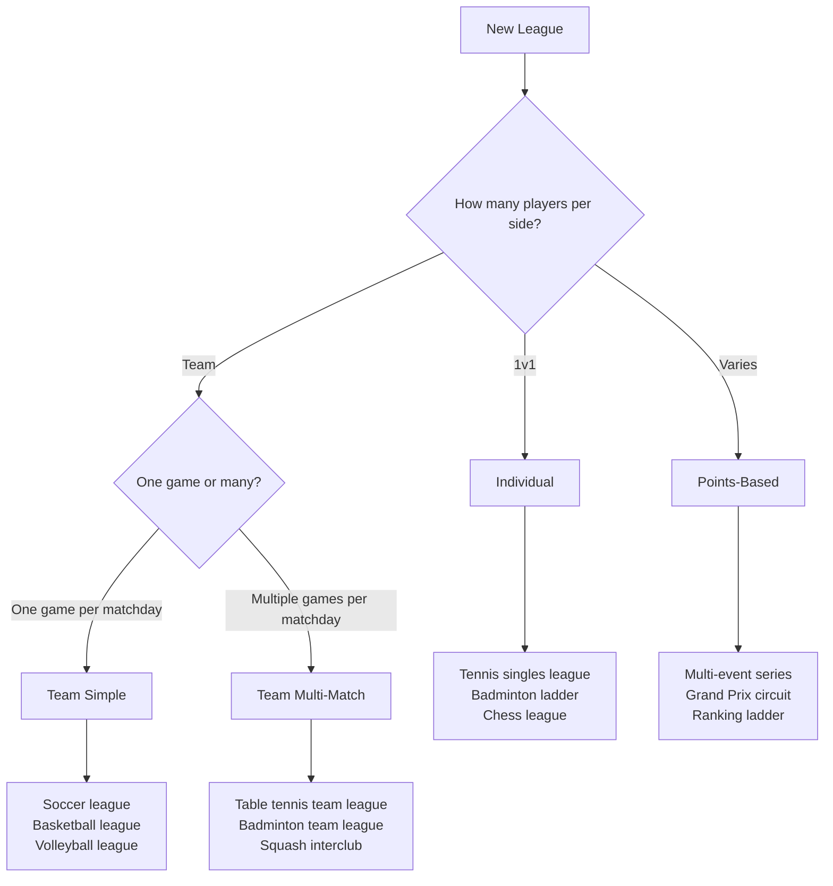
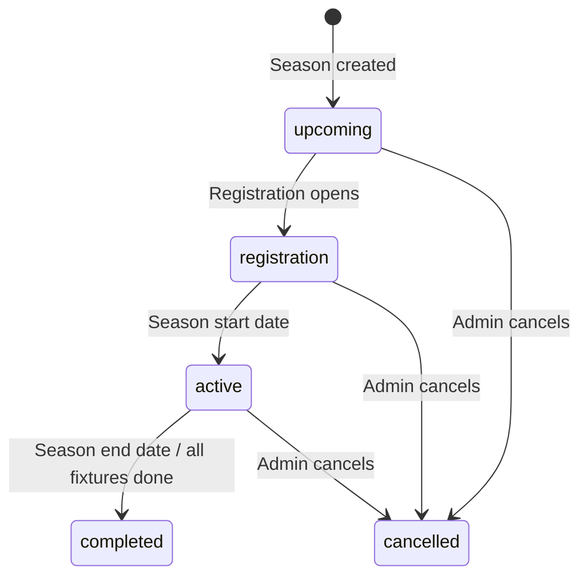
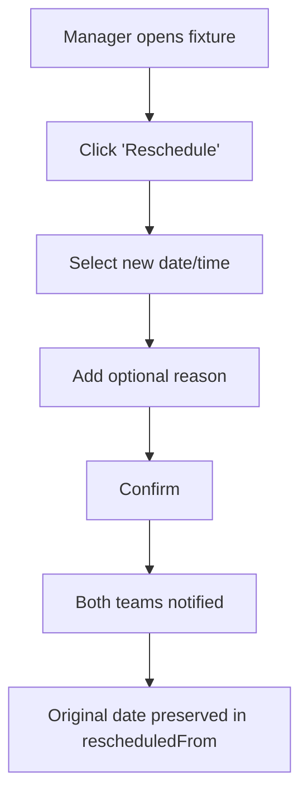
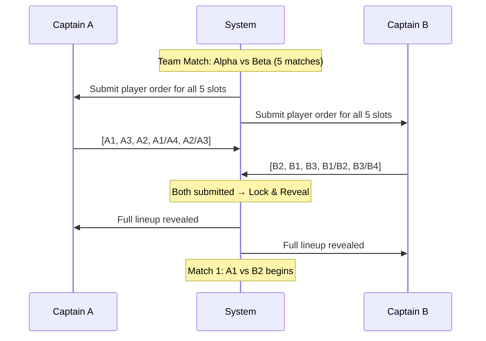
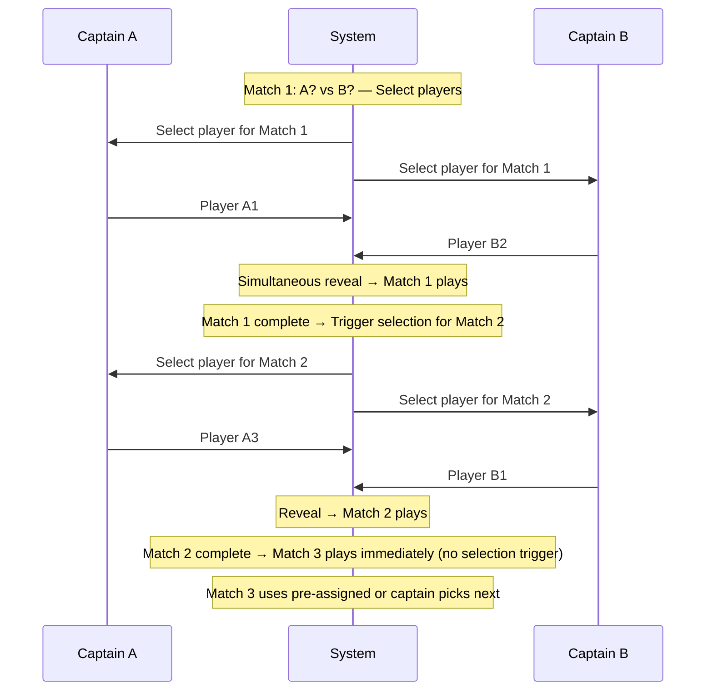
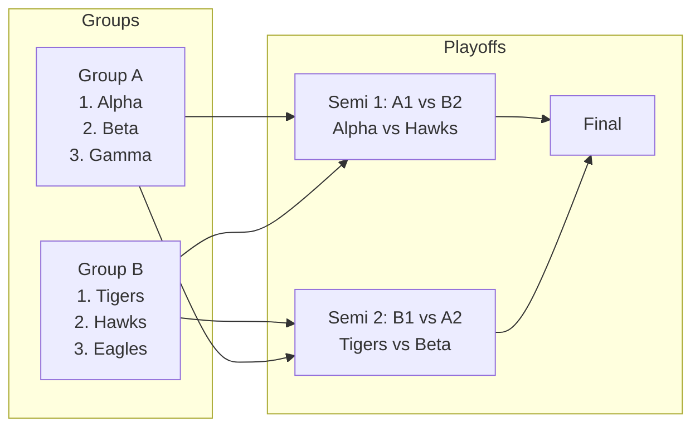
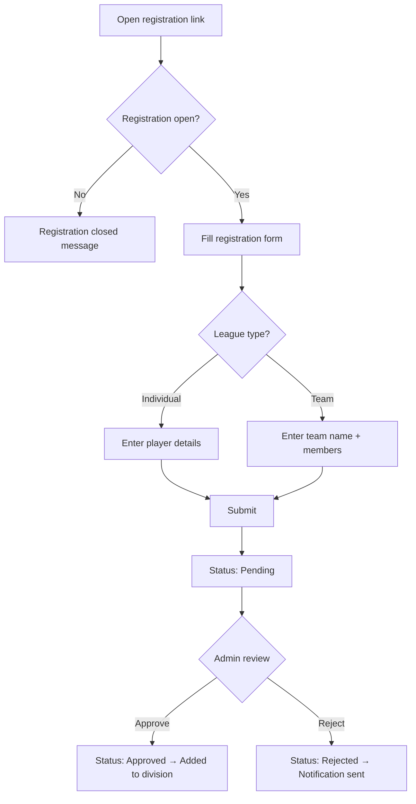
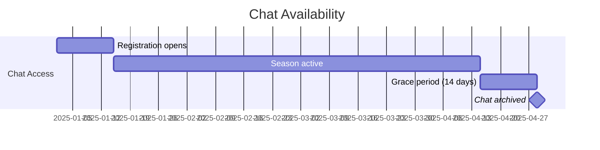

# League System

> Comprehensive documentation for the Scorr Studio league management feature — covering the existing architecture, proposed enhancements for public league mini-websites, multi-match team formats with player order and selection rules, youth player support, team chat, and a phased roadmap.

---

## Table of Contents

1. [Overview](#1-overview)
2. [Data Model](#2-data-model)
3. [League Types](#3-league-types)
4. [Season Management](#4-season-management)
5. [Divisions, Groups & Standings](#5-divisions-groups--standings)
6. [League Rules & Documents](#6-league-rules--documents)
7. [Match Types](#7-match-types)
8. [Match Scheduling & Rescheduling](#8-match-scheduling--rescheduling)
9. [Multi-Match Team Format — Deep Dive](#9-multi-match-team-format--deep-dive)
10. [Player Order & Selection Rules](#10-player-order--selection-rules)
11. [Default Rules (Auto-Default vs Match-Default)](#11-default-rules-auto-default-vs-match-default)
12. [Playoffs & Advancement](#12-playoffs--advancement)
13. [Public League Mini-Website](#13-public-league-mini-website)
14. [Registration System](#14-registration-system)
15. [Youth Players & Parent Accounts](#15-youth-players--parent-accounts)
16. [Team Chat](#16-team-chat)
17. [Admin Management Pages](#17-admin-management-pages)
18. [Roadmap](#18-roadmap)

---

## 1. Overview

Leagues in Scorr Studio are **long-running, recurring competitions** structured around seasons. Unlike competitions/tournaments (which are self-contained events), leagues run over weeks or months with regular fixtures, cumulative standings, and optional playoffs.

### Hierarchy

```
League
 └── Season (Spring 2025, Fall 2024, etc.)
      └── Division (Premier, Division 1, Recreational)
           └── Group (Group A, Group B — default: 1 group per division)
                └── Fixture (Week 1, Round 5)
                     └── TeamMatch (Team A vs Team B)
                          └── TeamMatchIndividual (Singles 1, Doubles A)
                               └── Match (actual scored match)
```

> [!IMPORTANT]
> **Players register for a Season.** Teams are then placed into Divisions (by skill level), and Divisions can be split into Groups if there are too many teams to play a full round-robin. Default is 1 group per division.

### Current State vs Proposed

| Area | Current State | Proposed |
|------|--------------|----------|
| League CRUD | ✅ Full create/read/update/delete | — |
| Season management | ✅ Create/delete with dates | Enhanced with registration dates, status lifecycle |
| Divisions | ✅ Create with points config | Division → Group hierarchy, advancement config |
| Groups | ❌ Not implemented | Sub-divide divisions when too many teams |
| Fixture generation | ✅ Round-robin only | Round-robin, double RR, custom |
| Standings | ✅ Basic P/W/D/L/Pts table | Enhanced with form, tiebreakers, head-to-head |
| Public page | ✅ Basic page with description | Full mini-website with branding, games, standings |
| Registration | ✅ Basic pending/approved/rejected | Season-specific, extendable deadlines |
| League rules | ❌ Not implemented | Dedicated rules page with PDF upload |
| Match rescheduling | ❌ Not implemented | Managers can change match times |
| Playoffs | ✅ Types defined | Group-seeded, configurable advancement |
| Multi-match | ✅ Types defined | Full player order/selection UI |
| Youth players | ❌ Not implemented | Parent accounts with invite system |
| Team chat | ❌ Not implemented | Season-scoped chat with grace period |
| Branding | ✅ Logo upload, public content | Banner images, colors, custom domain |

---

## 2. Data Model

### League (Convex `leagues` table)

```typescript
interface League {
  id: string;
  name: string;
  sportId: string;
  tenantId: string;

  // League type determines scoring and match structure
  type: LeagueType; // 'individual' | 'team_simple' | 'team_multi_match' | 'points'

  // Default settings for all matches (sport-specific)
  defaultMatchSettings: Record<string, unknown>;

  // Metadata & Branding
  description?: string;
  logoUrl?: string;
  bannerUrl?: string;           // [PROPOSED] Hero banner image
  primaryColor?: string;        // [PROPOSED] Brand color for mini-website
  customSlug?: string;          // [PROPOSED] Custom URL slug (/leagues/my-league)

  // League Rules & Documents
  rulesContent?: string;        // [PROPOSED] Markdown-formatted league rules
  rulesDocumentUrl?: string;    // [PROPOSED] Uploaded PDF of official rules
  rulesDocumentName?: string;   // [PROPOSED] Original filename of uploaded PDF

  // Seasons (nested)
  seasons: Season[];
  currentSeasonId?: string;

  // Registration
  registrationEnabled?: boolean;
  isPublic?: boolean;
  publicPageContent?: string;   // Markdown content

  createdAt: string;
  updatedAt: string;
}
```

### Season

```typescript
type SeasonStatus = 'upcoming' | 'registration' | 'active' | 'completed' | 'cancelled';

interface Season {
  id: string;
  leagueId: string;
  name: string;                     // "Spring 2025", "Fall 2024"

  // Key Dates
  registrationStartDate?: string;   // When registration opens
  registrationEndDate?: string;     // When registration closes (EXTENDABLE by admin)
  startDate: string;                // Season play starts
  endDate: string;                  // Season play ends

  status: SeasonStatus;

  // Registration is at the SEASON level — players/teams register for a season
  registrationExtensions?: RegistrationExtension[];  // [PROPOSED] Audit log of deadline changes

  // Divisions
  divisions: Division[];

  // Playoffs & Advancement
  playoffsEnabled: boolean;
  playoffsBracket?: Bracket;
  playoffsStartDate?: string;
  advancementConfig?: AdvancementConfig;  // [PROPOSED] Who advances to playoffs

  // Player order (for team_multi_match leagues)
  playerOrderConfig?: PlayerOrderConfig;   // [PROPOSED]

  // Chat
  chatEnabled?: boolean;                   // [PROPOSED]
  chatGracePeriodDays?: number;            // [PROPOSED] Days after season ends

  // Settings override (inherits from league)
  matchSettingsOverride?: Record<string, unknown>;
}

// Track when admins extend registration deadlines
interface RegistrationExtension {
  previousEndDate: string;
  newEndDate: string;
  reason?: string;
  extendedBy: string;               // Admin user ID
  extendedAt: string;
}
```

### Division

```typescript
interface Division {
  id: string;
  seasonId: string;
  name: string;                     // "Premier", "Division 1", "Recreational"

  // Groups — sub-divide the division (default: 1 group)
  groups: Group[];

  // Team match format (for team_multi_match leagues)
  teamMatchFormat?: TeamMatchFormat;

  // Points system
  pointsForWin: number;            // Default: 3
  pointsForDraw: number;           // Default: 1
  pointsForLoss: number;           // Default: 0

  // Tiebreaker order (configurable by organizer)
  tiebreakers: TiebreakerType[];

  // Advancement from this division to playoffs
  advancingCount?: number;         // How many teams advance per group
  advancementCriteria?: TiebreakerType[]; // Used to determine who advances

  // Settings override (inherits from season)
  matchSettingsOverride?: Record<string, unknown>;
}

// Groups within a division — when there are too many teams for a single round-robin
interface Group {
  id: string;
  divisionId: string;
  name: string;                     // "Group A", "Group B" (default: "Group 1")

  // Enrolled participants (teams or individuals)
  participants: DivisionParticipant[];

  // Fixtures (scheduled rounds within this group)
  fixtures: Fixture[];

  // Standings (calculated within group)
  standings: Standing[];
}
```

> [!NOTE]
> **Default behaviour**: Every division starts with 1 group. When the organiser adds more groups, teams are distributed across them. Each group plays its own round-robin, and the top N from each group advance to playoffs or the next stage.

### Fixture & TeamMatch

```typescript
interface Fixture {
  id: string;
  groupId: string;                  // Belongs to a group within a division
  name: string;                     // "Week 1", "Round 5"
  scheduledDate?: string;
  scheduledTime?: string;           // [PROPOSED] e.g. "19:00"
  venue?: string;
  teamMatches: TeamMatch[];
  status: 'scheduled' | 'in_progress' | 'completed';
  rescheduledFrom?: string;         // [PROPOSED] Original date if changed
  rescheduledReason?: string;       // [PROPOSED] Why it was moved
}

interface TeamMatch {
  id: string;
  fixtureId: string;

  team1Id: string;
  team1Name: string;
  team2Id: string;
  team2Name: string;

  status: 'scheduled' | 'in_progress' | 'completed' | 'postponed' | 'cancelled';

  // Individual matches (for team_multi_match)
  matches: TeamMatchIndividual[];

  // Result
  team1Wins: number;
  team2Wins: number;
  team1GamesWon?: number;
  team2GamesWon?: number;
  winner?: 'team1' | 'team2' | 'draw';

  // Points awarded for standings
  team1Points: number;
  team2Points: number;

  scheduledAt?: string;
  completedAt?: string;
}
```

### Proposed New Types

```typescript
// Player order configuration at the season level
interface PlayerOrderConfig {
  // When player selection occurs
  selectionTiming: 'pre_match' | 'mid_match';

  // For mid-match: after which match index does selection happen?
  // e.g., [0, 2] means select after match 1 and match 3
  selectionAfterMatchIndices?: number[];

  // Minimum players that must participate per team match
  minimumPlayersRequired: number;

  // How defaults are handled
  defaultMode: 'auto_default' | 'match_default';

  // Player selection visibility
  selectionVisibility: 'hidden' | 'simultaneous_reveal' | 'visible';

  // Time limit for player selection (seconds, 0 = unlimited)
  selectionTimeLimit?: number;
}

// Youth player linked to parent account
interface YouthPlayer {
  id: string;
  name: string;
  dateOfBirth?: string;
  parentAccountIds: string[];       // WorkOS user IDs of parents
  teamIds: string[];                // Teams this youth belongs to
  inviteToken?: string;             // Token for parent to claim this player
  invitedBy: string;                // Account that registered the player
  createdAt: string;
}

// Chat message in a league/season context
interface LeagueChatMessage {
  id: string;
  leagueId: string;
  seasonId: string;
  teamId?: string;                  // null = league-wide, string = team-specific
  senderId: string;
  senderName: string;
  content: string;
  type: 'text' | 'system' | 'announcement';
  createdAt: string;
}

// Advancement configuration for playoffs
interface AdvancementConfig {
  // How many teams advance from each group to playoffs
  advancingPerGroup: number;

  // Criteria used to determine advancement (ordered)
  advancementCriteria: TiebreakerType[];

  // What happens after groups  
  playoffFormat: 'single_elimination' | 'double_elimination' | 'best_of_series';

  // Seeding method for playoff bracket
  seedingMethod: 'group_position' | 'overall_points' | 'manual';

  // Cross-group seeding (e.g., 1st in A vs 2nd in B)
  crossGroupSeeding: boolean;
}
```

---

## 3. League Types

| Type | Key | Description | Match Structure |
|------|-----|-------------|-----------------|
| **Individual** | `individual` | 1v1 head-to-head | Each fixture = single match between 2 players |
| **Team (Simple)** | `team_simple` | Team vs Team, single result | Each fixture = one match, one score (e.g., soccer, basketball) |
| **Team (Multi-Match)** | `team_multi_match` | Team vs Team = multiple individual matches | Each fixture = X individual matches played sequentially or concurrently |
| **Points-Based** | `points` | Accumulate points from events | Participants accumulate ranking points from separate events |

### When to Use Each



---

## 4. Season Management

### Season Lifecycle



### Season Configuration

| Field | Required | Description |
|-------|----------|-------------|
| `name` | ✅ | Display name (e.g., "Spring 2025", "Fall 2024") |
| `startDate` | ✅ | When play begins |
| `endDate` | ✅ | When the season concludes |
| `registrationStartDate` | ❌ | When registration form goes live |
| `registrationEndDate` | ❌ | Registration cutoff — **can be extended** by admin to get more signups |
| `status` | Auto | Derived from dates or manually overridden |
| `advancementConfig` | ❌ | Who advances from groups to playoffs, seeding, format |
| `playerOrderConfig` | ❌ | For `team_multi_match` leagues: controls player selection |
| `chatEnabled` | ❌ | Enable team chat for this season |
| `chatGracePeriodDays` | ❌ | Days chat stays active after season ends (default: 14) |
| `playoffsEnabled` | ❌ | Enable playoff bracket after regular season |
| `matchSettingsOverride` | ❌ | Override default sport match settings for this season |

### Extending Registration Deadlines

League managers can **extend the registration end date** at any time to attract more signups:

- Navigate to **Season Settings → Registration → Extend Deadline**
- Select a new end date (must be in the future)
- Optionally add a reason ("Need 2 more teams")
- All extensions are logged in `registrationExtensions` for audit
- Notification sent to registered participants about extended window
- The season status stays in `registration` until the new deadline passes or it's manually advanced

### Season Dashboard (Proposed)

The season page should show at a glance:

- **Upcoming games** — Next 5 scheduled fixtures across all divisions
- **Recent results** — Last 5 completed fixtures with scores
- **Live games** — Any in-progress team matches
- **Standings summary** — Top 5 of each division
- **Season progress** — Percentage of fixtures completed
- **Registration status** — Open/closed with count of registrants

---

## 5. Divisions, Groups & Standings

### Division Structure

Divisions separate participants by **playing level** (e.g., Premier, Division 1, Recreational). Within each division, **groups** handle the case where there are too many teams for every team to play each other.

```
Season: Spring 2025
 ├── Division: Premier
 │    └── Group 1 (default — all 6 teams play each other)
 ├── Division: Division 1
 │    ├── Group A (8 teams)
 │    └── Group B (8 teams)
 └── Division: Recreational
      ├── Group A (6 teams)
      ├── Group B (6 teams)
      └── Group C (6 teams)
```

### Groups

| Setting | Default | Description |
|---------|---------|-------------|
| Group count | 1 | Every division starts with 1 group (i.e., all teams play each other) |
| Group names | Auto | "Group A", "Group B", etc. (customisable) |
| Team distribution | Manual | Admin assigns teams to groups; option for random draw |
| Schedule format | Round-robin | Each team in the group plays every other team |

> [!TIP]
> When there are 12+ teams in a division, the organiser should consider splitting into 2-3 groups. This keeps the schedule manageable and ensures competitive balance.

### Group Standings Table

Standings are calculated **per group**. The enhanced standings table supports:

| Column | Key | Shown For |
|--------|-----|-----------|
| Rank | `rank` | All |
| Team/Player | `participantName` | All |
| Played | `played` | All |
| Won | `wins` | All |
| Drawn | `draws` | `team_simple`, `individual` |
| Lost | `losses` | All |
| GF/GA/GD | `goalsFor`, `goalsAgainst`, `goalDifference` | `team_simple` |
| Match Wins / Match Losses | `teamMatchesWon`, `teamMatchesLost` | `team_multi_match` |
| Individual Wins | `individualMatchesWon` | `team_multi_match` |
| Games Won/Lost | `gamesWon`, `gamesLost` | `team_multi_match` |
| Points | `points` | All |
| Form | `form` | All (last 5: W/D/L) |

### Tiebreaker System

Tiebreakers are evaluated in order when teams have equal points. The organiser **configures the tiebreaker order** per division:

1. `goal_difference` — For goal-based sports
2. `goals_for` — Higher scorer wins
3. `head_to_head` — Direct matchup result
4. `matches_won` — Total match wins
5. `games_won` — Total games won across sets/legs
6. `points_difference` — Net points differential
7. `games_difference` — Net game differential (for multi-match)

> [!NOTE]
> The same tiebreaker criteria are used for both **standings ranking** and **advancement decisions** (who qualifies for playoffs). Organisers can set different criteria for advancement via `advancementCriteria` on the Division.

---

## 6. League Rules & Documents

Every league needs a place to post official rules, so all participants know the expectations.

### Rules Options

| Method | Description |
|--------|-------------|
| **Markdown rules** | Write rules directly in the admin panel using rich text / markdown. Displayed inline on the public league page. |
| **PDF upload** | Upload an official PDF document (e.g., scanned bylaws, association rules). Available for download on the public page. |
| **Both** | Use markdown for a summary/quick reference and PDF for the full official document. |

### Rules Content Structure

Suggested sections for league rules (markdown):

1. **General Conduct** — Sportsmanship, code of behaviour
2. **Eligibility** — Who can register, age requirements, residency
3. **Match Rules** — Sport-specific rules, equipment, scoring
4. **Scheduling** — Match day/time expectations, punctuality
5. **Postponements & Defaults** — How to request reschedules, default penalties
6. **Player Transfers** — Can players move between teams mid-season?
7. **Protests & Appeals** — How to dispute a result
8. **Penalties** — Point deductions, suspensions, fines

### Admin UI

- **League Settings → Rules tab**
- Rich markdown editor for inline rules
- File upload zone for PDF (max 10MB)
- Preview toggle to see how rules appear on the public page
- Rules are displayed on the public mini-website under a **"Rules"** nav link

### Public Display

```
/leagues/{leagueId}/rules     → League rules page
```

- Markdown rules rendered inline
- PDF shown as a download button with filename and file size
- Both visible on the same page if both are provided

---

## 7. Match Types

### Single Match (Individual / Team Simple)

One game per fixture entry. The result directly updates standings.

```
Fixture: Week 3
 └── Team A vs Team B → Score: 3-1 → Team A wins → 3pts for A, 0pts for B
```

### Multi-Match (Team Multi-Match)

One fixture entry contains multiple individual matches played between team members. The team-level result is derived from the individual results.

```
Fixture: Week 3
 └── TeamMatch: Club Alpha vs Club Beta
      ├── Singles 1: Player A1 vs Player B2 → 3-1 → Alpha wins
      ├── Singles 2: Player A3 vs Player B1 → 1-3 → Beta wins
      ├── Singles 3: Player A2 vs Player B3 → 3-2 → Alpha wins
      ├── Doubles 1: A1/A4 vs B1/B2      → 3-0 → Alpha wins
      └── Doubles 2: A2/A3 vs B3/B4      → 2-3 → Beta wins
      Result: Alpha 3 — Beta 2 → Alpha wins the team match
```

### Win Conditions

| Condition | Key | Description |
|-----------|-----|-------------|
| Majority | `majority` | First to >50% of individual matches (default) |
| First to X | `first_to_x` | First team to win X individual matches |
| Total Games | `total_games` | Team that wins the most total games/points across all matches |
| All Matches | `all_matches` | Must win every individual match (rare) |

---

## 8. Match Scheduling & Rescheduling

League managers need the ability to change match times after fixtures are generated.

### Rescheduling Flow



### Rescheduling Rules

| Rule | Description |
|------|-------------|
| **Who can reschedule** | League manager / admin only (not team captains directly) |
| **Notice period** | Configurable minimum notice (e.g., 48 hours before match) |
| **Reason required** | Optional but tracked for audit |
| **Notification** | Both teams receive email/push notification of the change |
| **History** | Original date stored in `rescheduledFrom` on the fixture |
| **Public visibility** | Rescheduled matches show "Rescheduled" badge on public page |

### Team-Requested Reschedules

Team captains can **request** a reschedule (not directly change it):

1. Captain submits a reschedule request via the match detail page
2. Request goes to the league manager for approval
3. Manager can approve (with suggested alternative dates) or deny
4. If approved, both teams are notified of the new date/time

### Bulk Rescheduling

For weather or venue issues affecting multiple matches:

- Manager selects multiple fixtures from the fixture list
- Applies a date shift (e.g., "move all by 1 week")
- Or manually reassigns dates per fixture
- All affected teams notified in a single batch notification

---

## 9. Multi-Match Team Format — Deep Dive

### Team Match Format Configuration

```typescript
interface TeamMatchFormat {
  matchCount: number;                    // Total individual matches (e.g., 5)
  matchTypes: TeamMatchType[];           // ['singles','singles','singles','doubles','doubles']
  matchLabels?: string[];                // ['Singles 1','Singles 2','Singles 3','Doubles A','Doubles B']
  winCondition: TeamMatchWinCondition;   // 'majority'
  winsRequired?: number;                 // For 'first_to_x'
  allowConcurrentMatches: boolean;       // Can matches run in parallel?
}
```

### Example Configurations

#### Table Tennis Team League (5 matches)

```json
{
  "matchCount": 5,
  "matchTypes": ["singles", "singles", "singles", "singles", "doubles"],
  "matchLabels": ["Singles 1", "Singles 2", "Singles 3", "Singles 4", "Doubles"],
  "winCondition": "majority",
  "allowConcurrentMatches": false
}
```

#### Badminton Interclub (7 matches)

```json
{
  "matchCount": 7,
  "matchTypes": ["singles", "singles", "singles", "doubles", "doubles", "mixed_doubles", "mixed_doubles"],
  "matchLabels": ["MS1", "MS2", "MS3", "MD1", "MD2", "XD1", "XD2"],
  "winCondition": "first_to_x",
  "winsRequired": 4,
  "allowConcurrentMatches": true
}
```

---

## 10. Player Order & Selection Rules

Player order defines **which player from each team plays in which match slot**. This is configured at the **season level** and applies to all team matches in that season.

### Selection Timing

| Timing | Key | How It Works |
|--------|-----|-------------|
| **Pre-Match** | `pre_match` | Both teams submit their full player order before the team match begins. Locked once submitted. |
| **Mid-Match** | `mid_match` | Teams select players for upcoming matches during the team match, based on `selectionAfterMatchIndices`. |

### Pre-Match Flow



### Mid-Match Flow

With `selectionAfterMatchIndices: [0, 2]` (select after match 1 and match 3):



### Selection Visibility

| Mode | Description |
|------|-------------|
| `hidden` | Opponent can't see selection until both teams submit (blind pick) |
| `simultaneous_reveal` | Both teams submit, then both see the result at the same time |
| `visible` | One team selects first, visible to the other (home advantage) |

### Minimum Player Requirement

The league admin sets `minimumPlayersRequired` at the season level. This ensures each team fields at least N unique players per team match.

- If a team can't meet the minimum → the team concedes (auto-default or match-default based on `defaultMode`)
- Players **can** play in multiple slots (e.g., singles AND doubles) unless restricted

### Player Selection UI (Captain View)

When it's time to select players, captains see:

| Element | Description |
|---------|-------------|
| **Available Roster** | Full team roster with availability indicators |
| **Match Slot** | The slot being filled (e.g., "Singles 2") |
| **Match Type** | Whether it's singles, doubles, or mixed |
| **Already Selected** | Which players are already assigned to other slots |
| **Timer** | Countdown if `selectionTimeLimit` is set |
| **Submit Button** | Locks in the selection |
| **Waiting State** | "Waiting for opponent to submit..." |

---

## 11. Default Rules (Auto-Default vs Match-Default)

When a team cannot field enough players, defaults determine what happens.

### Auto-Default

```
defaultMode: 'auto_default'
```

- System automatically awards a win to the opposing team for **each unfilled slot**.
- The team match continues for the remaining filled slots.
- Points awarded as if the defaulting team lost each empty slot.
- **Standings impact**: Individual match losses recorded, team match may still be won/lost overall.

**Example**: 5-match format, Team B only has 3 players:
- Slots 1-3: Played normally
- Slots 4-5: Auto-default → Team A wins each 3-0
- Team match result calculated from all 5 results

### Match-Default

```
defaultMode: 'match_default'
```

- The **entire team match** is forfeited.
- The opposing team wins the team match outright with maximum points.
- No individual matches are played.
- **Standings impact**: Full loss recorded for the defaulting team, full win for the opponent.

### Configuration in Season Settings

| Setting | Type | Description |
|---------|------|-------------|
| `defaultMode` | `'auto_default' \| 'match_default'` | What happens when a team can't field minimum players |
| `minimumPlayersRequired` | `number` | Minimum unique players per team match |
| `autoDefaultScore` | `string` | Score recorded for auto-defaulted individual matches (e.g., "11-0, 11-0, 11-0") |

---

## 12. Playoffs & Advancement

Playoffs transition from the regular season (group stage) to a knockout bracket. The organiser has full control over who advances and how the bracket is seeded.

### Advancement Configuration

Set at the **season level** via `advancementConfig`:

| Setting | Options | Description |
|---------|---------|-------------|
| `advancingPerGroup` | Number | How many teams from each group advance (e.g., top 2) |
| `advancementCriteria` | Ordered list | Tiebreaker criteria for determining who advances |
| `playoffFormat` | `single_elimination`, `double_elimination`, `best_of_series` | Bracket format |
| `seedingMethod` | `group_position`, `overall_points`, `manual` | How playoff seeds are assigned |
| `crossGroupSeeding` | Boolean | If true, seeds are interleaved (1st in A vs 2nd in B) |

### Seeding from Groups



### Advancement Criteria

When determining who advances from a group, the criteria are evaluated in order:

1. **Points** — Total league points
2. **Head-to-head** — Direct matchup between tied teams
3. **Goal/game difference** — Net differential
4. **Goals/games for** — Attacking output
5. **Most wins** — Total victories
6. **Drawing of lots** — Random (last resort)

> [!IMPORTANT]
> The organiser can **reorder these criteria** per division. Some leagues prioritise head-to-head over goal difference, others the reverse.

### Playoff Formats

| Format | Description |
|--------|-------------|
| **Single Elimination** | Lose once, you're out. Simple and fast. |
| **Double Elimination** | Must lose twice. Winners bracket + losers bracket. |
| **Best of Series** | Each round is a best-of-3 or best-of-5 series. |

### Organiser Controls

The organiser configures:

- **Which divisions feed into playoffs** (some recreational divisions may not have playoffs)
- **How many teams advance** per group (1, 2, 3, etc.)
- **Whether cross-division playoffs** are allowed (top N from Div 1 + top N from Div 2)
- **Manual overrides** — organiser can manually seed or adjust the bracket
- **Bye rounds** — automatic if advancing teams don't fill a power-of-2 bracket

---

## 13. Public League Mini-Website

Each league gets a **public-facing mini-website** that serves as its home on the web. This is the centrepiece of the league's online presence.

### URL Structure

```
/leagues/{leagueId}                          → League home page
/leagues/{leagueId}/standings                → Current season standings
/leagues/{leagueId}/fixtures                 → Fixture schedule
/leagues/{leagueId}/results                  → Recent results
/leagues/{leagueId}/rules                    → League rules & documents
/leagues/{leagueId}/teams/{teamId}           → Team profile page
/leagues/{leagueId}/register                 → Registration form
/leagues/{leagueId}/seasons/{seasonId}       → Historical season page
```

### League Home Page Layout

```
┌──────────────────────────────────────────────────────────────┐
│  [Logo]  LEAGUE NAME                        [Register Now]  │
│          Season: Spring 2025 ▾                               │
├──────────────────────────────────────────────────────────────┤
│                                                              │
│  ┌─ Banner Image ─────────────────────────────────────────┐  │
│  │                                                         │  │
│  │              League hero / banner image                  │  │
│  │                                                         │  │
│  └─────────────────────────────────────────────────────────┘  │
│                                                              │
│  ┌─ Upcoming Games ────────┐  ┌─ Recent Results ──────────┐  │
│  │ Mar 15  Div A           │  │ Mar 8   Div A             │  │
│  │ Alpha vs Beta    7:00pm │  │ Alpha 3-1 Beta       ✓    │  │
│  │ Gamma vs Delta   8:30pm │  │ Gamma 2-2 Delta      ✓    │  │
│  │                         │  │                           │  │
│  │ Mar 16  Div B           │  │ Mar 7   Div B             │  │
│  │ Tigers vs Lions  6:00pm │  │ Tigers 4-0 Lions     ✓    │  │
│  │                         │  │ Eagles 1-3 Hawks     ✓    │  │
│  │ → View all fixtures     │  │ → View all results        │  │
│  └─────────────────────────┘  └───────────────────────────┘  │
│                                                              │
│  ┌─ Live Now ──────────────────────────────────────────────┐  │
│  │ 🔴 Alpha vs Beta — Match 3 in progress (1-1)           │  │
│  └─────────────────────────────────────────────────────────┘  │
│                                                              │
│  ┌─ Standings ─────────────────────────────────────────────┐  │
│  │ Div A                    Div B                          │  │
│  │ 1. Alpha    12pts        1. Tigers   15pts              │  │
│  │ 2. Beta      9pts        2. Hawks    12pts              │  │
│  │ 3. Gamma     7pts        3. Eagles    8pts              │  │
│  │ 4. Delta     4pts        4. Lions     3pts              │  │
│  │ → Full standings         → Full standings               │  │
│  └─────────────────────────────────────────────────────────┘  │
│                                                              │
│  ┌─ About ─────────────────────────────────────────────────┐  │
│  │ League description / markdown content                    │  │
│  └─────────────────────────────────────────────────────────┘  │
│                                                              │
│  ┌─ Season Selector ───────────────────────────────────────┐  │
│  │ [Spring 2025 ✓] [Fall 2024] [Spring 2024]               │  │
│  └─────────────────────────────────────────────────────────┘  │
│                                                              │
│  Footer: Powered by Scorr Studio                             │
└──────────────────────────────────────────────────────────────┘
```

### Customisation Options

| Setting | Description |
|---------|-------------|
| `logoUrl` | League logo displayed in header (up to 200×200px) |
| `bannerUrl` | Hero banner image (recommended 1200×400px) |
| `primaryColor` | Accent color for buttons, links, highlights |
| `publicPageContent` | Rich markdown content for the "About" section |
| `customSlug` | Custom URL path (e.g., `/leagues/dublin-table-tennis`) |
| `isPublic` | Toggle entire mini-website visibility |

### Season Selector

- Default view: **current season**
- Drop-down or tab bar to switch between seasons
- Historical seasons show archived standings, results, and fixtures
- Historical seasons are read-only (no registration, no live updates)

---

## 14. Registration System

### Current Implementation

- Public registration form at `/leagues/{id}/register`
- Registrations have `pending` / `approved` / `rejected` status
- Admin reviews via Registrations tab with approve/reject dialog
- Shareable registration link with copy-to-clipboard

### Alternative: Flat-File Roster Import

Many organisations already have their own registration systems and are not ready to migrate to Scorr Studio's registration portal. For these cases, admins can use the **flat-file import tool** (see [user-profiles.md §4](file:///home/jack/clawd/scorr-studio/docs/user-profiles.md)) to import rosters from CSV/TSV/XLSX exports with column-to-field mapping. This allows a gradual migration path — orgs keep their existing registration workflow and simply import the results into Scorr Studio each season.

### Proposed Enhancements

#### Season-Specific Registration

- Registration links target a specific season (`/leagues/{id}/register?season={seasonId}`)
- Registration dates (`registrationStartDate` / `registrationEndDate`) control form availability
- Auto-close registration when the season starts or capacity is reached

#### Registration Form Builder

| Field | Type | Required | Description |
|-------|------|----------|-------------|
| Team/Player Name | text | ✅ | Display name |
| Contact Email | email | ✅ | Primary contact |
| Contact Phone | tel | ❌ | Secondary contact |
| Team Members | list | ❌ | For team registrations |
| Division Preference | select | ❌ | Preferred division |
| Youth Players | list | ❌ | List of youth players with parent emails |
| Notes | textarea | ❌ | Additional information |

#### Registration Flow



---

## 15. Youth Players & Parent Accounts

Youth players (under 18 or without their own account) need special handling for privacy, consent, and access control.

### Concept

- A **youth player** is registered by a team captain or league admin
- The youth player **does not have their own Scorr account**
- One or more **parent/guardian accounts** are linked to the youth player
- Parents can view the player's schedule, results, and receive notifications
- Parents cannot manage the team — only view their child's information

### Data Model

```typescript
interface YouthPlayer {
  id: string;
  name: string;
  dateOfBirth?: string;            // For age verification
  parentAccountIds: string[];       // WorkOS IDs of linked parent accounts
  teamIds: string[];               // Teams this youth belongs to
  registeredBy: string;            // Account that created this youth player
  inviteToken?: string;            // For parent account linking
  inviteStatus: 'pending' | 'accepted';
  createdAt: string;
}
```

### Parent Linking Flow

```mermaid
sequenceDiagram
    participant Cap as Team Captain
    participant Sys as System
    participant Par as Parent

    Cap->>Sys: Register youth player "Alex Smith"
    Cap->>Sys: Provide parent email: parent@example.com
    Sys->>Sys: Create YouthPlayer record
    Sys->>Sys: Generate invite token
    Sys->>Par: Email invite: "Alex Smith has been added to Team Alpha"
    Note over Par: Email contains secure link
    Par->>Sys: Click invite link
    alt Parent has Scorr account
        Par->>Sys: Log in → link youth player to account
    else No account
        Par->>Sys: Create account → link youth player
    end
    Sys->>Cap: Parent linked successfully
    Note over Par: Parent can now view Alex's matches, schedule, results
```

### Security & Access Rules

| Action | Captain | Parent | Youth Player |
|--------|---------|--------|--------------|
| Register youth player | ✅ | ❌ | ❌ |
| Send parent invite | ✅ | ❌ | ❌ |
| View match schedule | ✅ | ✅ (own child) | N/A |
| View match results | ✅ | ✅ (own child) | N/A |
| Edit youth player details | ✅ | ❌ | N/A |
| Remove youth player | ✅ | ❌ | N/A |
| Accept invite | ❌ | ✅ | N/A |
| View team roster | ✅ | ✅ (own child's team) | N/A |
| Manage team | ✅ | ❌ | N/A |

### Invite Security

- Invite tokens are **single-use** and cryptographically random
- Tokens expire after **7 days**
- Only the **original registering account** (captain) can generate invites
- Parent must authenticate (existing or new account) to claim the invite
- If parent email matches an existing Scorr account, auto-link is offered
- Captains can **re-send** or **revoke** invites from the team management page

---

## 16. Team Chat

### Concept

Team chat provides a communication channel for team members during an active season, with a configurable grace period after the season ends.

### Chat Scopes

| Scope | Who Can See | Description |
|-------|-------------|-------------|
| **Team Chat** | All members of a specific team | Private chat for the team |
| **League Chat** | All participants in the league | League-wide announcements and discussion |
| **Match Chat** | Players in a specific team match | Pre-match and post-match discussion |

### Lifecycle



- Chat is **created** when the season starts (or when `chatEnabled` is set)
- Chat is **active** for the duration of the season
- Chat enters **grace period** after the season ends — read and write still enabled
- After grace period — chat becomes **read-only archived**
- Admin can always post announcements regardless of season status

### Chat Features

| Feature | Description |
|---------|-------------|
| Text messages | Standard text chat |
| System messages | Auto-generated (match results, schedule changes) |
| Announcements | League admin broadcasts (pinned, highlighted) |
| @mentions | Tag specific team members |
| Match links | Auto-link to upcoming/completed match details |
| Read receipts | Optional per-team setting |
| Notifications | Push/email for new messages (configurable) |

### Chat Data Model

```typescript
interface LeagueChatMessage {
  id: string;
  leagueId: string;
  seasonId: string;
  channelId: string;           // Team ID or 'league' for league-wide
  senderId: string;            // WorkOS user ID
  senderName: string;
  content: string;
  type: 'text' | 'system' | 'announcement';
  replyToId?: string;          // Thread support
  createdAt: string;
  editedAt?: string;
}
```

---

## 17. Admin Management Pages

### Current Pages

| Page | Route | Status |
|------|-------|--------|
| League List | `/app/manage/[sport]/leagues` | ✅ Implemented |
| League Detail | `/app/manage/[sport]/leagues/[id]` | ✅ Implemented |
| League Settings | `/app/manage/[sport]/leagues/[id]/settings` | ✅ Implemented |
| Registrations | `/app/manage/[sport]/leagues/[id]/registrations` | ✅ Implemented |
| Division Detail | `/app/manage/[sport]/leagues/[id]/divisions/[seasonId]/[divisionId]` | ✅ Implemented |

### Proposed New Pages

| Page | Route | Description |
|------|-------|-------------|
| Season Dashboard | `/app/manage/[sport]/leagues/[id]/seasons/[seasonId]` | Overview with upcoming/recent/live games, registration controls |
| Group Management | `/app/manage/[sport]/leagues/[id]/divisions/[seasonId]/[divisionId]/groups` | Create/manage groups within a division, assign teams |
| Team Match Detail | `/app/manage/[sport]/leagues/[id]/team-match/[matchId]` | Manage a multi-match team match with player selection UI |
| Player Order Config | `/app/manage/[sport]/leagues/[id]/seasons/[seasonId]/player-order` | Configure player selection rules for the season |
| League Rules | `/app/manage/[sport]/leagues/[id]/rules` | Edit markdown rules, upload PDF documents |
| Fixture Rescheduling | `/app/manage/[sport]/leagues/[id]/fixtures` | View all fixtures, reschedule, bulk operations |
| Playoffs Config | `/app/manage/[sport]/leagues/[id]/seasons/[seasonId]/playoffs` | Configure advancement, seeding, bracket format |
| Youth Players | `/app/manage/[sport]/leagues/[id]/youth-players` | Manage youth players, send parent invites |
| Team Chat Admin | `/app/manage/[sport]/leagues/[id]/chat` | View/moderate all chat channels |
| Mini-Website Preview | `/app/manage/[sport]/leagues/[id]/preview` | Preview the public mini-website |

---

## 18. Roadmap

### Phase 1 — Enhanced Season Management & Registration ★

> **Goal**: Make seasons fully functional with proper dates, status lifecycle, groups, and registration controls.

- [ ] Add `registrationStartDate` and `registrationEndDate` to season creation dialog
- [ ] **Implement registration deadline extension** (extend end date + audit log)
- [ ] Implement automatic season status transitions based on dates
- [ ] Build season dashboard page with upcoming/recent/live games
- [ ] Add season-specific registration links
- [ ] Support division capacity limits
- [ ] Add season clone (copy settings from previous season)

### Phase 1.5 — Divisions & Groups ★

> **Goal**: Add group-level structure within divisions.

- [ ] Add Group model and UI within division management
- [ ] Default 1 group per division, option to add more
- [ ] Team assignment to groups (manual + random draw)
- [ ] Per-group fixture generation (round-robin within group)
- [ ] Per-group standings tables
- [ ] Configurable tiebreaker order per division

### Phase 2 — Public League Mini-Website ★

> **Goal**: Turn each league into a fully branded public website with rules.

- [ ] Redesign public page at `/leagues/[id]` with the full layout (banner, upcoming/recent/live, standings)
- [ ] Add `bannerUrl` and `primaryColor` to league settings
- [ ] **Build league rules page** (`/leagues/[id]/rules`) with markdown + PDF download
- [ ] **Add rules editor** in admin settings (markdown editor + PDF upload)
- [ ] Build fixtures page (`/leagues/[id]/fixtures`) with calendar/list view
- [ ] Build results page (`/leagues/[id]/results`) with filters by division/group
- [ ] Build full standings page (`/leagues/[id]/standings`) with all stat columns
- [ ] Add season selector to switch between current and historical seasons
- [ ] Add team profile pages (`/leagues/[id]/teams/[teamId]`)
- [ ] Support custom URL slugs
- [ ] SEO meta tags for all public pages

### Phase 3 — Multi-Match Player Order & Selection ★

> **Goal**: Implement the full player selection workflow for `team_multi_match` leagues.

- [ ] Add `playerOrderConfig` to season configuration UI
- [ ] Build captain's player selection interface (mobile-friendly)
- [ ] Implement pre-match selection flow with simultaneous reveal
- [ ] Implement mid-match selection flow with trigger points
- [ ] Add selection timer with countdown
- [ ] Enforce minimum player requirements
- [ ] Implement auto-default and match-default logic
- [ ] Add real-time sync for selection state (Convex subscriptions)
- [ ] Build team match detail page showing all individual match slots

### Phase 4 — Youth Players & Parent Accounts

> **Goal**: Securely support youth players with parent account linking.

- [ ] Create `YouthPlayer` model and Convex table
- [ ] Build youth player registration form (accessible from team management)
- [ ] Implement invite token generation and email sending
- [ ] Build parent claim flow (link existing account or create new)
- [ ] Create parent portal view (view child's schedule, results, team info)
- [ ] Add invite management UI for captains (re-send, revoke)
- [ ] Add age verification guardrails

### Phase 5 — Team Chat

> **Goal**: Add real-time team chat scoped to seasons with grace period.

- [ ] Create `leagueChatMessages` Convex table
- [ ] Implement chat UI component (team channel, league channel)
- [ ] Build real-time message subscription via Convex
- [ ] Add system messages for match results and schedule changes
- [ ] Implement admin announcements (pinned, broadcast)
- [ ] Add grace period logic (read-only after N days post-season)
- [ ] Push notification integration for new messages
- [ ] Add chat moderation tools for league admins

### Phase 6 — Advanced Scheduling & Fixtures

> **Goal**: Move beyond round-robin with flexible scheduling and match rescheduling.

- [ ] Support double round-robin fixture generation
- [ ] Support custom fixture scheduling (manual date/time/venue per match)
- [ ] **Build match rescheduling UI** (manager reschedules with notification)
- [ ] **Implement team reschedule requests** (captain requests, manager approves)
- [ ] **Bulk rescheduling** for weather/venue cancellations
- [ ] Calendar view for fixtures (month/week view)
- [ ] Venue management (define venues, assign to fixtures)
- [ ] Conflict detection (team scheduled twice on same day)
- [ ] Export fixtures to iCal / Google Calendar

### Phase 7 — Enhanced Standings & Stats

> **Goal**: Rich statistical views for league performance.

- [ ] Implement form column (last 5 results: W/D/L indicators)
- [ ] Add head-to-head comparison page
- [ ] Build individual player stats across team matches
- [ ] Add tiebreaker visualization (explain why teams are ranked as they are)
- [ ] Season awards (MVP, top scorer, most improved)
- [ ] Historical stats across seasons for returning teams/players

### Phase 8 — Playoffs & End-of-Season

> **Goal**: Seamless transition from group stage to playoff bracket.

- [ ] **Build advancement configuration UI** (how many advance per group, criteria)
- [ ] **Implement seeding from group standings** (group_position, overall_points, manual)
- [ ] Auto-seed playoff bracket from final group standings
- [ ] Support single and double elimination playoff formats
- [ ] Support best-of-series format
- [ ] Playoff bracket visualization on public page
- [ ] Configure number of teams qualifying per division/group
- [ ] Cross-division and cross-group playoffs
- [ ] **Configurable advancement/tiebreaker criteria** per division
- [ ] Manual bracket override for organisers

### Phase 9 — Notifications & Communication

> **Goal**: Keep all participants informed throughout the season.

- [ ] Email notifications for fixture scheduling
- [ ] Push notifications for match reminders (24h, 1h before)
- [ ] Result notifications after matches complete
- [ ] Registration status notifications (approved/rejected)
- [ ] Admin can send custom notifications to all participants
- [ ] Notification preferences per user (email, push, in-app)

### Priority Matrix

| Phase | Effort | Impact | Priority |
|-------|--------|--------|----------|
| 1. Enhanced Season Management & Registration | Medium | High | 🔴 Critical |
| 1.5. Divisions & Groups | Medium | High | 🔴 Critical |
| 2. Public Mini-Website & Rules | Large | High | 🔴 Critical |
| 3. Multi-Match Player Order | Large | High | 🔴 Critical |
| 4. Youth Players | Medium | Medium | 🟡 Important |
| 5. Team Chat | Medium | Medium | 🟡 Important |
| 6. Advanced Scheduling & Rescheduling | Medium | High | � Critical |
| 7. Enhanced Standings | Small | Medium | 🟢 Nice-to-have |
| 8. Playoffs & Advancement | Medium | High | � Critical |
| 9. Notifications | Medium | High | 🟡 Important |

---

## Key Files Reference

### Types
- [league.ts](file:///home/jack/clawd/scorr-studio/lib/types/league.ts) — All league type definitions

### Schema
- [schema.ts](file:///home/jack/clawd/scorr-studio/convex/schema.ts#L213-L231) — Convex `leagues` table definition

### Pages
- [League List](file:///home/jack/clawd/scorr-studio/app/app/manage/[sportname]/leagues/page.tsx)
- [League Detail](file:///home/jack/clawd/scorr-studio/app/app/manage/[sportname]/leagues/[id]/page.tsx)
- [League Settings](file:///home/jack/clawd/scorr-studio/app/app/manage/[sportname]/leagues/[id]/settings/page.tsx)
- [Registrations](file:///home/jack/clawd/scorr-studio/app/app/manage/[sportname]/leagues/[id]/registrations/page.tsx)
- [Division Detail](file:///home/jack/clawd/scorr-studio/app/app/manage/[sportname]/leagues/[id]/divisions/[seasonId]/[divisionId]/page.tsx)
- [Public League Page](file:///home/jack/clawd/scorr-studio/app/leagues/[id]/page.tsx)
- [Public Registration](file:///home/jack/clawd/scorr-studio/app/leagues/[id]/register/page.tsx)

### Actions
- [League actions](file:///home/jack/clawd/scorr-studio/app/app/manage/[sportname]/leagues/actions.ts) — CRUD barrel file
- [Division actions](file:///home/jack/clawd/scorr-studio/app/app/manage/[sportname]/leagues/[id]/divisions/actions) — Participant and fixture management
- [Registration actions](file:///home/jack/clawd/scorr-studio/app/app/manage/[sportname]/leagues/[id]/registrations/actions) — Registration management

### Convex Functions
- [leagues.ts](file:///home/jack/clawd/scorr-studio/convex/leagues.ts) — Convex queries and mutations
