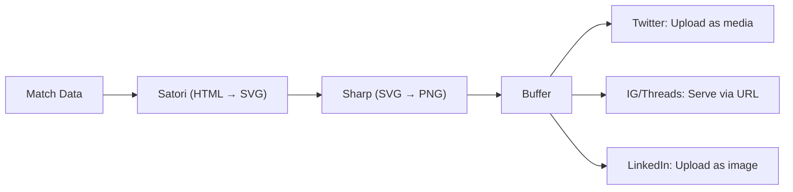
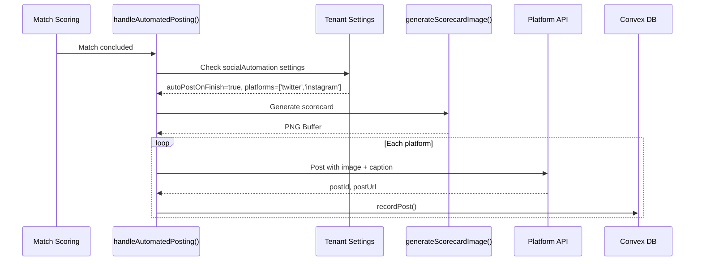
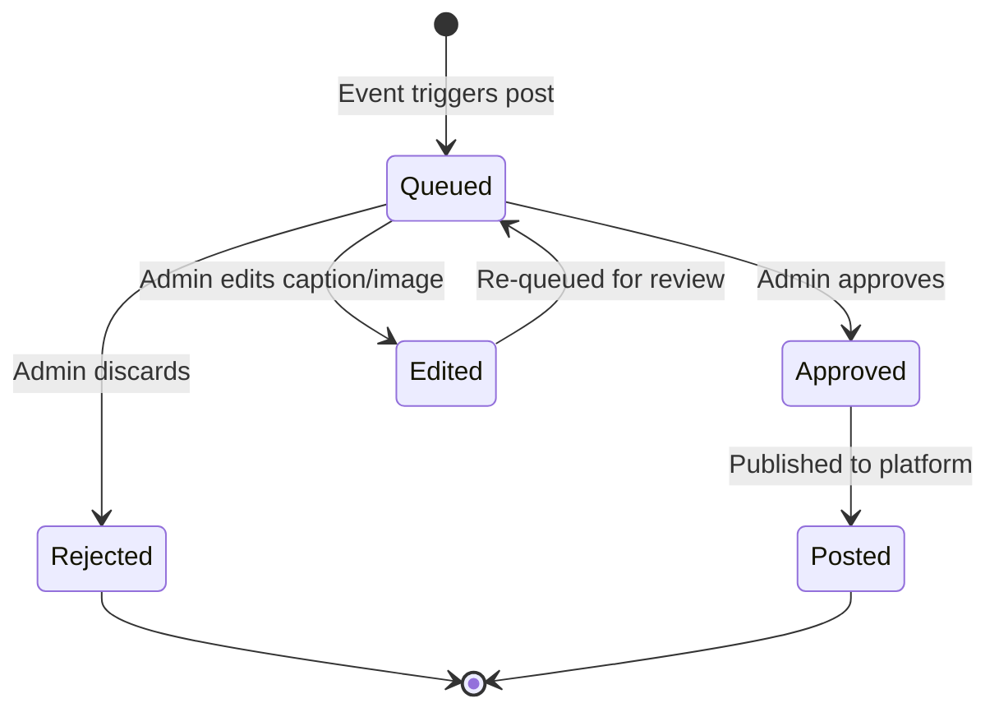
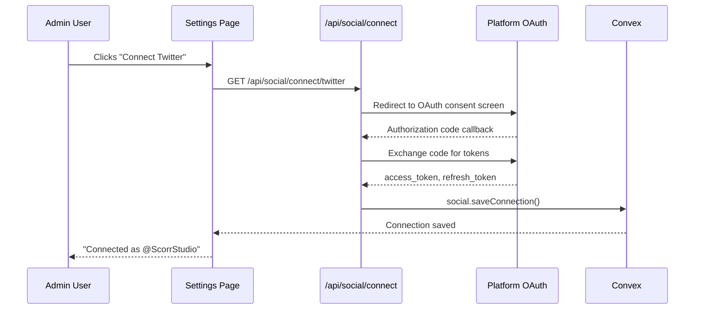
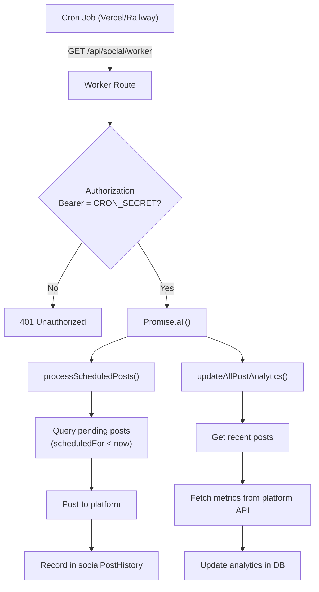

# Social Media Automation — Architecture & Roadmap

Internal documentation for the social media posting system in Scorr Studio. This feature allows tenants (owners/admins) to automatically or manually post match results, competition updates, and league announcements to connected social media platforms — with auto-generated scorecard images rendered from score display data.

---

## 1. Overview

### Value Proposition

Social media is the #1 marketing channel for sports organisations. Scorr Studio eliminates the manual work of creating graphics, writing captions, and posting results by:

- **Auto-generating scorecard images** from live match data using the same rendering pipeline as score displays
- **Posting instantly** when events occur (match finishes, bracket starts, registrations open)
- **Queueing posts for approval** so admins review before publishing
- **Tracking engagement** (likes, shares, comments, impressions) per post
- **Linking back** to public Scorr Studio pages for the competition, event, or league

### Who Can Use It

| Role | Permissions |
|---|---|
| **Owner** | Full access: connect accounts, configure automation, post manually, approve queue |
| **Admin** | Full access: same as Owner |
| **Manager** | View post history, submit posts to queue (cannot publish directly) |
| **Member** | No access to social features |

> [!IMPORTANT]
> Social account connections are **tenant-level** — they belong to the organisation, not individual users. Only owners/admins can connect or disconnect accounts.

---

## 2. Supported Platforms

| Platform | Auth Method | Post Type | Status | API Library |
|---|---|---|---|---|
| **Twitter/X** | OAuth 2.0 PKCE | Text + image | ✅ Live | [twitter.ts](file:///home/jack/clawd/scorr-studio/lib/api/twitter.ts) |
| **Instagram** | Facebook Login → IG Business | Photo + caption | ✅ Live | [instagram.ts](file:///home/jack/clawd/scorr-studio/lib/api/instagram.ts) |
| **Threads** | Meta Threads API | Text + image URL | ✅ Live | [threads.ts](file:///home/jack/clawd/scorr-studio/lib/api/threads.ts) |
| **LinkedIn** | OAuth 2.0 | Text + image | ✅ Live | [linkedin.ts](file:///home/jack/clawd/scorr-studio/lib/api/linkedin.ts) |
| **TikTok** | OAuth 2.0 PKCE | Video upload | 🔧 Built, not live | [tiktok.ts](file:///home/jack/clawd/scorr-studio/lib/api/tiktok.ts) |
| **YouTube** | Google OAuth 2.0 | — | 🔧 Connection only | Stored in `youtubeConnections` |
| **Facebook** | Facebook Login | Photo + text | 📋 Planned | — |
| **BlueSky** | AT Protocol | Text + image | 📋 Planned | — |

### Platform API Requirements

| Platform | App Registration | Key Env Variables |
|---|---|---|
| Twitter | [developer.twitter.com](https://developer.twitter.com) | `TWITTER_CLIENT_ID`, `TWITTER_CLIENT_SECRET`, `TWITTER_REDIRECT_URI` |
| Instagram | [developers.facebook.com](https://developers.facebook.com) (requires FB Business) | `FACEBOOK_APP_ID`, `FACEBOOK_APP_SECRET`, `FACEBOOK_REDIRECT_URI` |
| Threads | Meta for Developers (same app as IG) | Uses Facebook credentials |
| LinkedIn | [linkedin.com/developers](https://linkedin.com/developers) | `LINKEDIN_CLIENT_ID`, `LINKEDIN_CLIENT_SECRET`, `LINKEDIN_REDIRECT_URI` |
| TikTok | [developers.tiktok.com](https://developers.tiktok.com) | `TIKTOK_CLIENT_KEY`, `TIKTOK_CLIENT_SECRET`, `TIKTOK_REDIRECT_URI` |

---

## 3. File Map

| Area | Path | Description |
|---|---|---|
| **Platform API Wrappers** | | |
| Twitter | [lib/api/twitter.ts](file:///home/jack/clawd/scorr-studio/lib/api/twitter.ts) | OAuth, posting, media upload, analytics |
| Instagram | [lib/api/instagram.ts](file:///home/jack/clawd/scorr-studio/lib/api/instagram.ts) | Facebook Login, IG Business discovery, photo publishing |
| Threads | [lib/api/threads.ts](file:///home/jack/clawd/scorr-studio/lib/api/threads.ts) | Meta Threads API posting |
| LinkedIn | [lib/api/linkedin.ts](file:///home/jack/clawd/scorr-studio/lib/api/linkedin.ts) | OAuth, posting, analytics |
| TikTok | [lib/api/tiktok.ts](file:///home/jack/clawd/scorr-studio/lib/api/tiktok.ts) | OAuth, video upload |
| **Core Automation** | | |
| Automation engine | [lib/social/automation.ts](file:///home/jack/clawd/scorr-studio/lib/social/automation.ts) | Image generation, auto-posting, scheduling, analytics refresh |
| **Backend (Convex)** | | |
| Social functions | [convex/social.ts](file:///home/jack/clawd/scorr-studio/convex/social.ts) | Connections CRUD, post history, scheduled posts |
| Schema | [convex/schema.ts](file:///home/jack/clawd/scorr-studio/convex/schema.ts) | `socialConnections`, `socialPostHistory`, `scheduledSocialPosts` |
| **API Routes** | | |
| Worker endpoint | [app/api/social/worker/route.ts](file:///home/jack/clawd/scorr-studio/app/api/social/worker/route.ts) | Cron-triggered worker for scheduled posts + analytics |
| **UI** | | |
| Social settings | [app/app/settings/social/page.tsx](file:///home/jack/clawd/scorr-studio/app/app/settings/social/page.tsx) | Platform connections, automation config |
| Post history | [app/app/settings/social/history/page.tsx](file:///home/jack/clawd/scorr-studio/app/app/settings/social/history/page.tsx) | View past posts with analytics |
| Schedule action | [app/app/manage/.../schedulePostAction.ts](file:///home/jack/clawd/scorr-studio/app/app/manage/[sportname]/matches/actions/schedulePostAction.ts) | Schedule a post from match management |
| **User Docs** | | |
| Public docs | [content/docs/social.md](file:///home/jack/clawd/scorr-studio/content/docs/social.md) | User-facing help article |

---

## 4. Data Model

### socialConnections

Stores OAuth credentials for each platform connected by a tenant.

```typescript
{
    tenantId: string,
    platform: string,          // 'twitter', 'instagram', 'threads', 'linkedin', 'tiktok'
    accessToken: string,
    refreshToken?: string,
    expiresAt?: string,
    profileId?: string,        // Platform-specific user/page ID
    profileName?: string,      // Display name on the platform
    createdAt: string,
    updatedAt: string,
}
// Index: by_tenant_platform [tenantId, platform]
```

### socialPostHistory

Records every post published to social media with engagement tracking.

```typescript
{
    tenantId: string,
    matchId?: string,          // Linked match (if applicable)
    platform: string,
    postId: string,            // ID from the platform (tweet ID, IG post ID, etc.)
    postUrl?: string,          // Direct link to the post
    caption: string,
    createdAt: string,
    analytics?: {
        likes: number,
        shares: number,
        comments: number,
        impressions: number,
        lastUpdatedAt: string,
    },
}
// Indexes: by_tenant [tenantId], by_match [matchId], by_postId [postId]
```

### scheduledSocialPosts

Posts queued for future delivery.

```typescript
{
    tenantId: string,
    sportId: string,
    matchId?: string,
    platform: string,
    caption: string,
    scheduledFor: string,      // ISO timestamp — when to post
    status: string,            // 'pending' | 'posted' | 'failed'
    createdAt: string,
    error?: string,            // Error message if failed
}
// Indexes: by_tenant [tenantId], by_status [status, scheduledFor]
```

---

## 5. Scorecard Image Generation

The system auto-generates scorecard images (1200×630px) for social posts using the same rendering pipeline as score displays.

### Current Implementation



| Component | Library | Role |
|---|---|---|
| HTML rendering | `satori` + `satori-html` | Renders JSX-like HTML templates to SVG |
| Image conversion | `sharp` | Converts SVG → PNG buffer |
| Font | Noto Sans (bundled with Next.js) | Typography |

### Current Image Content

```
┌─────────────────────────────────────────────────┐
│                                                 │
│              FINAL RESULT                       │
│                                                 │
│    Team Name      3  VS  1      Team Name       │
│                                                 │
│         table-tennis • Feb 10, 2025             │
│                                                 │
│                    Powered by Scorr Studio       │
└─────────────────────────────────────────────────┘
```

### Proposed: Score Display Integration

Instead of using a hardcoded template, use the tenant's actual **score display design** to generate the post image:

1. Load the tenant's active score display template (Konva-based)
2. Inject the final match data (scores, names, event name)
3. Render the Konva stage to a PNG using `node-canvas` or `konva` server-side rendering
4. Use the resulting image for the social post

This means the social media image will look **exactly like** the live stream overlay — maintaining brand consistency.

> [!TIP]
> This is a key differentiator. No other platform lets you generate social images from your broadcast overlay automatically.

---

## 6. Automation Engine

### How Automated Posting Works Today



### Automation Settings (Tenant Level)

Configured in **Settings → Social**:

```typescript
socialAutomation: {
    autoPostOnFinish: boolean,         // Auto-post when a match finishes
    platforms: string[],               // Which platforms to post to
    customHashtags: string,            // Hashtags appended to every post
    captionTemplate?: string,          // Custom caption template
    tagPlayers: boolean,               // Include @handles of players
    postMode: 'instant' | 'queue',     // Post immediately or add to approval queue
}
```

### Caption Composition

The caption is auto-generated from match data:

```
{eventName}: {team1Name} {team1Score} - {team2Score} {team2Name} @player1 @player2 #ScorrStudio {customHashtags}
```

Player tags are resolved from profile social handles (`twitterHandle`, `instagramHandle`, `linkedinHandle`) when `tagPlayers` is enabled and the player has `taggingEnabled !== false`.

---

## 7. Event Triggers

The following events can trigger a social media post (automatic or queued):

### Competition Events

| Event | Trigger Point | Default Behaviour | Example Post |
|---|---|---|---|
| **Match finished** | `match.status = 'concluded'` | ✅ Auto-post (if enabled) | "Final: Alpha 3-1 Beta #TableTennis" |
| **Match started** | `match.status = 'live'` | Queue for approval | "LIVE NOW: Alpha vs Beta — Watch live at [link]" |
| **Group stage completed** | All group fixtures done | Queue for approval | "Group A standings are in! See who advances: [link]" |
| **Elimination bracket started** | First bracket match created | Queue for approval | "The bracket is set! 8 teams battle for the title: [link]" |
| **Quarter/Semi/Final starting** | Bracket round transition | Queue for approval | "SEMI-FINALS: Alpha vs Gamma at 7pm — Follow live: [link]" |
| **Competition winner crowned** | Final match concluded | Auto-post | "🏆 CHAMPION: Alpha wins the Spring Open! [link]" |
| **New competition created** | Competition published | Queue for approval | "Registration open for the Summer Smash! Sign up: [link]" |

### League Events

| Event | Trigger Point | Default Behaviour | Example Post |
|---|---|---|---|
| **Season match finished** | Fixture concluded | Auto-post (if enabled) | "Premier Division: Alpha 3-1 Beta — Updated standings: [link]" |
| **Registration opened** | `season.status = 'registration'` | Queue for approval | "🚨 Registration is OPEN for Spring 2025! Sign up: [link]" |
| **Registration closing soon** | 48h before `registrationEndDate` | Queue for approval | "⏰ Only 2 days left to register for Spring 2025! [link]" |
| **Registration closed** | `registrationEndDate` passed | Queue for approval | "Registration closed — 24 teams are in for Spring 2025! [link]" |
| **Registration extended** | Admin extends deadline | Queue for approval | "EXTENDED: Registration now open until March 15! [link]" |
| **Season started** | `season.status = 'active'` | Queue for approval | "The Spring 2025 season is underway! Follow all results: [link]" |
| **Season completed** | All fixtures done | Auto-post | "🏆 Season champions: Alpha FC with 28 points! Full standings: [link]" |
| **Division standings update** | Weekly digest | Queue for approval | "Week 5 standings — Alpha leads Premier Div by 3 points: [link]" |
| **Playoff bracket set** | Advancement computed | Queue for approval | "The playoff bracket is locked! 8 teams compete for glory: [link]" |

### Scheduling & Calendar Events

| Event | Trigger Point | Default Behaviour | Example Post |
|---|---|---|---|
| **Match day reminder** | 24h before scheduled match | Queue for approval | "Tomorrow: Alpha vs Beta at 7pm — Don't miss it! [link]" |
| **Weekly fixture preview** | Every Monday AM (configurable) | Queue for approval | "This week's matches: [link to fixtures page]" |
| **Milestone reached** | 100th match, 50 participants, etc. | Queue for approval | "🎉 We just hit 100 matches this season!" |

---

## 8. Post Approval Queue

### Instant vs Queue Mode

| Mode | Behaviour | Use Case |
|---|---|---|
| **Instant** | Post publishes immediately when triggered | Small clubs, fast-paced events |
| **Queue** | Post is drafted and held for admin approval | Larger organisations, brand-conscious leagues |

### Queue Workflow



### Proposed Schema: Post Queue

```typescript
// Proposed Convex table: socialPostQueue
{
    tenantId: string,
    triggerEvent: string,            // 'match_finished', 'registration_opened', etc.
    triggerEntityId?: string,        // Match ID, competition ID, season ID, etc.
    triggerEntityType?: string,      // 'match', 'competition', 'season', 'league'
    
    // Content
    caption: string,                 // Auto-generated, editable by admin
    imageUrl?: string,               // Generated scorecard or custom image
    linkUrl?: string,                // Link to public page
    platforms: string[],             // Target platforms

    // Status
    status: string,                  // 'queued' | 'approved' | 'posting' | 'posted' | 'rejected' | 'failed'
    
    // Metadata
    createdAt: string,
    createdBy: string,               // 'system' or admin user ID
    approvedAt?: string,
    approvedBy?: string,
    postedAt?: string,
    rejectedAt?: string,
    rejectedReason?: string,
    error?: string,                  // If posting failed
    
    // Results (populated after posting)
    postResults?: Array<{
        platform: string,
        postId: string,
        postUrl: string,
    }>,
}
```

### Queue UI

Located at `/app/settings/social/queue` (proposed):

| Column | Description |
|---|---|
| Status | Queued / Approved / Posted / Failed |
| Event | What triggered the post (e.g., "Match Finished: Alpha vs Beta") |
| Caption | Preview of the post text (editable) |
| Image | Thumbnail of the scorecard |
| Platforms | Icons for target platforms |
| Created | When the event occurred |
| Actions | Approve, Edit, Reject, Preview |

---

## 9. Post History & Analytics

### Current Implementation

The post history page at `/app/settings/social/history` shows:

- List of all posts made by the tenant
- Platform icon, caption, and timestamp
- Analytics (likes, shares, comments, impressions)
- Link to original post on the platform

### Analytics Refresh

The cron worker at `/api/social/worker` periodically fetches updated engagement metrics:

| Platform | Analytics Available |
|---|---|
| Twitter | ✅ Likes, retweets, quotes, replies, impressions |
| LinkedIn | ✅ Likes, shares, comments, impressions |
| Instagram | 📋 Planned (requires IG Insights API) |
| Threads | 📋 Planned |
| TikTok | 📋 Planned |

### Proposed: Enhanced Post History

| Enhancement | Description |
|---|---|
| **Search** | Search posts by caption text, platform, date range, event type |
| **Filters** | Filter by platform, status (posted/failed), event type |
| **Sort** | Sort by date, engagement, impressions |
| **Post links** | Direct links to the post on each platform |
| **Back-links** | Show which Scorr Studio page the post links to |
| **Bulk actions** | Re-post, delete from history, export analytics CSV |
| **Analytics dashboard** | Aggregate stats: total reach, best-performing platform, engagement trends |

---

## 10. Public Page Back-Links (URL Map)

Every social media post should link back to the relevant public Scorr Studio page. The link depends on the trigger event:

### Competition URLs

```
/competitions/{competitionId}                    → Competition home page
/competitions/{competitionId}/brackets           → Live bracket view
/competitions/{competitionId}/matches/{matchId}  → Match detail page
/competitions/{competitionId}/results            → Results page
/competitions/{competitionId}/register           → Registration page
```

### Event URLs

```
/events/{eventId}                                → Event home page
/events/{eventId}/schedule                       → Event schedule
/events/{eventId}/results                        → Event results
/events/{eventId}/register                       → Event registration
```

### League URLs

```
/leagues/{leagueId}                              → League home page
/leagues/{leagueId}/standings                    → Current standings
/leagues/{leagueId}/fixtures                     → Fixture schedule
/leagues/{leagueId}/results                      → Recent results
/leagues/{leagueId}/register                     → Season registration
/leagues/{leagueId}/rules                        → League rules
/leagues/{leagueId}/seasons/{seasonId}           → Historical season
```

### URL Resolution by Event Type

| Trigger Event | Link URL |
|---|---|
| Match finished | `/competitions/{id}/matches/{matchId}` or `/leagues/{id}/results` |
| Competition created | `/competitions/{id}/register` |
| Bracket started | `/competitions/{id}/brackets` |
| Competition winner | `/competitions/{id}/results` |
| Registration opened | `/leagues/{id}/register` or `/competitions/{id}/register` |
| Registration closing | Same as above |
| Season started | `/leagues/{id}/standings` |
| Season completed | `/leagues/{id}/standings` |
| Standings update | `/leagues/{id}/standings` |
| Playoff bracket set | `/leagues/{id}/standings` (bracket tab) |

---

## 11. Settings UI

### Social Settings Page

Location: **Settings → Social** (`/app/settings/social/`)

#### Connection Management

| UI Element | Description |
|---|---|
| Platform cards | One card per platform with Connect/Disconnect buttons |
| Connected indicator | Green dot + profile name when connected |
| OAuth flow | Redirects to platform auth, then back to settings |
| Connection test | "Test Post" button to verify credentials work |

#### Automation Configuration

| Setting | Type | Description |
|---|---|---|
| Auto-post on match finish | Toggle | Automatically post when a match concludes |
| Post mode | Select | `instant` (post immediately) or `queue` (hold for approval) |
| Target platforms | Multi-select | Which connected platforms to post to |
| Custom hashtags | Text | Hashtags appended to every post |
| Tag players | Toggle | Include @handles of participants |
| Caption template | Textarea | Customise the auto-generated caption format |

### Proposed: New Settings Pages

| Page | Route | Description |
|---|---|---|
| Post Queue | `/app/settings/social/queue` | View and manage queued posts awaiting approval |
| Post History | `/app/settings/social/history` | Search and browse all past posts with analytics |
| Event Config | `/app/settings/social/triggers` | Configure which events trigger posts and whether they're instant or queued |
| Templates | `/app/settings/social/templates` | Manage caption templates for different event types |

---

## 12. Technical Architecture

### OAuth Connection Flow



### Cron Worker Architecture



### Token Refresh Strategy

| Platform | Token Expiry | Refresh Method |
|---|---|---|
| Twitter | ~2 hours | Refresh token (offline.access scope) |
| Instagram | 60 days (long-lived) | Exchange for long-lived token at connect time |
| Threads | 60 days | Same as Instagram |
| LinkedIn | 60 days | Refresh token |
| TikTok | 24 hours | Refresh token (refresh_expires_in ~365 days) |

> [!WARNING]
> Token refresh is not yet automated. If a token expires, the scheduled post will fail with an auth error. The roadmap includes a token refresh middleware that runs before each post attempt.

---

## 13. Roadmap

### Phase 1 — Event-Triggered Posts ★ (Current Priority)

> **Goal**: Expand beyond match-finished to support all event triggers with queue mode.

- [ ] Define event trigger system with configurable per-event settings
- [ ] Implement post queue with approval/reject/edit workflow
- [ ] Build queue management UI at `/app/settings/social/queue`
- [ ] Add trigger for competition events (bracket started, winner crowned)
- [ ] Add trigger for league events (registration opened/closed, season start/end)
- [ ] Add trigger for scheduling events (match day reminders, weekly previews)
- [ ] Build event configuration UI at `/app/settings/social/triggers`
- [ ] Support `queue` mode alongside existing `instant` mode

### Phase 2 — Score Display Image Integration

> **Goal**: Use the tenant's actual score display design for social images.

- [ ] Server-side rendering of Konva score display templates
- [ ] Load tenant's active display design + inject match data
- [ ] Generate PNG from rendered Konva stage
- [ ] Fall back to satori-based scorecard if no display is configured
- [ ] Support different image aspect ratios per platform (1:1 for IG, 16:9 for Twitter, etc.)

### Phase 3 — Enhanced Post History & Search

> **Goal**: Make the post history a powerful, searchable log with links.

- [ ] Add search by caption text, date range, platform
- [ ] Add filters for event type, platform, status
- [ ] Show direct link to the post on the platform
- [ ] Show back-link to the Scorr Studio public page
- [ ] Add analytics dashboard (aggregate stats, trends, best-performing posts)
- [ ] Export analytics to CSV

### Phase 4 — Caption Templates & Customisation

> **Goal**: Let admins define custom caption templates per event type.

- [ ] Template system with variables: `{team1}`, `{team2}`, `{score}`, `{event}`, `{link}`, `{date}`
- [ ] Default templates for each event type
- [ ] Per-platform template overrides (Twitter has 280 char limit, LinkedIn allows longer)
- [ ] Emoji support and hashtag suggestions
- [ ] Preview rendering before saving

### Phase 5 — Token Management & Reliability

> **Goal**: Ensure posts never fail due to expired tokens.

- [ ] Automatic token refresh before each post attempt
- [ ] Token health monitoring (check validity on page load)
- [ ] Alerting when a token is about to expire
- [ ] Retry logic for failed posts (with exponential backoff)
- [ ] Dead letter queue for permanently failed posts

### Phase 6 — TikTok & Video Posts

> **Goal**: Expand to video platforms with automated highlight clips.

- [ ] Enable TikTok posting (video upload is built, needs integration)
- [ ] YouTube Shorts integration (connection exists)
- [ ] Auto-generate short video clips from match highlights
- [ ] Support video scorecard animations (Remotion or similar)

### Phase 7 — Facebook & BlueSky

> **Goal**: Round out platform coverage.

- [ ] Facebook Page posting (share Photo + link via Graph API)
- [ ] BlueSky posting via AT Protocol
- [ ] Platform-specific content optimisation (image sizes, caption lengths)

### Priority Matrix

| Phase | Effort | Impact | Priority |
|---|---|---|---|
| 1. Event-Triggered Posts | Large | Very High | 🔴 Critical |
| 2. Score Display Images | Medium | Very High | 🔴 Critical |
| 3. Post History & Search | Medium | High | 🟡 Important |
| 4. Caption Templates | Small | Medium | 🟡 Important |
| 5. Token Management | Medium | High | 🔴 Critical |
| 6. TikTok & Video | Large | Medium | 🟢 Nice-to-have |
| 7. Facebook & BlueSky | Medium | Medium | 🟢 Nice-to-have |

---

## 14. Current vs Proposed Comparison

| Capability | Today | Proposed |
|---|---|---|
| **Auto-post on match finish** | ✅ Working | ✅ Keep + add queue mode |
| **Manual post scheduling** | ✅ Basic scheduled posts | ✅ Enhanced with event-based triggers |
| **Scorecard generation** | ✅ Satori template (1200×630) | ✅ Use actual score display design |
| **Post queue/approval** | ❌ None | ✅ Full queue with approve/edit/reject |
| **Event triggers** | 🟡 Match finished only | ✅ 15+ event types (competition, league, scheduling) |
| **Post history** | ✅ Basic list view | ✅ Searchable, filterable, with links |
| **Analytics** | ✅ Twitter + LinkedIn | ✅ All platforms + aggregate dashboard |
| **Back-links to Scorr** | ❌ None | ✅ Every post links to relevant public page |
| **Caption templates** | 🟡 Hardcoded format | ✅ Customisable per event type |
| **Token refresh** | ❌ Manual reconnection | ✅ Automatic refresh + health monitoring |
| **Platform coverage** | ✅ 4 platforms live | ✅ 7 platforms (add FB, BlueSky, TikTok) |
| **Player tagging** | ✅ When profiles have handles | ✅ Keep + improve with opt-in preferences |
| **Video posts** | ❌ Images only | ✅ TikTok + YouTube Shorts + video clips |

---

## 15. Environment Variables

All social media integrations require these environment variables:

```bash
# Twitter/X
TWITTER_CLIENT_ID=
TWITTER_CLIENT_SECRET=
TWITTER_REDIRECT_URI=

# Instagram / Threads (Facebook App)
FACEBOOK_APP_ID=
FACEBOOK_APP_SECRET=
FACEBOOK_REDIRECT_URI=

# LinkedIn
LINKEDIN_CLIENT_ID=
LINKEDIN_CLIENT_SECRET=
LINKEDIN_REDIRECT_URI=

# TikTok
TIKTOK_CLIENT_KEY=
TIKTOK_CLIENT_SECRET=
TIKTOK_REDIRECT_URI=

# Cron Worker Auth
CRON_SECRET=

# YouTube (separate integration)
YOUTUBE_CLIENT_ID=
YOUTUBE_CLIENT_SECRET=
YOUTUBE_REDIRECT_URI=
```
