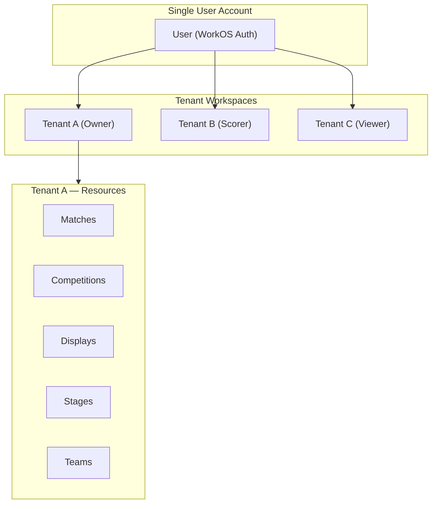
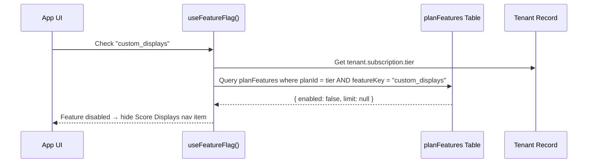

# Tenant System — Complete Reference

Comprehensive documentation of how **tenants** (organisations) work in Scorr Studio, including roles, permissions, settings, billing, and the multi-tenant access model.

---

## Overview — Azure-Subscription-Like Model

Tenants in Scorr Studio function similarly to **Azure Subscriptions**:

- A **single user account** creates and owns the tenant (the "subscription").
- Other users are **invited** into the tenant and given a specific role.
- Users **switch between tenants** without re-authenticating — one account, many workspaces.
- **Billing is centralised** — the tenant owner manages the subscription and payment methods for the entire organisation.
- All resources (matches, competitions, displays, stages, teams, etc.) belong to the **tenant**, not to individual users.



---

## 1. File Map

| Area | File |
|---|---|
| Convex Schema | [schema.ts](file:///home/jack/clawd/scorr-studio/convex/schema.ts) |
| Tenant CRUD | [tenants.ts](file:///home/jack/clawd/scorr-studio/convex/tenants.ts) |
| Members & Invitations | [members.ts](file:///home/jack/clawd/scorr-studio/convex/members.ts) |
| Tenant Settings (Convex) | [settings.ts](file:///home/jack/clawd/scorr-studio/convex/settings.ts) |
| RBAC Types & Permissions | [types.ts](file:///home/jack/clawd/scorr-studio/lib/rbac/types.ts) |
| RBAC Service (Server) | [index.ts](file:///home/jack/clawd/scorr-studio/lib/rbac/index.ts) |
| RBAC Hook (Client) | [usePermissions.ts](file:///home/jack/clawd/scorr-studio/lib/rbac/usePermissions.ts) |
| App Context (Tenant Switching) | [app-context.tsx](file:///home/jack/clawd/scorr-studio/components/app-context.tsx) |
| Settings Hub Page | [settings/page.tsx](file:///home/jack/clawd/scorr-studio/app/app/settings/page.tsx) |
| Members Management | [settings/members/page.tsx](file:///home/jack/clawd/scorr-studio/app/app/settings/members/page.tsx) |
| Billing & Plans | [settings/billing/page.tsx](file:///home/jack/clawd/scorr-studio/app/app/settings/billing/page.tsx) |

---

## 2. Tenant Data Model

### 2.1 Tenants Table

Stored in the Convex `tenants` table:

| Field | Type | Description |
|---|---|---|
| `tenantId` | string | External UUID (WorkOS organisation ID) |
| `name` | string | Organisation display name |
| `createdAt` | string (ISO) | When the tenant was created |
| `subscription` | object (optional) | Billing tier, feature overrides, payment details |
| `usage` | object (optional) | Resource usage counters (matches, displays, etc.) |
| `settings.enabledSports` | Record | Map of sport IDs → enabled boolean |
| `settings.socialAutomation` | object | Auto-post on finish, platforms, custom hashtags |
| `lastRenamedAt` | string (ISO) | Tracks 30-day rename cooldown |
| `lastActiveAt` | string (ISO) | For retention/analytics tracking |

**Indexes:** `by_tenantId`, `by_lastActive`

### 2.2 Members Table

| Field | Type | Description |
|---|---|---|
| `tenantId` | string | Which tenant this membership belongs to |
| `userId` | string | WorkOS user ID |
| `email` | string | Member's email |
| `name` | string (optional) | Display name |
| `role` | string | `owner`, `admin`, `designer`, `scorer`, or `viewer` |
| `joinedAt` | string (ISO) | When membership was accepted |

**Indexes:** `by_tenant`, `by_user`, `by_tenant_user`

### 2.3 Invitations Table

| Field | Type | Description |
|---|---|---|
| `tenantId` | string | Target tenant |
| `token` | string | Unique invitation token (used in URL) |
| `email` | string | Invited email address |
| `role` | string | Role to assign on acceptance |
| `invitedBy` | string | User ID of the inviter |
| `createdAt` | string (ISO) | When invitation was sent |
| `expiresAt` | string (ISO, optional) | Invitation expiry |

**Indexes:** `by_tenant`, `by_token`, `by_tenant_email`

### 2.4 Tenant Settings Table

Separate from the main tenant record for sport-specific configuration:

| Field | Type | Description |
|---|---|---|
| `tenantId` | string | Owner tenant |
| `enabledSports` | Record | `{ "table-tennis": true, "badminton": false, ... }` |

---

## 3. Roles & Permissions (RBAC)

### 3.1 Role Hierarchy

5 roles defined in [types.ts](file:///home/jack/clawd/scorr-studio/lib/rbac/types.ts), from most to least privileged:

| Role | Description | Who Can Assign |
|---|---|---|
| **Owner** | Organisation creator — full access + billing control | System (on tenant creation) |
| **Admin** | Full access to all features and settings (excluding billing) | Owner, Admin |
| **Designer** | Can create and edit scoreboards, overlays, and displays | Owner, Admin |
| **Scorer** | Can score matches and view most data | Owner, Admin |
| **Viewer** | Read-only access to match and competition data | Owner, Admin |

### 3.2 Permission Matrix

19 granular permission actions grouped by resource:

| Permission | Owner | Admin | Designer | Scorer | Viewer |
|---|---|---|---|---|---|
| **Tenant** | | | | | |
| `tenant:manage` | ✅ | ✅ | — | — | — |
| `tenant:invite` | ✅ | ✅ | — | — | — |
| `tenant:remove_member` | ✅ | ✅ | — | — | — |
| **Matches** | | | | | |
| `match:create` | ✅ | ✅ | — | — | — |
| `match:update` | ✅ | ✅ | — | — | — |
| `match:delete` | ✅ | ✅ | — | — | — |
| `match:score` | ✅ | ✅ | — | ✅ | — |
| `match:view` | ✅ | ✅ | ✅ | ✅ | ✅ |
| **Competitions** | | | | | |
| `competition:create` | ✅ | ✅ | — | — | — |
| `competition:update` | ✅ | ✅ | — | — | — |
| `competition:delete` | ✅ | ✅ | — | — | — |
| `competition:view` | ✅ | ✅ | ✅ | ✅ | ✅ |
| **Displays & Stages** | | | | | |
| `display:create/update/delete` | ✅ | ✅ | ✅ | — | — |
| `display:view` | ✅ | ✅ | ✅ | ✅ | ✅ |
| `stage:create/update/delete` | ✅ | ✅ | — | — | — |
| `stage:view` | ✅ | ✅ | ✅ | ✅ | ✅ |
| **Social** | | | | | |
| `social:manage` | ✅ | ✅ | — | — | — |
| `social:post` | ✅ | ✅ | — | — | — |
| **Settings** | | | | | |
| `settings:view` | ✅ | ✅ | ✅ | ✅ | — |
| `settings:update` | ✅ | ✅ | — | — | — |
| **Billing** | | | | | |
| `billing:view` | ✅ | — | — | — | — |
| `billing:manage` | ✅ | — | — | — | — |

> [!IMPORTANT]
> **Billing is Owner-only.** Admins have full access to everything *except* billing. This ensures the account holder retains financial control.

> [!NOTE]
> **Teams & Registrations** are not managed at the tenant level. Instead:
> - **Competition teams** are managed through the competition's own access controls — anyone with `competition:update` can manage teams within that competition.
> - **League teams & registrations** are managed through the league's own role system (see below).

### 3.3 League Roles (Scoped to Individual Leagues)

Leagues have their own role assignments independent of tenant-level RBAC. These roles are scoped to a **single league**, not the entire tenant:

| League Role | Description |
|---|---|
| **League Admin** | Full control over the league (seasons, scheduling, standings) |
| **Coach** | Manages their team roster, lineup, and match preparation within the league |
| **Manager** | Organisational duties — registration, communication, logistics for their team |
| **Player** | Registered participant — can view schedules, results, and their own stats |

League roles are assigned per-league and per-team, allowing one user to be a Coach in League A and a Player in League B.

### 3.4 Server-Side Enforcement

The RBAC service in [index.ts](file:///home/jack/clawd/scorr-studio/lib/rbac/index.ts) provides:

| Function | Purpose |
|---|---|
| `checkPermission(userId, tenantId, action)` | Returns `{ allowed, role, reason }` |
| `requirePermission(userId, tenantId, action)` | Throws `PermissionError` if denied |
| `requireAnyPermission(userId, tenantId, actions)` | Pass if user has at least one permission |
| `requireAdmin(userId, tenantId)` | Shorthand for admin-only enforcement |
| `getUserRole(userId, tenantId)` | Returns the user's role in designated tenant |
| `getUserPermissions(userId, tenantId)` | Returns full permission list for user |

### 3.5 Client-Side Hook

The `usePermissions()` hook in [usePermissions.ts](file:///home/jack/clawd/scorr-studio/lib/rbac/usePermissions.ts) provides:

```typescript
const { role, can, canAny, canAll, isAdmin, isOwner } = usePermissions();

// Usage examples
if (can('tenant:manage')) { /* show admin controls */ }
if (can('billing:manage')) { /* show billing page */ }
if (isAdmin) { /* show settings panel */ }
```

---

## 4. Tenant Switching

### 4.1 How It Works

Users switch between tenants via the `AppContext` — no re-authentication is required:

```
User logs in → Fetch memberships → Display tenant picker → Set active tenant via cookie
```

### 4.2 AppContext State

The [app-context.tsx](file:///home/jack/clawd/scorr-studio/components/app-context.tsx) provider manages:

| State | Type | Persistence |
|---|---|---|
| `tenantId` | string \| null | Cookie: `scorrstudio_tenant_id` (1-year TTL) |
| `tenantName` | string \| null | Cookie: `scorrstudio_tenant_name` (1-year TTL) |
| `sportName` | string \| null | Cookie: `scorrstudio_sport_name` (1-year TTL) |
| `userRole` | string \| null | In-memory (fetched per session) |
| `userId` | string \| null | In-memory (from auth) |

### 4.3 Switching Flow

1. User opens the tenant picker (dashboard sidebar)
2. System calls `tenants.listByUser(userId)` — queries `members` by user, then fetches each tenant
3. User selects a tenant → `setTenantId(id, name)` is called
4. Cookies are updated: `scorrstudio_tenant_id` and `scorrstudio_tenant_name`
5. All subsequent API calls use the cookie-based `tenantId`
6. The user's role is resolved from the `members` table for the selected tenant
7. UI permissions update reactively based on the new role

> [!NOTE]
> A user can **own** only one tenant (enforced on creation by checking existing memberships), but can be a **member** of unlimited tenants through invitations.

---

## 5. Invitation & Onboarding Flow

### 5.1 Inviting a User

1. Admin/Owner opens **Settings → Team Members → Invite Member**
2. Enters email address and selects a role (`Admin`, `Scorer`, or `Viewer`)
3. System calls `members.createInvitation()` — generates a unique token
4. Invitation is stored in the `invitations` table with `expiresAt`
5. Invited user receives the invitation (email with token link)

### 5.2 Accepting an Invitation

1. User clicks invitation link containing the token
2. System calls `members.getByToken(token)` to validate
3. If valid and not expired, user is added to `members` table with the assigned role
4. Invitation is deleted from `invitations`
5. User can now switch to the new tenant via the tenant picker

### 5.3 Managing Members

| Action | Required Permission | Description |
|---|---|---|
| View members | `settings:view` | See all members and pending invites |
| Invite member | `tenant:invite` | Send invitation email with role |
| Remove member | `tenant:remove_member` | Immediately revoke access |
| Revoke invitation | `tenant:remove_member` | Cancel pending invite |

---

## 6. Settings Pages

The settings hub at `/app/settings` provides 7 sub-pages. Access to the hub requires a selected tenant.

### 6.1 General Settings

**Path:** `/app/settings`

| Setting | Who Can Edit | Constraints |
|---|---|---|
| Organisation Name | `tenant:manage` (Owner, Admin) | Min 2 chars, max 50 chars, **30-day cooldown** between renames |
| Current Plan | Read-only display | Shows subscription tier |
| Created Date | Read-only display | — |
| Delete Organisation | `tenant:manage` (Owner, Admin) | Danger zone action |

### 6.2 Team Members

**Path:** `/app/settings/members`

- View active members with role badges and join dates
- View pending invitations with sent date
- Invite new members (Admin/Owner only) with role selection
- Remove members or revoke invitations (Admin/Owner only)
- Role display: Admin (shield icon), Scorer (user icon), Viewer (eye icon)

### 6.3 Billing & Plans

**Path:** `/app/settings/billing`

> [!IMPORTANT]
> Only the **Owner** role can view and manage billing. Admins cannot access this page.

#### Pricing Philosophy

- **Matches and Competitions are always unlimited** on every tier — there is no cap on scoring or tournament creation.
- Monetisation is based on **customisation, branding, and advanced features**, not on core usage.
- Feature access is controlled by a **database-driven feature flag table** (see §8), not hardcoded in the app.

#### Pricing Tiers

| Tier | Price | What You Get |
|---|---|---|
| **Free** | $0 forever | Unlimited matches & competitions, 1 league, standard Scorr-branded displays (no custom displays or templates), no social automation |
| **Pro** | $29/month | Everything in Free + custom score displays, template marketplace, social automation, remove Scorr branding, multiple leagues |
| **Enterprise** | $99/month | Everything in Pro + API access, webhooks, priority support, white-label options, unlimited leagues |

#### Free Tier Restrictions

| Feature | Free | Pro | Enterprise |
|---|---|---|---|
| Matches | ∞ | ∞ | ∞ |
| Competitions | ∞ | ∞ | ∞ |
| Leagues | 1 | Multiple | Unlimited |
| Score Displays | Standard only (Scorr logo) | Custom | Custom + white-label |
| Template Marketplace | ❌ | ✅ | ✅ |
| Display Editor | ❌ | ✅ | ✅ |
| Social Automation | ❌ | ✅ | ✅ |
| Custom Branding | ❌ | ✅ | ✅ |
| API Access | ❌ | ❌ | ✅ |
| Webhooks | ❌ | ❌ | ✅ |
| Priority Support | ❌ | ❌ | ✅ |

> [!IMPORTANT]
> Free-tier users see a **standard score display with Scorr Studio branding**. The Score Displays editor and template marketplace are hidden from the navigation entirely — they are gated by the `custom_displays` and `templates` feature flags.

#### Billing Flow

```
Select Plan → POST /api/billing/checkout → Stripe Checkout → Redirect back
Manage Subscription → POST /api/billing/portal → Stripe Customer Portal
```

- **Checkout:** Creates a Stripe Checkout Session for plan upgrade
- **Portal:** Opens Stripe Customer Portal for managing payment methods, invoices, and cancellation
- **Centralised billing:** The tenant owner's payment method covers all usage for all members

### 6.4 Sports Settings

**Path:** `/app/settings/sports`

- Toggle sports on/off per tenant
- Stored in both `tenantSettings.enabledSports` and `tenants.settings.enabledSports`
- Controls which sport sections appear in the dashboard navigation

### 6.5 Social Automation

**Path:** `/app/settings/social`

- Configure auto-post on match finish
- Select platforms (Twitter, Instagram)
- Set custom hashtags
- Connect/disconnect social accounts (OAuth tokens stored in `socialConnections`)

### 6.6 Developer Settings

**Path:** `/app/settings/developers`

#### API Keys

| Field | Description |
|---|---|
| `keyId` | Public key identifier (prefix `sk_xxx`) |
| `hashedSecret` | bcrypt hash of the secret key |
| `name` | User-provided label |
| `permissions` | Array of permission strings (`matches:read`, `matches:write`, etc.) |
| `expiresAt` | Optional expiry date |
| `revokedAt` | Set when key is revoked |

#### Webhooks

| Field | Description |
|---|---|
| `url` | Target endpoint URL |
| `events` | Array of event types (`match.started`, `match.updated`, etc.) |
| `secret` | HMAC signature verification secret |
| `isActive` | Enable/disable toggle |
| `failureCount` | Consecutive failure tracker |

Both API keys and webhooks are scoped to the **tenant**, not individual users.

### 6.7 Usage & Limits

**Path:** `/app/settings/usage`

- Displays current resource consumption against plan limits
- Usage is tracked via `tenants.usage` (counters incremented/decremented by Convex mutations)
- Monthly reset available via `tenants.resetMonthlyUsage()`

### 6.8 YouTube Integration

**Path:** `/app/settings/youtube`

- OAuth connection to YouTube channel
- Stored in `youtubeConnections` table (per tenant + user)
- Enables live streaming features

---

## 7. Usage Tracking

The tenant's `usage` field is a flexible counter map managed by Convex mutations:

| Mutation | Description |
|---|---|
| `tenants.incrementUsage(tenantId, resource, amount)` | Add to a usage counter |
| `tenants.decrementUsage(tenantId, resource, amount)` | Subtract from a counter (floor: 0) |
| `tenants.resetMonthlyUsage(tenantId)` | Reset all counters to `{}` |

Resources are tracked as string keys (e.g. `"matches"`, `"displays"`, `"competitions"`) with numeric values.

---

## 8. Feature Flags (Database-Driven)

Feature access is **not hardcoded** in the application. Instead, a database table defines which features each plan enables. The app queries this table at runtime to determine access.

### 8.1 `planFeatures` Table

A new Convex table that maps plan tiers to feature flags:

| Field | Type | Description |
|---|---|---|
| `planId` | string | `free`, `pro`, `enterprise` |
| `featureKey` | string | Feature identifier (e.g. `custom_displays`) |
| `enabled` | boolean | Whether this feature is available on this plan |
| `limit` | number (optional) | Numeric limit (e.g. `leagues: 1` for free) |

**Indexes:** `by_plan`, `by_feature`

### 8.2 Feature Keys

| Feature Key | Description | Free | Pro | Enterprise |
|---|---|---|---|---|
| `custom_displays` | Access to Score Display editor | ❌ | ✅ | ✅ |
| `templates` | Template marketplace access | ❌ | ✅ | ✅ |
| `social_automation` | Auto-post to social media | ❌ | ✅ | ✅ |
| `custom_branding` | Remove Scorr Studio logos | ❌ | ✅ | ✅ |
| `leagues` | League creation (limit-based) | 1 | Multiple | ∞ |
| `api_access` | REST API key generation | ❌ | ❌ | ✅ |
| `webhooks` | Webhook endpoint registration | ❌ | ❌ | ✅ |
| `priority_support` | Priority support queue | ❌ | ❌ | ✅ |
| `white_label` | Full white-label options | ❌ | ❌ | ✅ |

### 8.3 How It Works



1. **UI component** calls a `useFeatureFlag(featureKey)` hook
2. Hook reads the tenant's current plan from `subscription.tier`
3. Hook queries the `planFeatures` table for that plan + feature combination
4. Returns `{ enabled, limit }` — the UI reacts accordingly (hide nav items, show upgrade prompts, enforce limits)

### 8.4 Tenant-Level Overrides

Individual tenants can have feature overrides that supersede their plan defaults:

```typescript
// Override stored on tenant.subscription.featureOverrides
tenants.updateFeatureFlags(tenantId, {
    "custom_displays": true,  // Grant a free-tier tenant display access
    "leagues": 5,             // Override the limit
});
```

The resolution order is:
1. Check `tenant.subscription.featureOverrides[featureKey]` — if set, use it
2. Fall back to `planFeatures` table lookup for the tenant's plan tier

> [!NOTE]
> This design means **pricing changes only require database updates**, not code deployments. Adding a new feature flag or adjusting plan access is a data operation.

---

## 9. Tenant Lifecycle

### 9.1 Creation

```
User signs up → WorkOS auth → Create tenant (tenantId = WorkOS org ID) → Add user as Owner member
```

**Constraint:** A user can only create **one** tenant. The `tenants.create` mutation checks for existing memberships and throws `"User already has a tenant"` if one exists.

### 9.2 Active Tracking

- `tenants.updateLastActive(tenantId)` updates `lastActiveAt` timestamp
- Used for retention analytics and identifying inactive organisations
- Telemetry: `app_context_mounted` fires on each session with tenant context

### 9.3 Rename Cooldown

- Tenant name can only be changed once every **30 days**
- Enforced server-side in `tenants.update()` by comparing `lastRenamedAt`
- Error message: _"You can only rename your organization once every 30 days. Please wait N more days."_

---

## 10. Security Model Summary

| Concern | Approach |
|---|---|
| **Authentication** | WorkOS (SSO, email/password) |
| **Tenant isolation** | All resources indexed by `tenantId` — queries always filter by tenant |
| **Session persistence** | Cookie-based (`scorrstudio_tenant_id`) with 1-year TTL |
| **Role resolution** | Looked up from `members` table on each session |
| **Server enforcement** | `requirePermission()` / `requireAdmin()` in API routes |
| **Client enforcement** | `usePermissions()` hook gates UI elements |
| **Billing isolation** | Owner-only billing access — admins cannot modify payment |
| **API key scoping** | Keys belong to tenant, not user — revocation is tenant-wide |
| **Webhook scoping** | Endpoints registered per tenant with HMAC signature verification |

---

## 11. Multi-Tenant Access Analogy

| Azure Subscription Concept | Scorr Studio Equivalent |
|---|---|
| Azure Account | WorkOS User Account |
| Azure Subscription | Tenant (Organisation) |
| Subscription Owner | Owner role |
| Resource Group | Sport (scoped by `sportId` within tenant) |
| Azure RBAC Role | RBAC role (Owner / Admin / Designer / Scorer / Viewer) |
| Azure Cost Management | Billing page (Owner-only, Stripe) |
| Switch Subscription | Tenant picker (cookies + `setTenantId`) |
| Resource | Match, Competition, Display, Stage, Team |
| Azure AD Invitation | Invitation token (email + role) |
