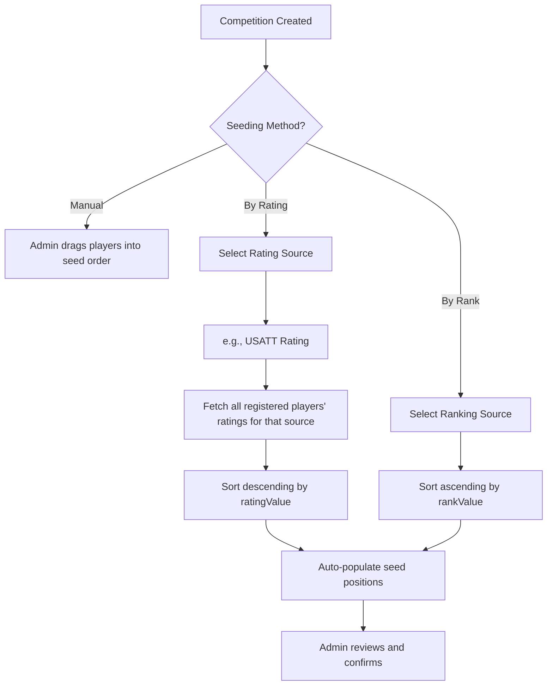
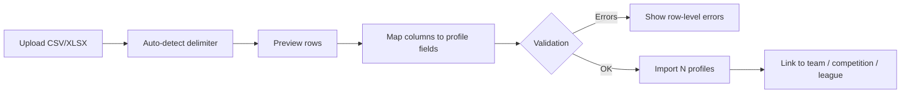

# User Profiles & Athlete Model

This document outlines the design for a unified User Profile system in Scorr Studio. The goal is to create a single, portable identity for every user — whether they are an admin, coach, parent, or athlete — with structured athlete attributes, custom fields, and external rating/ranking integration for automatic seeding.

## 1. Current State

| Layer | Location | Fields | Limitation |
| :--- | :--- | :--- | :--- |
| **Auth User** | `types/User.ts` | `id`, `email`, `firstName`, `lastName`, `profilePictureUrl` | No athlete data |
| **Profile** | `convex/profiles` | `name`, `phoneNumber`, `avatarUrl`, social handles, `metadata` (any) | Unstructured metadata blob |
| **Player** | Embedded in `teams.players` | `id`, `name`, `number`, `position`, `photoUrl` | Not linked to user accounts; duplicated across teams |
| **Match Link** | `matchParticipants` | `profileId`, `matchId`, `role` | Only links profiles, not players |

**Key Problems:**
1.  Players are **disconnected** from User Accounts. A person on Team A and Team B has two separate player records.
2.  No structured **athlete attributes** (handedness, height, DOB).
3.  **Ratings/rankings** are not tracked, making automatic seeding impossible.
4.  No **custom fields** for tenant-specific data.

---

## 2. Proposed User Object

A single `profiles` table serves as the canonical record for every person in the system. This is the object that the mobile app and web app will both read/write.

### 2.1 Core Identity Fields

```typescript
interface UserProfile {
    // Identity (from Auth Provider - WorkOS)
    userId: string;             // WorkOS user ID (primary key)
    email: string;
    firstName: string;
    lastName: string;
    displayName?: string;       // Optional public-facing name
    avatarUrl?: string;
    phoneNumber?: string;       // E.164 format
    dateOfBirth?: string;       // ISO 8601 (YYYY-MM-DD)
    gender?: 'male' | 'female' | 'non-binary' | 'prefer_not_to_say';
    nationality?: string;       // ISO 3166-1 alpha-2 country code
    hometown?: string;          // City, State/Province
    
    // Social
    twitterHandle?: string;
    instagramHandle?: string;
    linkedinHandle?: string;
    taggingEnabled?: boolean;

    // System
    verified?: boolean;
    createdAt: string;
    updatedAt: string;
}
```

### 2.2 Athlete Attributes

Stored as a structured sub-object on the profile, keyed by sport. This allows a user to be a right-handed tennis player and a left-handed table tennis player simultaneously.

```typescript
interface AthleteAttributes {
    [sportId: string]: {
        // Physical
        handedness?: 'right' | 'left' | 'ambidextrous';
        height?: { value: number; unit: 'cm' | 'in' };
        weight?: { value: number; unit: 'kg' | 'lb' };
        reach?: { value: number; unit: 'cm' | 'in' };  // Boxing/MMA
        
        // Play Style
        stance?: string;            // e.g., 'orthodox' | 'southpaw' (Boxing)
        grip?: string;              // e.g., 'shakehand' | 'penhold' (Table Tennis)
        playStyle?: string;         // e.g., 'baseline' (Tennis), 'attacking' (TT)
        preferredPosition?: string; // e.g., 'goalkeeper' (Soccer)
        
        // Experience
        yearsPlaying?: number;
        coachName?: string;
        clubName?: string;
    };
}
```

### 2.3 Custom Fields (Max 10 per Tenant)

Tenant admins can define up to **10 custom fields** that are stored on every user profile within their organization. These fields serve a dual purpose: they hold profile data **and** they are exposed as drag-and-drop block components in the **Konva Score Display Editor** and the **Bracket Viewer**.

> [!IMPORTANT]
> Custom fields are the mechanism for surfacing data like ratings on scoreboards and brackets. For example, a tenant defines Custom Field 1 as "USATT Rating". That value is stored on the user's profile, and a corresponding **"Custom Field 1" block** appears in the Konva editor's component palette for drag-and-drop placement on overlays.

```typescript
interface CustomFieldDefinition {
    slot: number;               // 1-10 (fixed slot number)
    tenantId: string;
    label: string;              // e.g., "USATT Rating", "School Grade"
    type: 'text' | 'number' | 'date' | 'select' | 'boolean';
    options?: string[];         // For 'select' type
    required?: boolean;         // Enforced during registration (see §2.4)
    sportId?: string;           // If sport-specific, otherwise global
}

// Stored on the profile:
interface CustomFieldValues {
    [tenantId: string]: {
        [slot: number]: string | number | boolean;  // slot 1-10
    };
}
```

#### Display Integration

| Surface | How Custom Fields Appear |
| :--- | :--- |
| **Konva Score Display Editor** | Each defined custom field appears as a draggable block ("Custom Field 1", "Custom Field 2", etc.) in the component palette. When placed on the canvas, it renders the value from the active match's player profile. |
| **Bracket Viewer** | Bracket nodes can be configured to show custom fields alongside the player name, e.g., `"John Doe (1850)"` where 1850 is Custom Field 1 (USATT Rating). The bracket template has a toggle per custom field. |
| **Profile Page** | Custom fields render as dynamic form inputs in the user's profile, labelled with the tenant's `label` value. |

#### Bracket Display Format

Bracket nodes use a configurable template string:

```
{firstName} {lastName} ({customField1})
→ "John Doe (1850)"

{firstName} {lastName} - {customField2}
→ "Jane Smith - Springfield HS"
```

The bracket settings page allows the admin to select which custom fields (if any) appear next to player names, and in what format (parenthesized, dash-separated, or below the name).

### 2.4 Tenant-Required Fields

Tenants can mark any profile field (core or custom) as **required** or **optional** for their organization. When a user registers or joins a tenant, the system checks whether the user's profile satisfies all required fields. If any are missing, the user is prompted to complete them before proceeding.

```typescript
interface TenantFieldRequirement {
    tenantId: string;
    field: string;              // e.g., 'dateOfBirth', 'hometown', 'athleteAttributes.handedness'
    required: boolean;          // true = must be filled, false = shown but not enforced
    promptLabel?: string;       // Custom label, e.g., "Date of Birth (required for age divisions)"
}
```

**Registration Flow:**
1.  User signs up or accepts a team/tenant invitation.
2.  System fetches the tenant's `fieldRequirements`.
3.  System compares against the user's existing profile.
4.  If any `required: true` fields are missing, a **"Complete Your Profile"** modal is shown before the user can proceed.
5.  User fills in the missing fields and submits.
6.  Registration completes only after all required fields are satisfied.

---

## 3. Rating & Ranking (User-Input Only)

> [!IMPORTANT]
> Scorr Studio does **not** integrate with external rating APIs. There are an unlimited number of associations worldwide, and it is not this application's job to connect to any of them. Instead, ratings are **self-reported by users** (or imported via flat-file — see Section 4). The reference table below exists to help users understand what values to enter for their sport.

### 3.1 Rating Storage Model

```typescript
interface ExternalRating {
    source: string;             // Free-text label, e.g., "USATT", "UTR", "DUPR"
    ratingValue: number;        // The numeric rating
    rankValue?: number;         // National/World rank (if available)
    memberId?: string;          // Player's member ID in that system (for reference)
    lastUpdated: string;        // ISO 8601
}

// Stored on the profile, keyed by sport:
interface PlayerRatings {
    [sportId: string]: ExternalRating[];
}
```

### 3.2 Common Rating Systems by Sport (Reference)

The following table is a **reference guide** for users and admins. It documents common rating systems so users know what values to enter. The `source` field on the profile is free-text — users can enter any association name.

| Sport | Governing Body | Rating System | Rating Type | Notes |
| :--- | :--- | :--- | :--- | :--- |
| **Table Tennis** | ITTF / USATT | USATT Rating | Numeric (0-2800+) | Most US tournaments use USATT ratings for seeding |
| **Tennis** | ITF / USTA | UTR (Universal Tennis Rating) | Numeric (1.00-16.50) | UTR is the most universal cross-association rating |
| **Pickleball** | USA Pickleball | DUPR (Dynamic Universal Pickleball Rating) | Numeric (2.0-8.0) | DUPR is becoming the standard for all pickleball |
| **Badminton** | BWF | BWF World Ranking | Points-based | Used for international seeding |
| **Squash** | WSF / US Squash | ClubLocker Rating | Numeric | US Squash uses ClubLocker for domestic ratings |
| **Cricket** | ICC | ICC Player Rankings | Points-based | Separate for batting, bowling, all-rounder |
| **Soccer** | FIFA | No individual rating | N/A | Team-level FIFA ranking; player ratings via EA FC |
| **Basketball** | FIBA | No standard individual rating | N/A | Use custom league stats (PPG, APG) |
| **Volleyball** | FIVB | No standard individual rating | N/A | Use custom league stats |
| **Baseball** | MLB / USA Baseball | No universal amateur rating | N/A | Use batting average, ERA as custom stats |
| **Boxing** | AIBA / WBC | Official World Rankings | Rank position | Division-specific |
| **MMA** | UFC Rankings / regional | Official Rankings | Rank position | Weight-class-specific |
| **American Football** | NFL / NCAA | No universal individual rating | N/A | Use custom stats (QBR, yards) |
| **Ice Hockey** | IIHF | No universal individual rating | N/A | Use custom stats (goals, assists) |
| **Padel** | FIP / WPT | FIP Ranking | Points-based | Growing sport, rankings still maturing |
| **Darts** | PDC / WDF | Order of Merit | Prize money based | PDC ranking is the primary system |
| **Snooker** | WPBSA | World Ranking | Prize money based | Official world ranking list |
| **Field Hockey** | FIH | FIH World Ranking | Points-based | Team-level rankings primarily |
| **Handball** | IHF | No standard individual rating | N/A | Use custom stats |
| **Rugby** | World Rugby | World Rankings | Points-based | Team-level; individual via custom stats |

### 3.3 Mapping Strategy for Automatic Seeding



**Implementation:**
1.  Admin creates a competition and selects "Auto-Seed by Rating".
2.  Admin chooses the rating source (e.g., "USATT Rating").
3.  The system queries all registered participants' `playerRatings[sportId]` for the matching `source`.
4.  Players are sorted and placed into seed positions.
5.  Unrated players are placed at the bottom or in a separate "unseeded" pool.
6.  Admin can manually override any seed before confirming.

---

## 4. Roster Import (Flat-File)

Many organisations already have their own registration systems. Rather than forcing them onto Scorr Studio's registration portal immediately, we provide a **flat-file import tool** that allows admins to bring rosters in from any external system and map columns to Scorr Studio profile fields.

> [!TIP]
> This is the primary migration path for organisations transitioning to Scorr Studio. They can continue using their existing registration system and simply export → import rosters each season.

### 4.1 Supported File Formats

| Format | Extension | Delimiter |
| :--- | :--- | :--- |
| Comma-Separated Values | `.csv` | `,` |
| Tab-Separated Values | `.tsv` | `\t` |
| Semicolon-Separated | `.csv` | `;` (common in EU exports) |
| Pipe-Separated | `.txt` | `\|` |
| Excel | `.xlsx` | N/A (parsed via sheet) |

The importer should **auto-detect the delimiter** from the first few lines. The user can override if detection is wrong.

### 4.2 Field Mapping UI

After uploading, the admin is presented with a mapping screen:

1.  **Preview:** First 5 rows of the file are shown in a table.
2.  **Column Mapping:** Each column header gets a dropdown to map to a Scorr Studio profile field.
3.  **Available Target Fields:**
    *   `firstName`, `lastName`, `displayName`
    *   `email`, `phoneNumber`
    *   `dateOfBirth`, `gender`, `nationality`, `hometown`
    *   `athleteAttributes.[sportId].handedness`
    *   `athleteAttributes.[sportId].height`
    *   `playerRatings.[sportId].source` (e.g., "USATT")
    *   `playerRatings.[sportId].ratingValue`
    *   `playerRatings.[sportId].memberId`
    *   Any tenant-required field
4.  **Unmapped columns** are ignored (shown greyed out).
5.  **Save Mapping:** Admins can save a mapping template for reuse (e.g., "USATT Export Format").



### 4.3 Import Destinations

The same import tool can be used from multiple contexts:

| Context | Access Point | Result |
| :--- | :--- | :--- |
| **Team Roster** | Team management page | Players added to team with `profileId` link |
| **Competition Event** | Competition management → event | Participants added and available for seeding |
| **League Season** | League management → season | Registrants added to the season's division |
| **Global Profiles** | Admin → User Management | Profiles created in the system without team assignment |

### 4.4 Duplicate Handling

On import, the system checks for existing profiles by **email** (primary) or **firstName + lastName** (fallback):

| Scenario | Behaviour |
| :--- | :--- |
| Email matches existing profile | Update existing profile with new data (merge) |
| Name matches but email differs | Flag as potential duplicate, ask admin to confirm |
| No match found | Create new profile |

---

## 5. Mobile App Import Strategy

The mobile app (React Native / Expo) will use the same Convex backend. When a user creates an account on the mobile app:

1.  **Auth:** User signs up via WorkOS (same provider). A `userId` is generated.
2.  **Profile Sync:** The app calls `profiles.updateProfile` with the user's data.
3.  **Team Join:** User scans a QR code or enters a team token. The system links their `userId` to the team's player record.
4.  **Rating Input:** User manually enters their rating source and value on their profile.

### Player ↔ Profile Linking

The current `teams.players` array stores disconnected `Player` objects. The migration path:

```diff
// Current Player (embedded in team)
{
    id: "uuid",
    name: "John Doe",
    number: 7,
    position: "Forward",
    photoUrl: "..."
}

// Proposed Player (linked to profile)
{
    id: "uuid",
    name: "John Doe",           // Denormalized for display
+   profileId: "workos_user_id", // Link to profiles table
    number: 7,
    position: "Forward",
    photoUrl: "..."              // Falls back to profile.avatarUrl
}
```

When `profileId` is present, the system can:
- Auto-update `name` and `photoUrl` from the profile.
- Pull athlete attributes (handedness, height) for display overlays.
- Access ratings for seeding.

---

## 6. Profile Page UI Enhancements

The current `ProfileForm.tsx` only shows firstName, lastName, phone, and email. The enhanced profile page should include:

| Section | Fields | Notes |
| :--- | :--- | :--- |
| **Identity** | First Name, Last Name, Display Name, DOB, Gender, Nationality, Hometown, Avatar | Core fields |
| **Contact** | Email (read-only), Phone, Social Handles | Existing + enhanced |
| **Athlete (per sport)** | Handedness, Height, Weight, Grip, Play Style, Club | Sport-specific tabs |
| **Ratings** | Rating Source, Value, Member ID, Last Updated | Editable table (user-input) |
| **Custom Fields (1-10)** | Tenant-defined fields (e.g., USATT Rating, School) | Numbered slots, also available in Konva editor & brackets |
| **Teams** | List of teams the user belongs to | Read-only, links to team pages |
| **Match History** | Recent matches with results | Pulled from `matchParticipants` |

---

## 7. Roadmap

### Phase 1: Structured Profile
- [ ] Migrate `profiles` schema to include structured `athleteAttributes` and `playerRatings` fields (replacing unstructured `metadata`).
- [ ] Add `profileId` field to the `Player` type embedded in teams.
- [ ] Update `ProfileForm.tsx` to include DOB, gender, nationality, hometown, athlete attributes.

### Phase 2: Rating Input & Seeding
- [ ] Build UI for users to add/edit their own ratings on their profile (free-text source + numeric value).
- [ ] Implement "Auto-Seed by Rating" in competition creation flow.

### Phase 3: Roster Import Tool
- [ ] Build flat-file upload UI with auto-delimiter detection.
- [ ] Build column → profile field mapping screen with preview.
- [ ] Implement saved mapping templates.
- [ ] Implement duplicate detection (email-based merge, name-based flagging).
- [ ] Integrate import tool into Team, Competition, and League management pages.

### Phase 4: Custom Fields & Display Integration
- [ ] Create `customFieldDefinitions` table (max 10 slots per tenant).
- [ ] Build Admin UI for defining/editing custom field labels and types.
- [ ] Render dynamic custom field inputs on the Profile page.
- [ ] Add "Custom Field 1-10" block components to the Konva Score Display Editor palette.
- [ ] Add custom field toggle to Bracket Viewer node template settings.
- [ ] Implement bracket display format configuration (parenthesized, dash, below name).

### Phase 5: Mobile App Sync
- [ ] Implement profile sync between mobile app and Convex backend.
- [ ] Build QR code / token-based team join flow that links `profileId`.
- [ ] Auto-populate player data from linked profiles.
